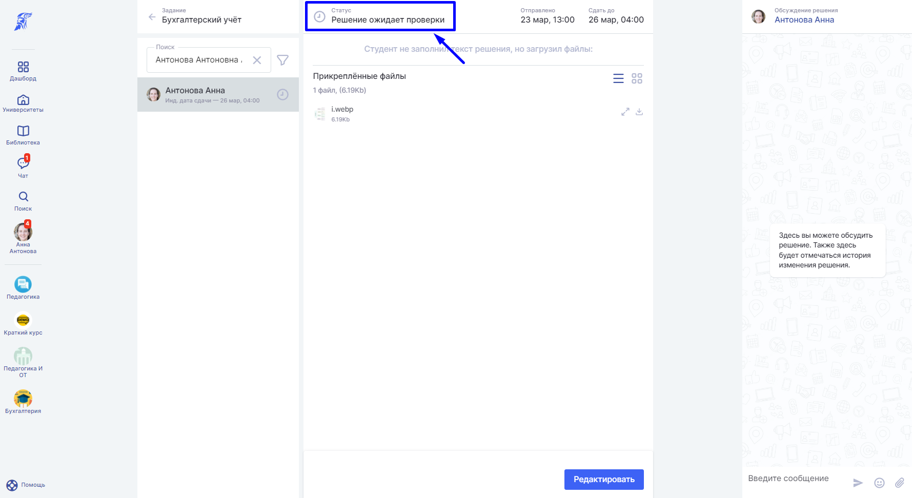
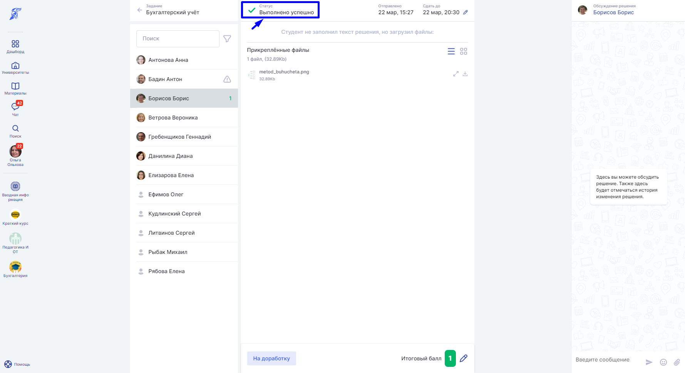
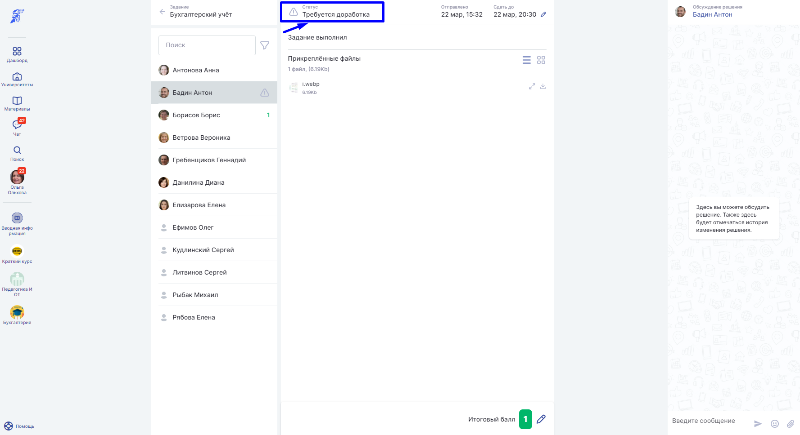
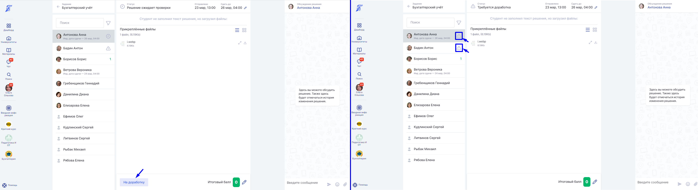
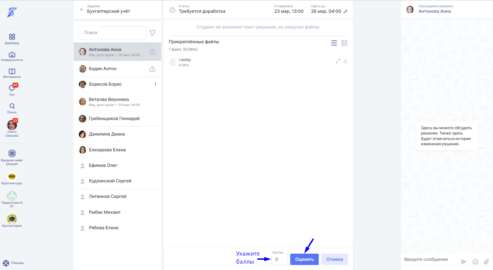

Преподавателю в любой момент доступно выставление предварительной или окончательной оценки Студенту.

При отправке Студентом решения в Задание, вне зависимости отправляется первый вариант или решение редактируется, Активность для студента переходит в статус “**На проверке**”. Преподаватель, переходя в активности Задание по ссылке "Все решения", также видит этот статус.

:::info 

Оценка, выставленная Студенту, автоматически попадет в таблицу оценок на странице [дисциплины](./../../struktura/disciplina/_index).

:::

Статусы активности для студента:

-  **успешно** (Если **оценка больше или равна** значению порогового балла - в столбце со статусом проставляется зелёная галочка);

Если **Решение**, приложенное студентом, зачтено, то **Преподаватель** устанавливает статус для активности "**Пройдена**". Активность считается пройденной и попадает в **Прогресс студента**.

-  **неуспешно** (Значения порогового балла - в столбце со статусом проставляется красный крестик);

Если **Решение** Студента выполнено плохо, то активность можно отметить  как проваленную. Для этого, кликнув по ячейке Статус выберите пункт "**Провалена**". Проваленная активность не попадет в **Прогресс студента**.

.png>)

-  **доработка**

После проверки преподаватель может написать замечания и отправить\
Решение на доработку. В этом случае ему необходимо выбрать статус \
"**На доработку**", кликнув на ячейку в левом нижнем углу экрана. Студент\
также увидит, что по его **Решению** есть **Замечание** и он должен внести исправления.

Если "Минимальный порог баллов" не установлен (или равен 0), то задание будет считаться успешным после выставлениялюбой оценки.

:::info 

Преподаватель может вручную изменить или установить любой статус решению на странице списка решений.

:::

-  **совпадающие решения**

Система позволяет идентифицировать абсолютно идентичные работы. Для этого: происходит побайтовое сравнение файлов, прикрепляемых студентам в качестве решения в рамках активности с типом “Задание” (сравнение по хешу). Считается, что при совпадении хешей файлы одинаковые и, соответственно, имеют признак “списанности”.  Если найдены совпадающие файлы, то в списке студентов отобразится индикатор:

.png>)

В фильтры на странице списка решений есть опция “Совпадающие”: при применении данного фильтра в списке студентов показываются те, у кого решения совпадают, сортировка происходит по совпадению (то есть, чтобы рядом оказались те, у кого индикаторы совпадают между собой).

.png>)