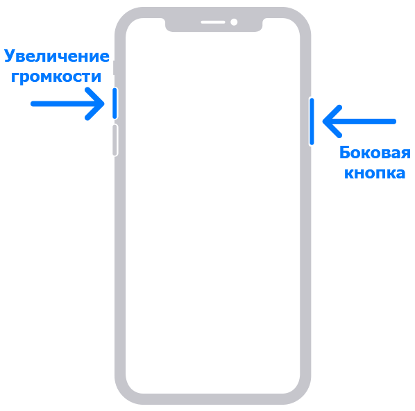
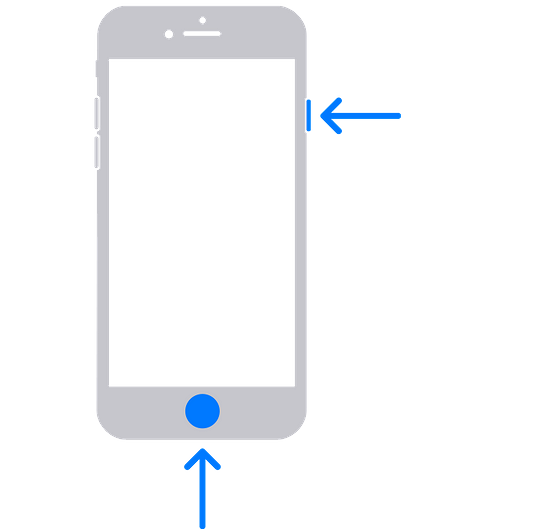

# 📸 Как сделать скриншот (снимок экрана)



Чтобы сделать  скриншот, **найдите клавишу** ⎙ Print Screen, чаще всего на клавиатуре она обозначается Prt Sc и обычно  находится в правой части ряда функциональных клавиш (функциональной клавишей является, например, F5), которые расположены в верхней части клавиатуры.

* На клавише под словами «Prt Sc» могут быть слова «Sys Req».
* Клавиша может обозначаться как «prt scr», «prnt scrn» или «prt sc».
* Если слова «Print Screen» расположены под другими словами (например, под «Sys Req»), следует зажать клавишу Fn, а затем нажать клавишу «Print Screen», чтобы сделать скриншот.

<figure><figcaption></figcaption></figure>

Далее скриншот можно сразу вставить в письмо для отправки или в графический редактор при необходимости, используя комбинацию клавиш Ctrl + V.

<figure><figcaption></figcaption></figure>

Также скриншот можно сохранить открыв программу **Paint** (графический редактор) и воспользовавшись комбинацией Ctrl + V. Снимок экрана появится в окне редактора. Сохранить изображение можно через меню «Файл».

<figure><figcaption></figcaption></figure>



Как создать снимок экрана на компьютере Mac:

Чтобы создать снимок всего экрана, одновременно нажмите и удерживайте следующие три клавиши: Shift, Command и 3. Если в углу экрана появится миниатюра, щелкните ее, чтобы отредактировать снимок экрана. Или дождитесь сохранения снимка экрана на рабочем столе. Получится снимок всего экрана.

<figure><figcaption></figcaption></figure>

Чтобы выбрать область скриншота, нажмите и удерживайте следующие три клавиши: Shift, Command и 4. В данном случае можно выбрать область, которая будет запечатлена на скриншоте.



Как сделать скриншот:

* На iPhone c Face ID. Быстро нажмите и отпустите одновременно боковую кнопку и кнопку увеличения громкости.&#x20;

<figure><figcaption></figcaption></figure>

* На iPhone с кнопкой «Домой». Быстро нажмите и отпустите одновременно боковую кнопку и кнопку «Домой».

<figure><figcaption></figcaption></figure>



Как сделать скриншот:

1. Откройте экран.
2. Скриншот можно сделать разными способами в зависимости от модели телефона:
   * Одновременно нажмите кнопки **питания** и **уменьшения громкости**.
   * Если сделать скриншот таким образом не получается, нажмите кнопку **питания** и удерживайте в течение нескольких секунд, а затем выберите **Скриншот**.
   * Если ни один из этих способов не сработает, попробуйте найти инструкции на сайте производителя устройства.

<figure><figcaption></figcaption></figure>

1. В левом нижнем углу экрана появится уменьшенное изображение скриншота. На некоторых телефонах в верхней части экрана появится значок скриншота .


