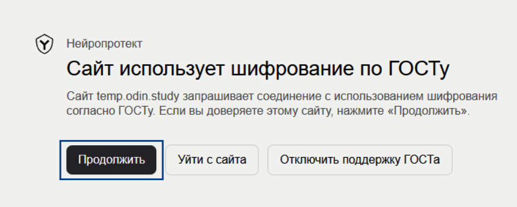

Иногда случается так, что при использовании Яндекс.Браузера наблюдается ошибка с входом. Это связано с шифрованием данных.

Для того, чтобы ошибки входа не возникло, надо нажать «Продолжить» на вот таком предупреждении при входе. Это не ошибка, это просто предупреждение о том, что используется российский метод шифрования.

{width=883px height=355px}

Если вдруг ошибка сохраняется, тогда для Яндекс.Браузера (и Chromium Gost) надо установить корневой сертификат Минцифры с сайта <https://www.gosuslugi.ru/crt> из раздела «Windows». Для удобства пользователей там содержится видеоинфтрукция по установке.

Устанавливать следует именно корневые сертификаты, а не выпускающие (от них не будет вреда, но для входа они не потребуются).

В некоторых случаях необходимо также обновление КриптоПро.