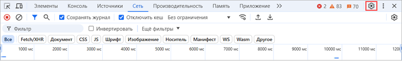

Для решения проблем могут понадобиться консольные и HAR-логи, в которые записываются взаимодействия браузера с сайтом.

[tabs]

[tab:HAR-логи в Google Chrome и Яндекс.Браузере]

1. Нажмите F12 на клавиатуре, чтобы открыть окно инструментов разработчика.

2. Выберите вкладку **Сеть**.

3. Нажмите кнопку со скриншота, чтобы очистить сетевой журнал.

   {width=825px height=127px}

4. Установите флажки **Сохранять журнал** и **Отключить кеш**.

   {width=822px height=126px}

5. Нажмите шестеренку, чтобы перейти к настройкам панели разработчика.

   {width=822px height=126px}

6. Установите флажок **Разрешить создание HAR (с конфиденциальными данными)** и закройте окно настроек.

   {width=823px height=237px}

7. Воспроизведите проблему.

8. Зажмите кнопку скачивания левой кнопкой мыши.

   {width=825px height=126px}

9. Выберите **Экспортировать HAR (с конфиденциальными данными)**. Если при длительном нажатии на значок не открывается меню с выбором типа экспорта, перезапустите браузер, затем повторно воспроизведите проблему и снова зажмите значок левой кнопкой мыши.

   {width=825px height=127px}

10. Выберите папку для сохранения логов и нажмите **Сохранить**.

[/tab]

[tab:Google Chrome и Яндекс.Браузере]

1. Нажмите F12 на клавиатуре, чтобы открыть окно инструментов разработчика.

2. Выберите вкладку **Консоль**.

3. Нажмите правой кнопкой мыши в любой области окна и выберите **Сохранить как**.

   {width=650px height=207px}

4. Выберите папку для сохранения логов и нажмите **Сохранить**.

[/tab]

[tab:HAR-логи в Firefox]

1. Нажмите F12 на клавиатуре, чтобы открыть окно инструментов разработчика.

2. Выберите вкладку **Сеть**.

3. Нажмите , чтобы очистить сетевой журнал.

   {width=700px height=195px}

4. Воспроизведите проблему.

5. Нажмите правой кнопкой мыши на любую запись и выберите **Сохранить все как HAR**.

   {width=700px height=524px}

6. Выберите папку для сохранения логов и нажмите **Сохранить**.

[/tab]

[tab:Консольные логи в Firefox]

1. Нажмите F12 на клавиатуре, чтобы открыть окно инструментов разработчика.

2. Выберите вкладку **Консоль**.

3. Нажмите правой кнопкой мыши на любой строке и выберите **Сохранить все сообщения в файл**.

   {width=700px height=329px}

4. Выберите папку для сохранения логов и нажмите **Сохранить**.

[/tab]

[tab:HAR-логи и консольные логи в Safari]

**HAR-логи**

1. Откройте Safari и нажмите **Настройки** в меню браузера.

2. Выберите вкладку **Дополнения** и установите флажок **Показывать меню «Разработка» в строке меню**.

   {width=578px height=314px}

3. Выберите **Разработка** --> **Показать веб-инспектор** в меню.

4. Выберите вкладку **Сеть**.

5. Нажмите , чтобы очистить сетевой журнал.

   {width=752px height=128px}

6. Нажмите отмеченную кнопку и выберите **Сохранить журнал**.

   {width=750px height=128px}

7. Воспроизведите проблему.

8. Нажмите **Экспортировать**.

   {width=750px height=125px}

9. Выберите папку для сохранения логов и нажмите **Сохранить**.

**Консольные логи**

1. Откройте Safari и нажмите **Настройки** в меню браузера.

2. Выберите вкладку **Дополнения** и установите флажок **Показывать меню «Разработка» в строке меню**.

   {width=578px height=314px}

3. Выберите **Разработка** --> **Показать веб-инспектор** в меню.

4. Выберите вкладку **Консоль**.

5. Воспроизведите проблему.

6. Нажмите правой кнопкой мыши в любой области окна и выберите **Сохранить выбранные**.

   {width=750px height=231px}

7. Выберите папку для сохранения логов и нажмите **Сохранить**.

[/tab]

[/tabs]

