Кэш (cache) браузера -- это копии страниц, картинок, видеороликов и прочих материалов, которые вы посмотрели с помощью браузера. Кэш помогает экономить время на открытие страниц: если страница, которую вы смотрите, уже есть в кэше, браузер мгновенно откроет её.

Иногда кэшированные файлы препятствуют отображению актуального содержимого сайтов, так как загружаются устаревшие сохраненные данные, поэтому имеет смысл время от времени очищать кэш.

**!** При неправильной работе сайтов и приложений первым делом стоит очистить кэш, это действие в большинстве случаев устраняет проблему в работе с системой.

Ниже вы можете выбрать ваш браузер и ознакомиться с **инструкцией по очистке кэша для компьютера и ноутбука.**

[tabs]

[tab:Google Chrome]

Если у вас установлен браузер Google Chrome {width=120px height=120px}

1. Открываем браузер

2. Заходим в настройки браузера (правый верхний угол, вертикальное троеточие)

3. Нажимаем "Настройки"

4. Нажимаем "Безопасность и конфиденциальность"

5. Выбираем "Очистить историю"

6. Выбираем временной диапазон "Все время"

7. Ставим или снимаем галочки так, чтобы осталась галочка только на пункте "Изображения и другие файлы, сохраненные в кэше"

Нажимаем "Удалить данные".

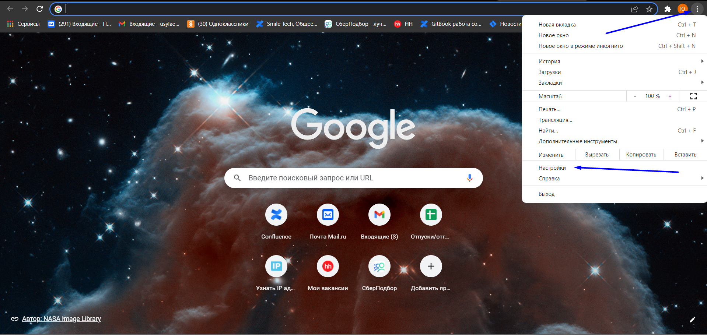{width=1919px height=910px}

Заходим в настройки браузера

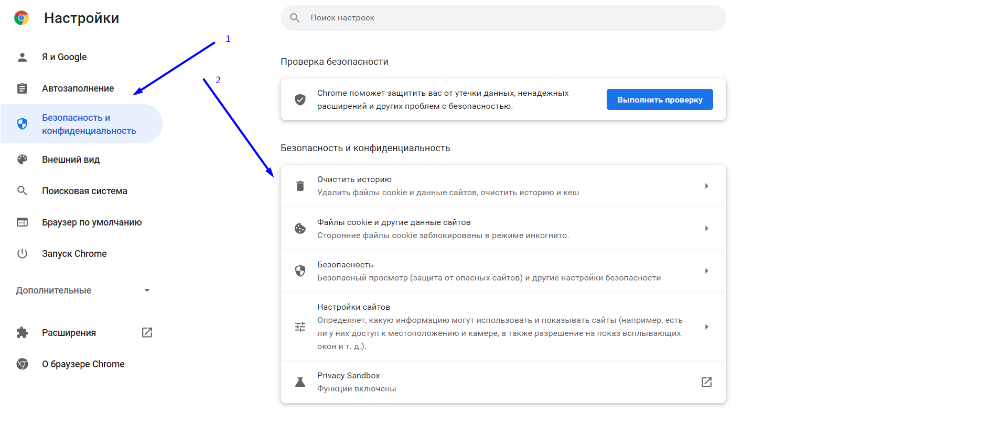{width=1907px height=818px}

Выбираем "Безопасность и конфиденциальность", далее "Очистить историю"

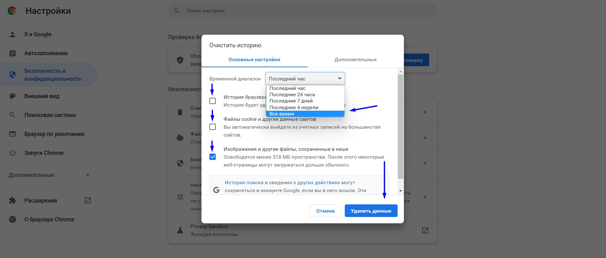{width=1916px height=818px}

Выбираем диапазон "Все время", оставляем галочку только на "Изображения и другие файлы", нажимаем "Удалить данные".

[/tab]

[tab:Яндекс.Браузер]

Если у вас установлен Яндекс браузер {width=120px height=120px}

1. Открываем браузер

2. Заходим в настройки браузера (правый верхний угол, три горизонтальные полоски)

3. Нажимаем "Настройки"

4. Нажимаем "Системные"

5. Выбираем "Очистить историю"

6. Выбираем временной диапазон "Все время"

7. Ставим или снимаем галочки так, чтобы осталась галочка только на пункте "Файлы, сохраненные в кэше"

8. Нажимаем "Очистить"

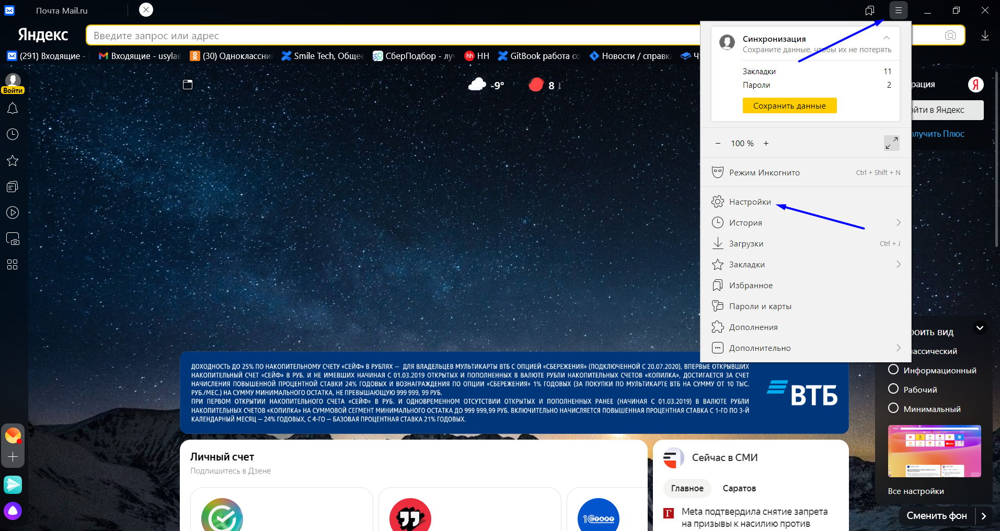{width=1913px height=1017px}

Заходим в настройки браузера

{width=1910px height=1018px}

Выбираем "Системные", далее "Очистить историю", "Файлы, сохраненные в кэше", нажимаем очистить.

[/tab]

[tab:Microsoft Edge]

Если у вас установлен браузер Microsoft Edge {width=120px height=120px}

1. Открываем браузер

2. Заходим в настройки браузера (правый верхний угол, вертикальное троеточие)

3. Нажимаем "Настройки"

4. Нажимаем "Конфиденциальность, поиск и службы"

5. Пролистываем до пункта "Удалить данные о просмотре веб-страниц"

6. Нажимаем "Выбрать элементы для удаления"

7. Выбираем диапазон времени "Все время"

8. Ставим или снимаем галочки так, чтобы осталась галочка только на пункте "Кэшированные изображения и файлы"

9. Нажимаем "Удалить сейчас"

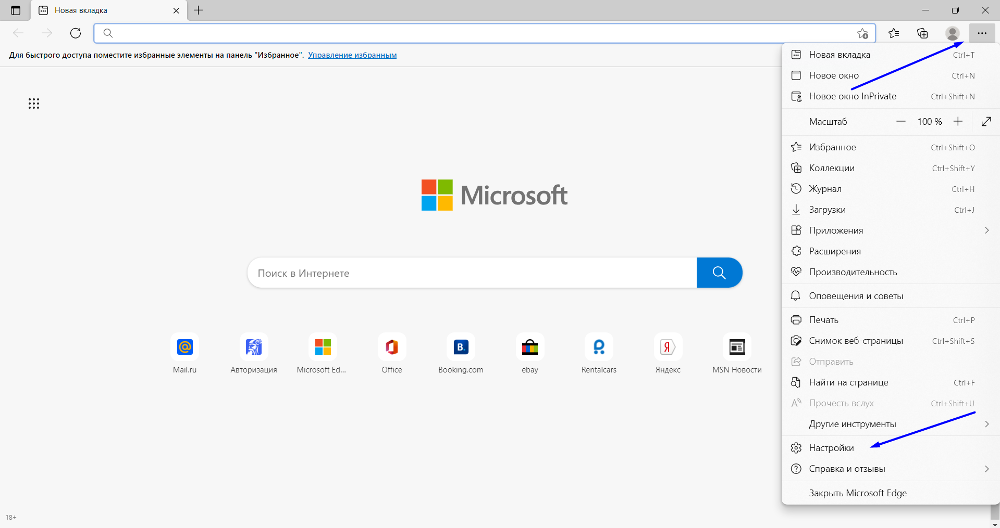{width=1919px height=1015px}

Заходим в настройки браузера

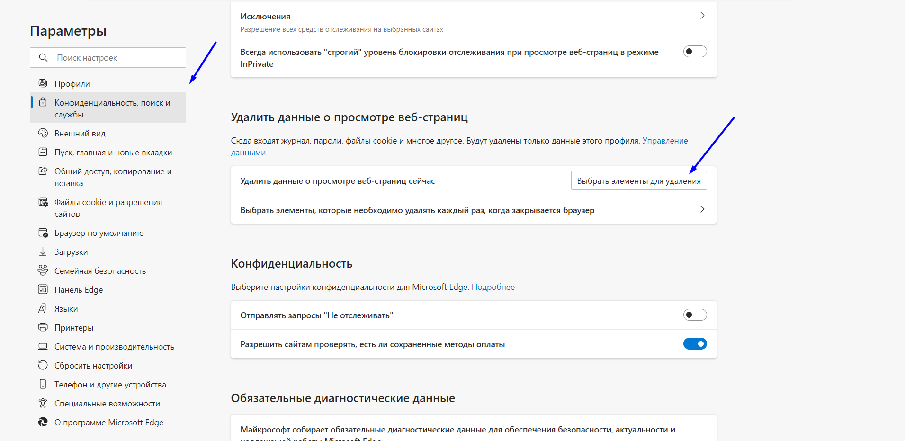{width=1911px height=931px}

Выбираем "Конфиденциальность, поиск и службы", выбираем элементы для удаления

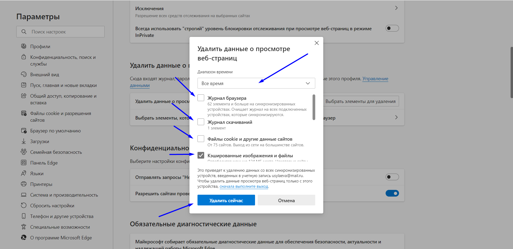{width=1917px height=931px}

Выбираем диапазон времени, нужна галочка на пункте "Кэшированные изображения и файлы", нажимаем "Удалить сейчас".

[/tab]

[tab:Mozilla Firefox]

Если у вас установлен браузер Mozilla Firefox {width=120px height=67px}

1. Открываем браузер

2. Заходим в настройки браузера (правый верхний угол, три горизонтальные полоски)

3. Нажимаем "Настройки"

4. Нажимаем "Приватность и защита"

5. Пролистываем до пункта "Куки и данные сайтов"

6. Нажимаем "Удалить данные"

7. Ставим или снимаем галочки так, чтобы осталась галочка только на пункте "Кэшированное веб-содержимое"

8. Нажимаем "Удалить"

{width=1918px height=1023px}

Заходим в настройки браузера

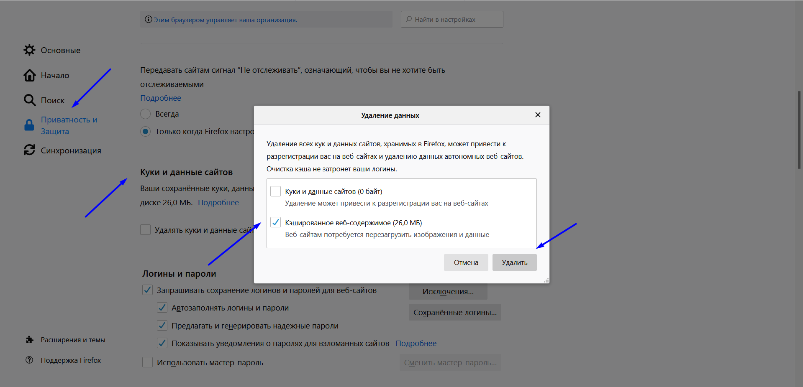{width=1919px height=926px}

Нажимаем "Защита и приватность", листаем до "Куки и данные сайтов", выбираем "Удалить данные", ставим галочку и удаляем.

[/tab]

[tab:Safari]

Если у вас установлен браузер Safari {width=71px height=39px}

1. Открываем браузер

2. Заходим в настройки браузера (правый верхний угол шестеренка)

3. Нажимаем "Настройки"

4. Нажимаем "Конфиденциальность"

5. Нажимаем "Удалить все данные веб-сайтов"

6. Нажимаем "Удалить сейчас"

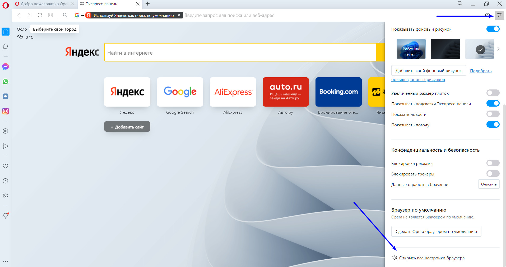{width=768px height=408px}

Заходим в настройки браузера

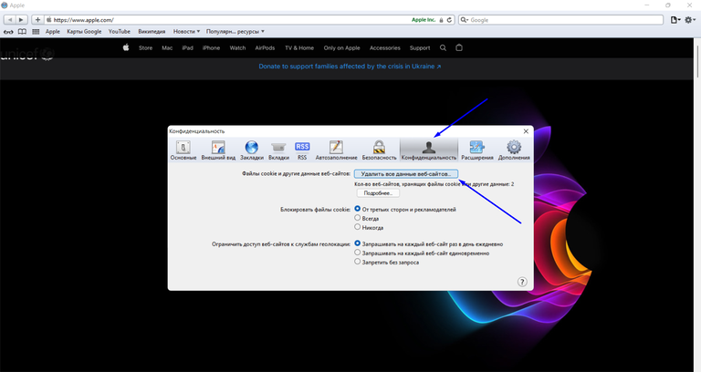{width=768px height=408px}

Выбираем "Конфиденциальность", "Удалить все данные веб-сайтов", нажимаем "Удалить сейчас"

[/tab]

[/tabs]

Ниже вы можете выбрать ваш браузер и ознакомиться с **инструкцией по очистке кэша для смартфона.**

[tabs]

[tab:Google Chrome]

Если у вас установлен браузер Google Chrome {width=120px height=120px}

1. Открываем браузер

2. Заходим в настройки браузера (правый верхний угол, вертикальное троеточие)

3. Нажимаем "История"

4. Нажимаем "Очистить историю"

5. Ставим или снимаем галочки так, чтобы осталась галочка только на пункте "Изображения и файлы, сохраненные в кэше"

6. Выбираем временной диапазон "Все время"

7. Нажимаем "Удалить данные"

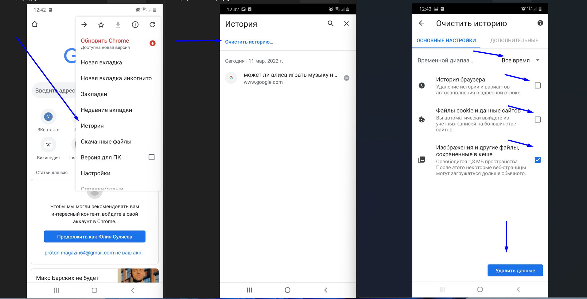{width=1912px height=976px}

Заходим в настройки браузера-выбираем "История"-"Очистить историю"-выбираем временной диапазон-галочка на "Изображения и другие файлы"-нажимаем "Удалить данные"

[/tab]

[tab:Safari]

Если у вас установлен браузер Safari {width=120px height=67px}

1. Заходим в настройки устройства

2. Выбираем Safari

3. Выбираем "Очистить историю и данные"

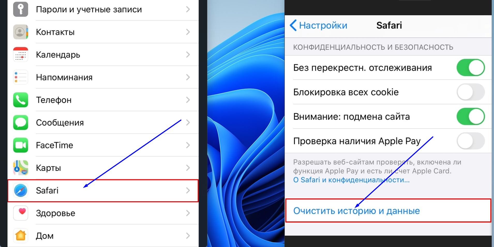{width=1910px height=956px}

Заходим в настройки устройства-выбираем Safari-нажимаем "Очистить историю и данные"

[/tab]

[/tabs]