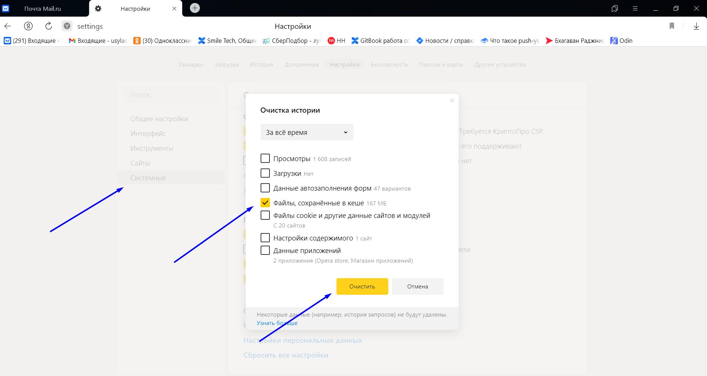
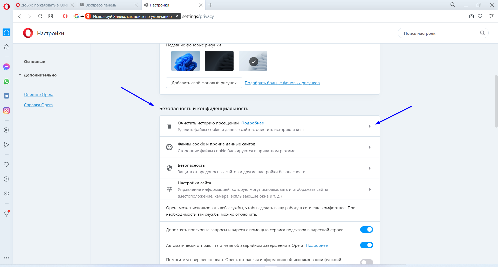
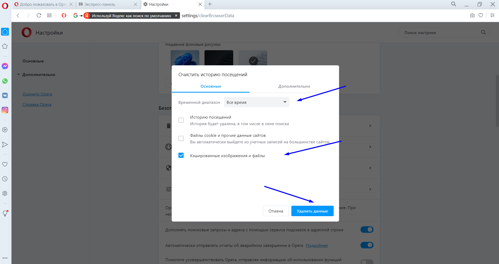
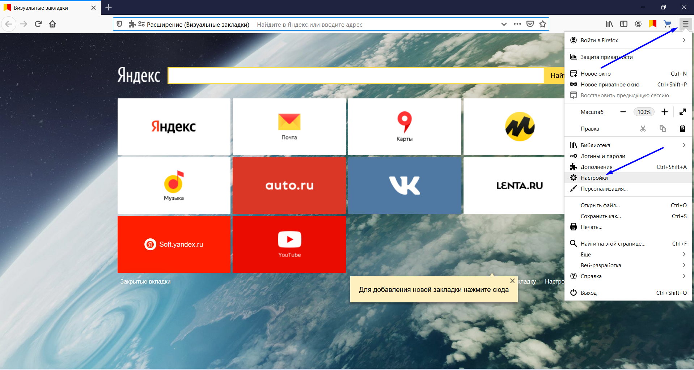
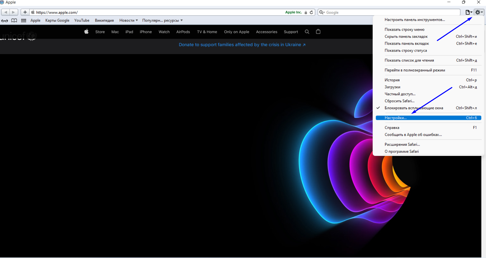

# 🔄 Кэш браузера - что это и зачем его очищать

Кэш (cache) браузера — это копии страниц, картинок, видеороликов и прочих материалов, которые вы посмотрели с помощью браузера. Кэш помогает экономить время на открытие страниц: если страница, которую вы смотрите, уже есть в кэше, браузер мгновенно откроет её.

Иногда кэшированные файлы препятствуют отображению актуального содержимого сайтов, так как загружаются устаревшие сохраненные данные, поэтому имеет смысл время от времени очищать кэш.

<mark style="color:blue;">**!**</mark> При неправильной работе сайтов и приложений первым делом стоит очистить кэш, это действие в большинстве случаев устраняет проблему в работе с системой.

Ниже вы можете выбрать ваш браузер и ознакомиться с **инструкцией по очистке кэша для компьютера и ноутбука.**

[tabs]
[tab:Google Chrome]
Если у вас установлен браузер Google Chrome

1. Открываем браузер
2. Заходим в настройки браузера (правый верхний угол, вертикальное троеточие)
3. Нажимаем "Настройки"
4. Нажимаем "Безопасность и конфиденциальность"
5. Выбираем "Очистить историю"
6. Выбираем временной диапазон "Все время"
7. Ставим или снимаем галочки так, чтобы осталась галочка только на пункте "Изображения и другие файлы, сохраненные в кэше"
8. Нажимаем "Удалить данные".

 (1).png>)

 (1) (1) (1).png>)

 (1).png>)
[/tab]

[tab:Яндекс.Браузер]
Если у вас установлен Яндекс браузер 

1. Открываем браузер
2. Заходим в настройки браузераправый верхний угол, три горизонтальные полоски)
3. Нажимаем "Настройки"
4. Нажимаем "Системные"
5. Выбираем "Очистить историю"
6. Выбираем временной диапазон "Все время"
7. Ставим или снимаем галочки так, чтобы осталась галочка только на пункте "Файлы, сохраненные в кэше"
8. Нажимаем "Очистить"

[/tab]

[tab:Opera]
Если у вас установлен браузер Opera

1. Открываем браузер
2. Заходим в настройки браузера (правый верхний угол, три горизонтальные полоски)
3. Листаем вниз и выбираем "Открыть все настройки браузера"
4. В пункте "Безопасность и конфиденциальность" нажимаем "Очистить историю посещений"
5. Выбираем временной диапазон "Все время"
6. Ставим или снимаем галочки так, чтобы осталась галочка только на пункте "Кэшированные изображения и файлы"
7. Нажимаем "Удалить данные"

[/tab]

[tab:Microsoft Edge]
Если у вас установлен браузер Microsoft Edge

1. Открываем браузер
2. Заходим в настройки браузера (правый верхний угол, вертикальное троеточие)
3. Нажимаем "Настройки"
4. Нажимаем "Конфиденциальность, поиск и службы"
5. Пролистываем до пункта "Удалить данные о просмотре веб-страниц"
6. Нажимаем "Выбрать элементы для удаления"
7. Выбираем диапазон времени "Все время"
8. Ставим или снимаем галочки так, чтобы осталась галочка только на пункте "Кэшированные изображения и файлы"
9. Нажимаем "Удалить сейчас"

 (1) (1) (1).png>)

 (1) (1).png>)

 (1) (1).png>)
[/tab]

[tab:Mozilla Firefox]
Если у вас установлен браузер Mozilla Firefox

1. Открываем браузер
2. Заходим в настройки браузера (правый верхний угол, три горизонтальные полоски)
3. Нажимаем "Настройки"
4. Нажимаем "Приватность и защита"
5. Пролистываем до пункта "Куки и данные сайтов"
6. Нажимаем "Удалить данные"
7. Ставим или снимаем галочки так, чтобы осталась галочка только на пункте "Кэшированное веб-содержимое"
8. Нажимаем "Удалить"

[/tab]

[tab:Safari]
Если у вас установлен браузер Safari

1. Открываем браузер
2. Заходим в настройки браузера (правый верхний угол шестеренка)
3. Нажимаем "Настройки"
4. Нажимаем "Конфиденциальность"
5. Нажимаем "Удалить все данные веб-сайтов"
6. Нажимаем "Удалить сейчас"

[/tab]
[/tabs]

Ниже вы можете выбрать ваш браузер и ознакомиться с **инструкцией по очистке кэша для смартфона.**

[tabs]
[tab:Google Chrome]
Если у вас установлен браузер Google Chrome

1. Открываем браузер
2. Заходим в настройки браузера (правый верхний угол, вертикальное троеточие)
3. Нажимаем "История"
4. Нажимаем "Очистить историю"
5. Ставим или снимаем галочки так, чтобы осталась галочка только на пункте "Изображения и файлы, сохраненные в кэше"
6. Выбираем временной диапазон "Все время"
7. Нажимаем "Удалить данные"

[/tab]

[tab:Safari]
Если у вас установлен браузер Safari

1. Заходим в настройки устройства
2. Выбираем Safari
3. Выбираем "Очистить историю и данные"

[/tab]
[/tabs]

