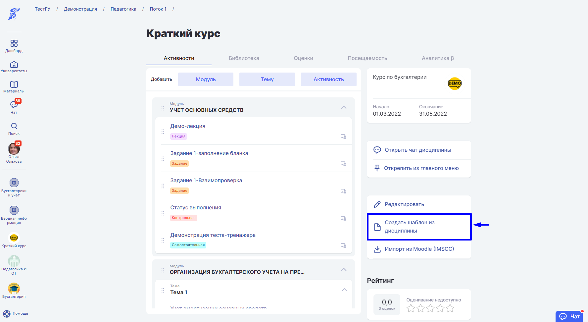
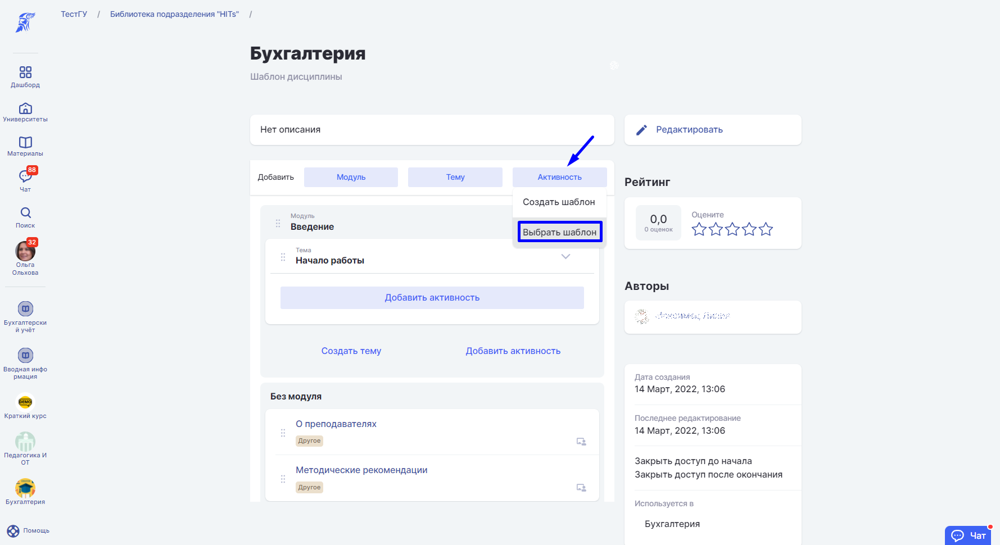
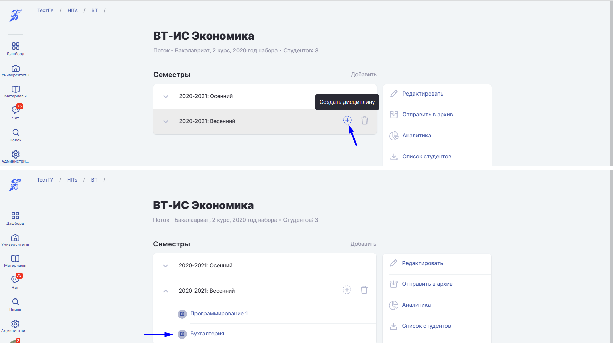

Чтобы объединить несколько [дисциплин](./../struktura/disciplina/_index), необходимо создать [шаблоны](./../struktura/disciplina/shablon-discipliny). На базе одного шаблона добавить новую дисциплины с [шаблоном активностей](./../servisy/biblioteka/materialy/shablon-aktivnosti) их других дисциплин:

1\. Объедините все дисциплины в один шаблон.

2\. Зайдите в библиотеку подразделения, а затем в шаблон любой дисциплины.

.png>)

3\. Дополните шаблон дисциплины нужными шаблонами активностей из других дисциплин.

4\. На базе дополненного шаблона на странице потока создайте новую дисциплину.

