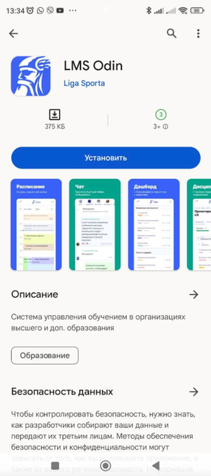
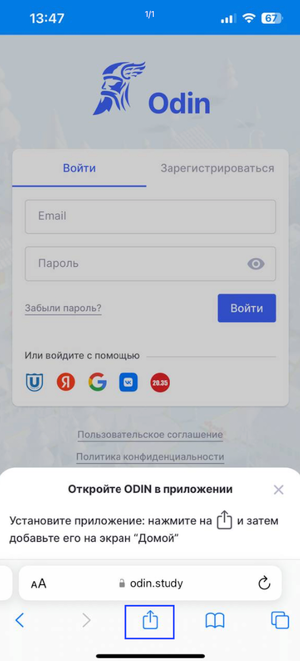
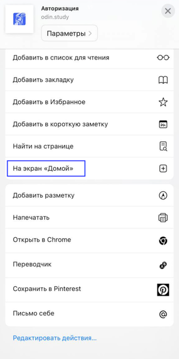
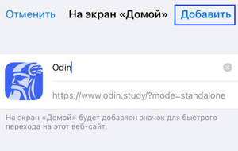
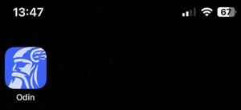
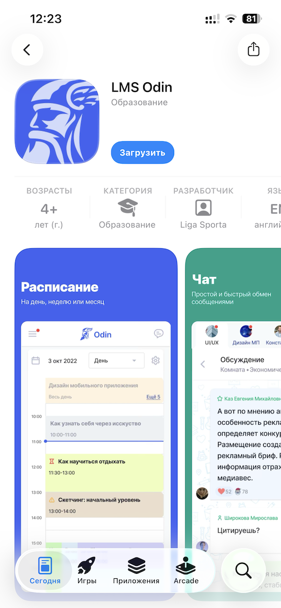

В зависимости от ОС телефона, можете выбрать тот или иной вариант установки приложения Odin

[tabs]

[tab:На смартфоне Android]

Приложение доступно Odin в [Google Play](https://play.google.com/store/apps/details?id=study.odin.www.twa).

{width=300px height=675px}

[/tab]

[tab:PWA на IPhone]

При необходимости вы можете установить PWA - **приложение** для SPA на мобильной версии **через браузер**:

-  Зайдите в браузер Safari

-  Меню браузера нажмите на {width=42px height=39px}

{width=300px height=661px}

-  Выберите пункт “На экран Домой”.

{width=300px height=601px}

-  Нажмите кнопку “Добавить”.

{width=300px height=190px}

-  PWA - приложение для SPA установлено на экран вашего телефона.

{width=300px height=137px}

[/tab]

[tab:На смартфон IPhone]

Приложение для яблочных устройств доступно [по ссылке](https://apps.apple.com/us/app/lms-odin/id6469049760). 

{width=567px height=1227px}

[/tab]

[/tabs]