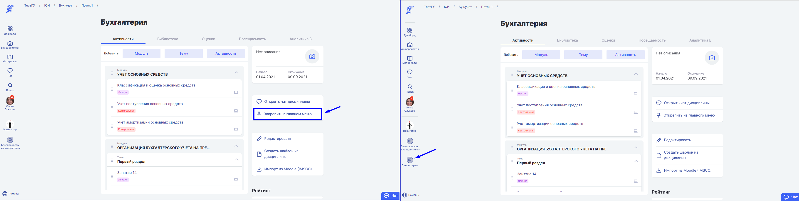
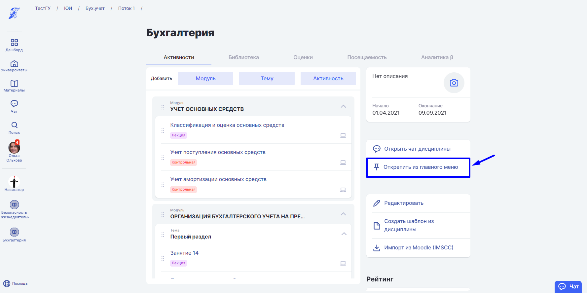

### Как закрепить дисциплину в меню быстрого доступа?

Для быстрого доступа к Дисциплине закрепите её в основном боковом меню, нажав "Закрепить в главном меню".

Дисциплина появится в боковом меню слева.

:::info 

Список всех ваших дисциплин можно посмотреть на Дашборде.

:::

### Как убрать дисциплину из меню?

Если Дисциплина закончилась, открепите её, нажав "Открепить из главного меню" или клинкуть правой кнопкой мыши на значок дисциплины в меню.

Дисциплина исчезнет из левого бокового меню.

