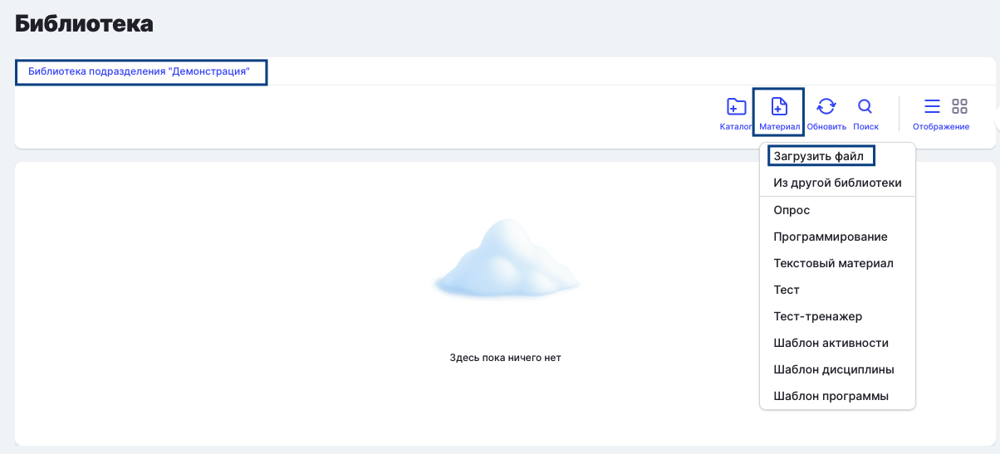
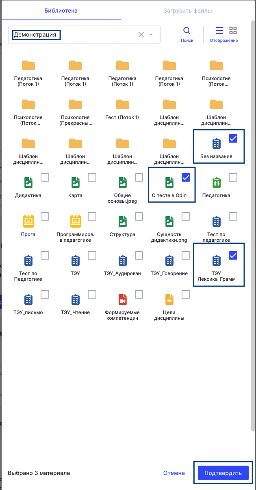
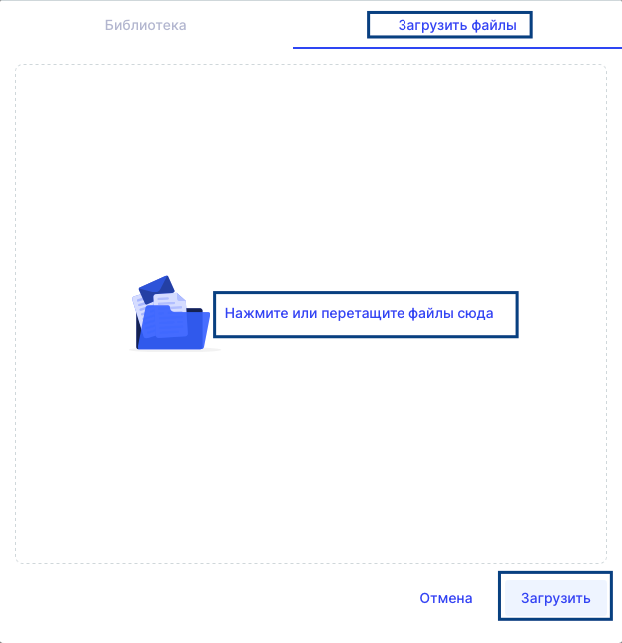

Для удобной работы с материалами (типа файл) важно знать способы, как можно их загрузить в систему разными способами, чтобы выбрать подходящий

В системе возможны следующие варианты работы с [материалом](./../../servisy/biblioteka/materialy/_index) и его добавлением.

### 1\. Материал будет использован в дальнейшем в разных активностях

Например, Вам необходимо добавить сразу много файлов, которые в дальнейшем будут использованы во многих [активностях](./../../struktura/disciplina/aktivnosti/_index) подразделения, а также предполагается использование файлов не только Вами, но и Вашими коллегами.

В этом случае рекомендуется добавить файлы в библиотеку подразделения, чтобы к ним был доступ у всех пользователей и далее его можно было использовать в любой дисциплине.

Для этого необходимо зайти на страницу [подразделения](./../../struktura/podrazdelenie), нажать на [Библиотека](./../../servisy/biblioteka/_index), далее найти кнопку Материал, выбрать тип Файл. И через открывшуюся дропзону загрузить до 30 файлов.

{width=1204px height=547px}

После этого при создании/редактировании активности добавленные файлы будут доступны в блоке Добавляйте материалы.

{width=608px height=220px}

В открывшемся окне следует найти библиотеку подразделения, в которую были добавлены файлы. Далее галочками выбрать требуемые материалы, нажать «Подтвердить».

{width=630px height=1206px}

Материал добавлен в активность. Осталось нажать на кнопку Сохранить и файл отобразится в активности.

### 2\. Материал будет использован только в одной конкретной активности

Если в определенной активности запланирован вебинар на сторонней платформе, а потом надо будет загрузить запись этого вебинара в активность, то подойдет описанный ниже способ загрузки материалов на платформу.

Если необходимо добавить материал в одну [активность](./../../struktura/disciplina/aktivnosti/_index), то при создании/редактировании активности необходимо войти в блок Добавляйте материалы, нажать на кнопку Добавить материалы.

{width=597px height=210px}

В открывшемся окне выбрать Загрузить файлы, через дропзону добавить файлы с компьютера или другого устройства и нажать на кнопку Загрузить.

{width=622px height=643px}

Необходимый файл добавлен в активность. Осталось нажать на кнопку Сохранить, чтобы он отобразился.

:::info 

Все материалы, которые добавляются в активность, автоматически попадают в библиотеку дисциплины и будут доступны для дальнейшего использования.

:::

:::info 

Любой материал следует добавлять в систему один раз.

:::

