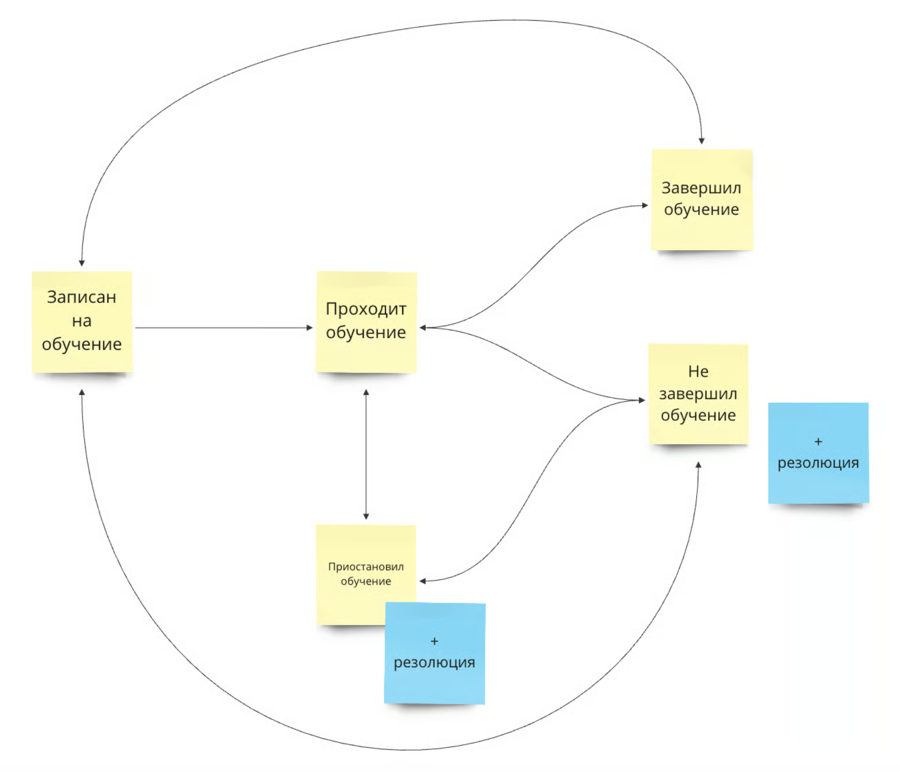

В Odin реализована фундаментальная история со статусами, которая позволяет помочь образовательным организациям с их важными задачами по мониторингу, на каком этапе обучения находится студент

## **Набор статусов**

Каждому студенту в Odin присваивается один из следующих статусов обучения в рамках потока:

-  Записан на обучение - данный статус присваивается автоматически студенту как первоначальный, когда студент добавлен в группу потока.

-  Проходит обучение - данный статус присваивается автоматически студенту, если ранее у него был статус “Записан на обучение” и в текущем потоке:

   \- Он завершил хотя бы одну активность\
   \- Ему проставили хотя бы одну отметку о посещаемости\
   \- Ему проставили хотя бы одну оценку\
   \- Он начал проходить хотя бы один тест (фиксация по факту приступления к тесту)

-  Приостановил обучение - данный статус означает, что по какой-либо причине студент временно не обучается в данном потоке (например, ушел в академический отпуск). Перевод в этот статус осуществляется вручную сотрудником организации.

-  Завершил обучение - данный статус означает, что студент успешно завершил обучение, т.е. выполнил критерии прохождения программы, которые определяются образовательной организацией. Перевод в этот статус осуществляется вручную сотрудником организации.

-  Не завершил обучение - данный статус означает, что студент не завершил обучение, т.е. не выполнил критерии прохождения программы, которые определяются образовательной организацией и был отчислен с нее. Перевод в этот статус осуществляется вручную сотрудником организации.

## **Набор резолюций**

Резолюция - это причина для выставления одного из статусов. Резолюции могут быть только у двух статусов: “Приостановил обучение” и “Завершил обучение”. В Odin предусмотрены два типа резолюций:

-  **Предустановленные резолюции** - это те резолюции, которые добавляют администраторы системы, они доступны всем организациям для использования в работе, но пользователи этих организаций не могут их изменить.

Предустановленные резолюции для статуса “Не завершил обучение”:

\- Отчислен за неуспеваемость\
\- Отчислился по собственному желанию\
\- Обучение отменено

Предустановленные резолюции для статуса ”Приостановил обучение”:

\- Академический отпуск\
\- По семейным обстоятельствам

-  **Пользовательские резолюции** - те, которые сотрудники организации определяют сами. Такие резолюции будут уникальными для каждой организации.

:::info 

**Создание и редактирование резолюций доступно только администраторам организаций.**

:::

Создание и редактирование резолюций осуществляется на странице редактирования [организации](./../../struktura/universitet/_index).

Название кастомной резолюции должно быть уникальным для организации, нельзя добавить две резолюции с одинаковым названием. Если название резолюции оказывается не уникальным, то после ввода оно подсвечивается красным цветом и появляется ошибка “Название резолюции должно быть уникальным”. При сохранении страницы редактирования организации такая резолюция не сохранится.

Если необходимо удалить резолюцию на странице редактирования организации, то сделать это можно в том случае, если ни одному из студентов в этой организации не проставлена данная резолюция. Если у хотя бы одного студента проставлена резолюция, то по нажатию на крестик рядом с резолюций показывается красная всплывающая ошибка с текстом: “Удаление резолюции невозможно, т.к. она присутствует хотя бы у одного студента”.

## Как установить статус обучения?

### **Способ 1. Блок "Статус обучения" на странице профиля студента**

.png>)

## **Способ 2. Страница потока кнопка "Завершить обучение"**

Любой из способов  откроет "Страницу завершения обучения", которая доступна на всех потоках, на этой странице есть возможность установить новые статусы и резолюции.

:::info 

**Права на изменение  и установку статуса на этой странице есть у пользователя с ролью администратор программы и выше.**

:::

## **Установка статусов пользователем**

В Odin существует зависимость между статусами. На Рис.1 изображена взаимосвязь между ними. Направление стрелок указывает из какого на какой можно поменять статус.

{width=1736px height=1488px}

При изменении статуса студенту отражаются только те, которые доступны при переходе из текущего статуса, согласно Рис.1 (выше). Например, если текущий статус “Приостановил обучение”, то при открытии меню отобразятся только статусы “Проходит обучение” и “Не завершил обучение”.