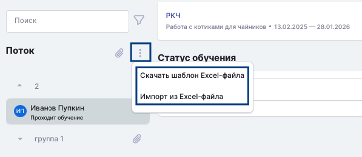
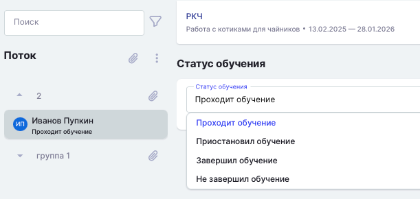
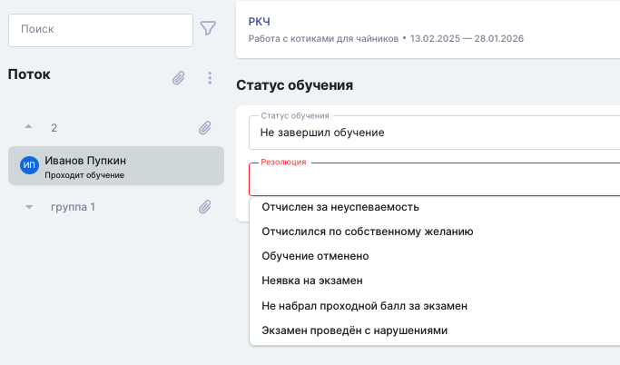
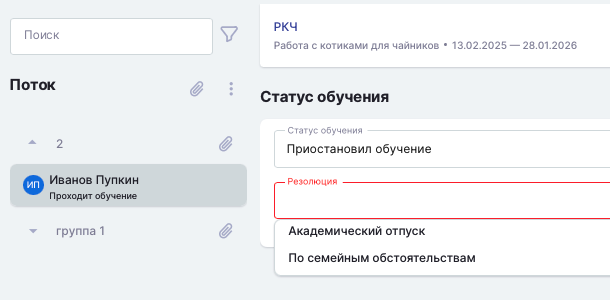

Важным условием передачи данных между проектами Odin и Flow является завершение обучения по каждому из потоков.

:::danger 

Изменить статус на странице завершения обучения возможно только до даты завершения. Если статус выставлен ошибочно, необходимо написать в поддержку.

Все данные дублируются на портал Работа России вручную. Если эти данные уже внесены на портал, то менять их во Flow бессмысленно.

:::

### Как выставить информацию о завершении обучения  студенту?

Есть три способа выставить статус

Способ 1. В случае, если конкретному студенту во время обучения необходимо выставить статус "Отчислился" или по завершении обучения выбрать успешно/неуспешно, можно со страницы профиля **сразу** перейти на страницу "Завершения обучения".

 (1) (1) (1) (1) (1) (1) (1) (1) (1) (1) (1) (1) (1) (1) (1) (1) (1) (1) (1) (1) (1) (1) (1) (1).png>)

Способ 2. Когда обучение в потоке по датам закончилось, на странице потока необходимо нажать на «Завершить обучение».

:::info 

Нажатие на кнопку "Завершить обучение" просто откроет страницу для заполнения информации.

:::

 (1) (1) (1) (1) (1) (1) (1) (1) (1) (1) (1) (1) (1) (1) (1) (1) (1) (1) (1) (1) (1) (1) (1) (1) (1).png>)

На данной странице необходимо будет проставить статус по каждому из студентов.

 (1) (1) (1) (1) (1) (1) (1) (1) (1) (1) (1).png>)

Способ 3. Через массовый импорт на странице завершения обучения. Необходимо нажать на тридот, скачать и заполнить шаблон, далее загрузить его в систему.

{width=597px height=260px}

Допустимые значения ячейки "Пройдено успешно» в Excel-файле:

-  **1 – обучение пройдено успешно**

-  **0 – обучение пройдено не успешно**

-  **не заполнено – студент будет пропущен**

-  **Другие значения не допускаются**

После импорта система автоматически выставит статус завершения обучения по студентам.

## **Набор статусов**

Каждому студенту в Odin присваивается один из следующих статусов обучения в рамках потока:

-  **Записан на обучение** - данный статус присваивается автоматически студенту как первоначальный, когда студент добавлен в группу потока.

-  **Проходит обучение** - данный статус присваивается автоматически студенту, если ранее у него был статус “Записан на обучение” и в текущем потоке:

   \- Он завершил хотя бы одну активность\
   \- Ему проставили хотя бы одну отметку о посещаемости\
   \- Ему проставили хотя бы одну оценку\
   \- Он начал проходить хотя бы один тест (фиксация по факту начала решения  теста)

-  **Приостановил обучение** - данный статус означает, что по какой-либо причине студент временно не обучается в данном потоке (например, ушел в академический отпуск). Перевод в этот статус осуществляется вручную сотрудником организации.

-  **Завершил обучение** - данный статус означает, что студент успешно завершил обучение, т.е. выполнил критерии прохождения программы, которые определяются образовательной организацией. Перевод в этот статус осуществляется вручную сотрудником организации.

-  **Не завершил обучение** - данный статус означает, что студент не завершил обучение, т.е. не выполнил критерии прохождения программы, которые определяются образовательной организацией и был отчислен с нее. Перевод в этот статус осуществляется вручную сотрудником организации.

-  **Пользовательские резолюции** - те, которые сотрудники организации определяют сами. Такие резолюции будут уникальными для каждой организации.

{width=611px height=290px}

## **Набор резолюций**

Резолюция - это причина для выставления одного из статусов. Резолюции могут быть только у двух статусов: “Приостановил обучение” и “Завершил обучение”. В Odin предусмотрены два типа резолюций:

-  **Предустановленные резолюции** - это те резолюции, которые добавляют администраторы системы, они доступны всем организациям для использования в работе, но пользователи этих организаций не могут их изменить.

Предустановленные резолюции для статуса “Не завершил обучение”:

-  Отчислен за неуспеваемость

-  Отчислился по собственному желанию

-  Обучение отменено

-  Неявка на экзамен

-  Не набрал проходной балл за экзамен

-  Экзамен проведен с нарушениями

{width=683px height=402px}

Предустановленные резолюции для статуса ”Приостановил обучение”:

-  Академический отпуск

-  По семейным обстоятельствам

{width=610px height=300px}

-  **Пользовательские резолюции** - те, которые сотрудники организации определяют сами. Такие резолюции будут уникальными для каждой организации.

:::info 

**Создание и редактирование резолюций доступно только администраторам организаций.**

:::

Создание и редактирование резолюций осуществляется на странице редактирования [организации](./../../struktura/organizaciya/_index).

:::tip 

Если гражданин отчислился во время обучения и во Flow, ему добавлен приказ об отчислении по собственному желанию, статус "Не завершил обучение" в Odin выставится автоматически.

:::

:::danger 

Если известно об отчислении, но во Flow пока нет приказа, также можно выставить "Не завершил обучение", чтобы [закрыть доступ к образовательным материалам](./kak-bystro-zakryt-dostup-k-materialam-programmy).\
Далее во Flow необходимо загрузить заявление на отчисление и добавить приказ об отчислении по собственному желанию.\
Гражданин может сам добавить заявление на отчисление, если до даты завершения обучения более 3-х рабочих дней (день окончания обучения в расчёт не принимается)/если менее, то образовательная организация должна загрузить заявление самостоятельно.

:::

### Цифровой след

:::info 

Информация о цифровом следе заполняется во Flow представителем федерального оператора

:::

## Перейдите во Flow для работы с документами

Далее вам следует дождаться синхронизации проектов Odin и Flow (Синхронизация проходит 1 раз в час) и перейти к заполнению приказов об отчислении во Flow, статус заявок должен быть в одном из трёх статусов:

-  **Отчислен за неуспеваемость** -  гражданин неуспешно завершил обучение, возможно назначить приказ об отчислении с указанием причины "Неуспеваемость".

-  **Успешно завершил обучение. Требуется отчислить**  - гражданин успешно завершил обучение на платформе Odin. Ожидает добавление приказа об отчислении с основанием "Выдача документа о квалификации".

-  **Отчислить на основании заявления**  - данный статус по завершении обучения - это крайний случай. Большинство заявок, где гражданин отчислился по собственному желанию, должны быть обработаны во время обучения.

1. Создайте приказ на отчисление для потока, где обучение завершено (важно обращать внимание на основание приказа).  Добавьте приказ в заявке для каждого гражданина.

2. Заполните данные документа о квалификации.