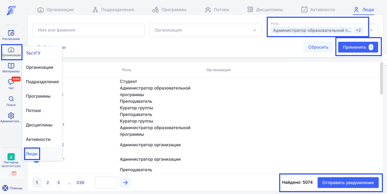
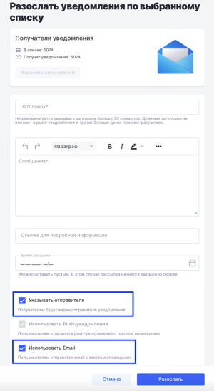
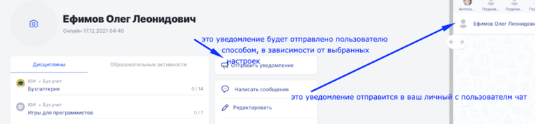

Уведомление, отправленное со страницы пользователя или из раздела Организация - Люди (разослать уведомление можно выбрав необходимые фильтры - затем кнопку “Применить”), попадёт на почту, а ответное письмо в техническую поддержку Odin.

{width=768px height=385px}

:::tip 

**Если вы используете рассылку уведомлений помимо чата, надо обязательно указать отправителя письма.**

:::

{width=300px height=549px}

Если вы попросите какие-либо документы у слушателя, то он должен знать адрес, по которому их направить, и адресата, который получит его письмо.

:::note 

**Не стоит писать**: “Здравствуйте, Олег! Я ваш куратор Алиса, вижу, что вы не прошли контрольную номер 1. Чем я могу помочь?”, - Олег, читая ваше письмо, отвечает, но ответ получает не Алиса, а **служба поддержки**, которая не знает, чем помочь Олегу по контрольной номер 1. (В случае, если НЕ указан отправитель).

Очень просим вас указывать отправителя.

:::

:::tip 

Укажите в письме не только имя куратора, но и контакт для надежности.

Алиса должна была написать стандартную подпись: “По всем проблемам и вопросам вы можете написать мне в телеграмм[ https://t.me/ALA](https://t.me/ALA).                                                                                       С уважением, Алиса Иванова.”

:::

{width=768px height=178px}

