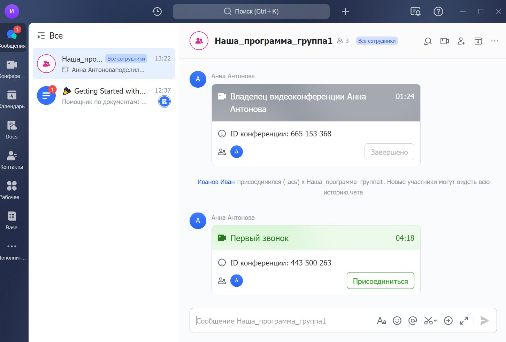

Видеозвонки возможно проводить в любой удобной системе

## Рассмотрим Lark

### Приложение

Приложение можно скачать на компьютер по ссылке <https://www.larksuite.com/download?download_from=inappvc> или ввести Lark  в AppStore/PlayMarket.

После того, как приложение скачали, необходимо зарегистрироваться с помощью телефона/почты или войти через Google -аккаунт.

 (1).png>)

Заполните данные о себе.

 (1).png>)

Создайте организацию.

 (1) (1).png>)

Дайте организации понятное имя.

 (1) (1).png>)

Скопируйте и передайте код участникам команды.

 (1).png>)

## Видеозвонок в Lark

Начните звонок.  Lark попросит разрешить доступ к камере и микрофону.  Необходимо согласиться, так как при звонке вам потребуется говорить и видеть собеседника.

 (1).png>)

### Подробнее как дать разрешение микрофону и камере для участия в звонке

[tabs]

[tab: MacOS и IPhone]

-  Нажмите на значок камеры и нажмите "Настройки системы"

 (1).png>)

-  Включите  разрешение для приложения Lark

 (1).png>)

-  Перезапустите приложение.

 (1).png>)

[/tab]

[tab: Windows]

1. Выберите Пуск  > Параметры  > Конфиденциальность > Микрофон. В области Разрешить доступ к микрофону на этом устройстве выберите Изменить и убедитесь, что параметр Доступ к микрофону для этого устройства включен.

2. Затем разрешите приложениям доступ к микрофону. В области параметров микрофона найдите параметр Разрешить приложениям доступ к микрофону и убедитесь, что этот параметр включен.

3. Если приложениям разрешен доступ к микрофону, можно изменить эти параметры для каждого приложения. В области параметров микрофона перейдите в раздел. Выберите, каким приложениям Майкрософт разрешен доступ к микрофону, и включите приложения, которым нужно использовать микрофон.

4. Повторите настройку для Камеры. Для этого выберите пункт Видео.

 (1).png>)

[/tab]

[tab:Android]

1. Откройте настройки телефона.

2. Нажмите **Приложения**.

3. Выберите приложение. Если его нет в списке, нажмите **Показать все приложения**, а затем выберите требуемое.

4. Выберите **Разрешения**.

   -  Откроется список разрешений приложения.

5. Чтобы изменить настройки определенного разрешения, нажмите на него и выберите **Разрешить** или **Запретить**.

[/tab]

[/tabs]

### Поделитесь звонком с командой

 (1).png>)

 (1) (5) (1).png>)

После этого у всех участников будет информационное сообщение  о звонке с возможностью "Присоединиться".

## Какая информация должна быть в  Odin

На странице активности необходимо добавить следующую информацию:

1. Ссылка на установку приложения Lark <https://www.larksuite.com/download?download_from=inappvc>

2. Ссылка на инструкцию по установке  [Если меня просят присоединится в Lark](https://informa.gitbook.io/odin_students/esli-menya-prosyat-prisoedinitsya-v-lark).

3. Код для подключения к созданной организации (8 букв). Например, YJXLNJDB.

4. Данные о времени и формате проведения звонка (ссылку на звонок в Lark можно получить из [календаря](./gde-eshyo-mozhno-provodit-videozvonki#ssylka-na-zvonok-v-lark), где добавлено событие).

Данные необходимо внести на странице редактирования активности

 (1).png>)

Для студентов после сохранения будет выглядеть вот так.

 (1).png>)

### Ссылка на звонок в Lark

Ссылку можно передать в любом из мессенджеров всем участникам организации.

 (4) (1) (1) (1).png>)

## Где посмотреть запись звонка в Lark?

Если во время проведения звонка была включена запись, то её можно скачать.

 (1) (2) (1).png>)

Откроется страница с видео и кнопкой "Download video".

 (1).png>)

:::info 

Рекомендуем добавить запись как материал на странице редактирования активности в Odin, студенты используют записи занятий для закрепления материала.

:::