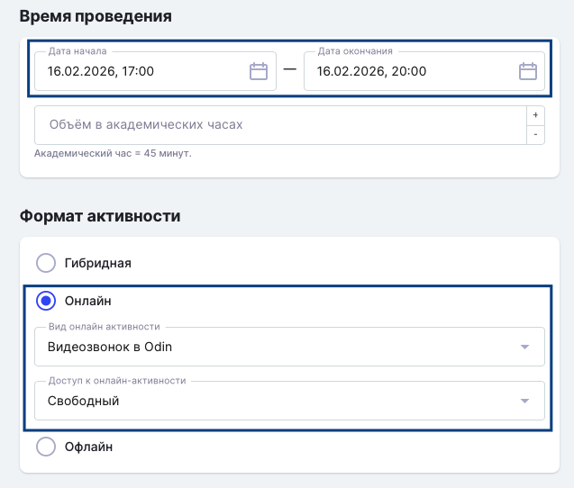

-  Перейдите на страницу редактирования  Активности.

.png>)

-  Установите дату/время и формат Активности.

   {width=637px height=542px}

:::info 

Возможно установить "Доступ к онлайн-активности": **свободный** - можно присоединиться без камеры,  **с видеокамерой** - без наличия видеокамеры к звонку присоединиться не получится.

:::

-  За 10 минут до времени начала активности начнётся автоматический звонок.

.png>)

:::info 

Если к звонку в активности за 15 минут никто не подключится, то звонок завершится автоматически.

:::

-  Проверьте оборудование: Микрофон, Динамики, Камеру и Фон. Нажмите "Присоединиться". [Подробнее как дать доступ к камере/микрофону](./../../kommunikaciya/videozvonki/kak-dat-dostup-k-kamere-i-mikrofonu-dlya-zvonkov-v-odin)

 (3) (1).png>)

-  **При необходимости включите запись звонка.** Сделанная запись автоматически попадет как материал в Активность, со страницы которой начался звонок, и будет доступна для просмотра после кодирования. \
   Все записи звонков доступны также в Чате дисциплины.

.png>)

:::info 

За час до начала звонка придёт уведомление в Odin, чтобы звонок не пропустили.

:::

.png>)

-  Студенты могут попасть в звонок следующим образом:

1. зайти в звонок по кнопке  "Звонок в Odin" на странице активности во время её проведения,

2. перейти по кнопке "Текущие звонки" и нажать на кнопку "Присоединиться".

3. Преподаватель может дополнительно оповестить студентов, нажав кнопку "Позвать участников звонка". В этом случае у всех студентов громко заиграет мелодия звонка и они точно не пропустят его. (Мелодия играет до тех пор, пока не нажали одну из кнопок "Присоединиться" или "Отклонить".).

:::note 

**Обратите внимание, что звонок со звуком начнётся только после клика на кнопку "Позвать участников" или во время начала активности** (за 10 минут до времени начала к звонку можно присоединяться, но звука звонка не будет).

:::

 (1) (2).png>)

### Завершить звонок

Звонок можно закончить одним из двух способов:

-  Завершить звонок - выйти из звонка, тогда звонок закончится только у вас.

-  Завершить для всех -  звонок закончится для всех участников.

:::info 

Если преподаватель просто закроет вкладку звонка = Завершить звонок.

:::

 (1) (1) (2) (1).png>)

:::tip 

По необходимости можно настроить синхронизацию с  Google календарем. [Подробнее](./../nastroika-sinkhronizacii-s-google-kalendarem)

:::

