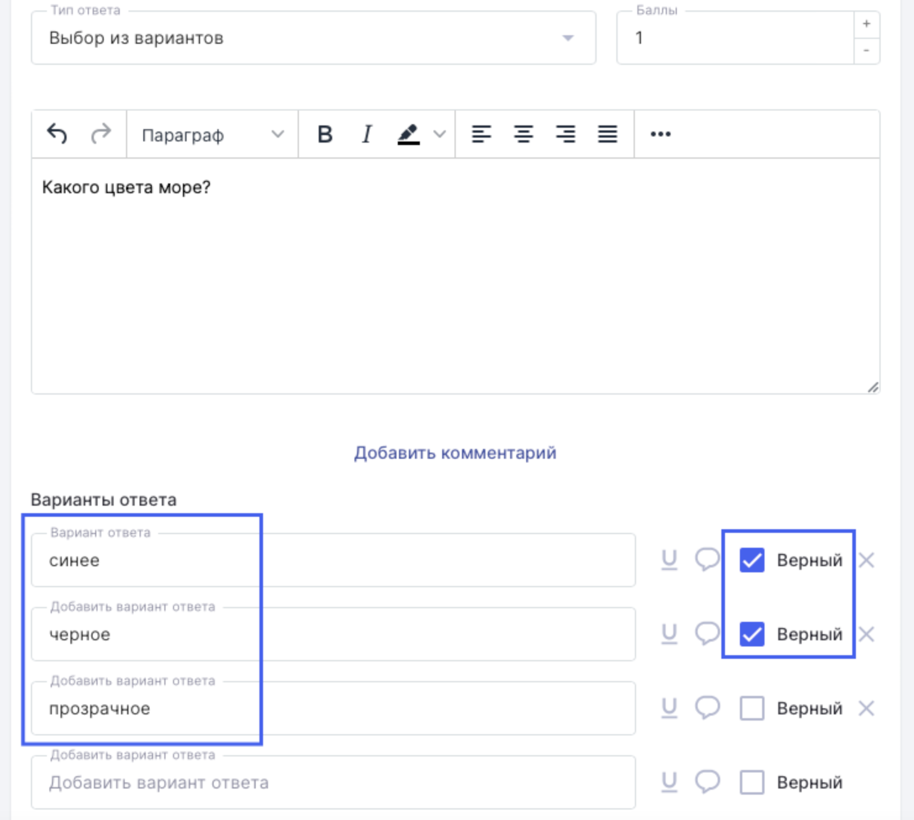

# Как создать тест? Пошаговая инструкция

:::info

Активность с типом **Контрольная** - единственная активность, куда можно добавить материал с типом **Тест**.

:::

### Создание материала типа Тест

**Конструктор тестов - сервис Odin для создания теста.**

Чтобы начать работать в конструкторе тестов необходимо выбрать пункт меню Материалы -> Библиотека -> Материал -> Тест.

 (1).png>)

### Заполнение основной информации о тесте

На странице создания теста можно установить настройку, чтобы показывались подсказки по заполняемым полям. Возможно указать **название** теста, составить его краткое **описание**, добавить автора(-ов), определить **время изучения** материалов, установить ограничения, касающиеся **минимального порога баллов** (эти ограничения являются рекомендацией автора и далее копируются в активность (контрольную), хотя их можно будет отредактировать), а также определить **временной лимит** на прохождение теста. Также можно установить доступ, разрешающий редактирование материала сотрудникам организации.

:::info

Все изменения, введенные на странице создания теста, сохраняются автоматически в личную библиотеку создателя.

:::

.png>)

### Структура теста

Перейдя к блоку Вопросы, можно увидеть **варианты**, в которых вопросы студентам выпадут случайным образом. За каждый введенный вопрос необходимо указать количество баллов, которое студент получит за верно данный ответ. После каждого вопроса есть кнопка Добавить вопрос, при нажатии на которую появляется окошко для следующего вопроса теста.

Тест может быть разделен на блоки. Чтобы добавить следующий блок, необходимо нажать на +, расположенный в самом низу страницы после последнего введенного вопроса. Редактировать название каждого блока следует нажатием на кнопку с карандашиком, рядом с названием блока. Свернуть/развернуть блок предполагается нажатием на стрелочку, показывающую вниз/вверх соответственно. Удалить весь блок можно, нажав на три точки, расположенные справа в строке с названием блока (три точки появляются, если добавлено 2 и более блока в тест).

В левом нижнем углу сохраняется ссылка на создаваемый тест, а в правом нижнем углу указано максимальное количество баллов, которое студент может получить за верные ответы на все вопросы теста.

.png>)

### Типы ответов

При создании теста необходимо определиться, ответ какого типа будет добавлен к каждому конкретному вопросу. Один тест может содержать различные вариации вопросов с разными типами ответов. Всего возможны 5 вариантов:

<strong>выбор из вариантов</strong>

Подразумевает выбор из нескольких предложенных вариантов ответа. При создании указываются все возможные варианты ответа. Верных вариантов может быть как один, так и несколько. Если верных ответов несколько, то верным ответ будет только в случае выбора студентом всех верных вариантов. Можно включить режим расширенного ввода текста ответа (подчеркнутый значок U), добавить комментарий к варианту ответа (облачко),  удалить уже введенные варианты ответа (крестик напротив неверно введенного варианта).

<strong>свободный ответ</strong>

Подразумевает свободный ответ студента на заданный вопрос. Предполагается, что возможны три варианта подачи такого ответа:

* ручная проверка - преподаватель проверяет каждый ответ студента и самостоятельно вручную определяет верный он или нет.

- точное совпадение - при таком варианте преподаватель указывает, какой ответ студента может стать верным. Только точно введеное значение, соответствующее одному из вариантов преподавателя, будет засчитано как верный ответ.

* диапазон - диапазон устанавливается в случае, когда верным ответом станет число, попадающее в определенный промежуток чисел "от" и "до".

 (1) (1) (1) (1) (1) (1) (1) (1) (1) (1) (1).png>)

<strong>файл</strong>

Студент прикладывает электронный файл, который является ответом на поставленный вопрос теста. Ограничений к загружаемому файлу в системе не установлено. В этом случае преподаватель должен будет проверить ответ на вопрос вручную.

 (1) (1) (1) (1) (1) (1) (1) (1) (1).png>)

<strong>сопоставление</strong>

При таком варианте необходимо сопоставить между собой верные пары ответов. Студенту необходимо перетащить ячейку из столбца справа к соответствующей ячейке столбца слева.

 (1) (1) (1) (1) (1) (1) (1) (1) (1) (1) (1) (1) (1) (1) (1) (1) (1) (1) (1) (1) (1) (1) (1) (1) (1) (1) (1) (1) (1) (1) (1) (1) (1) (1) (1) (1) (1) (1) (1) (1) (1) (1) (1) (1) (1) (1) (1) (1) (1) (1) (1) (1) (1) (1) (1) (1) (1) (1) (1) ( (6).png>)

<strong>сортировка</strong>

При таком типе ответа студенту необходимо расположить указанные опции в порядке возрастания/убывания/логической последовательности.

 (1) (1) (1) (1) (1) (1) (1) (1) (1) (1) (1) (1) (1) (1) (1) (1) (1) (1) (1) (1) (1) (1) (1) (1).png>)

:::info

По ссылке, расположенной в левом нижнем углу страницы создания теста, всегда можно перейти на страницу созданного теста и отредактировать его.

:::

:::info

Количество блоков теста/вариантов/ответов на вопрос/баллов за верный ответ не ограничено.

:::

Удалить тест можно из библиотеки, кликнув правой кнопкой мыши на название.
