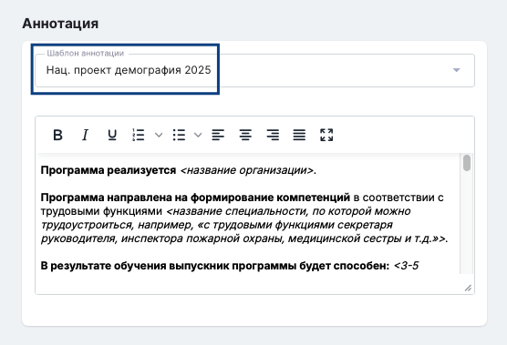

Пошаговая инструкция добавления программы по проекту "Активные меры содействия занятости". Программы будут доступны на портале Работа России (РР).

## **Регистрация организации в Odin**

Регистрация [организации](https://informa.gitbook.io/odin/struktura/organizaciya) возможна (только после прохождения ПКО) через службу поддержки [support@odin.study](mailto:support@odin.study) или [форму](https://www.tgu-dpo.ru/form?answer_choices_9290506=13646025&14243936=14642754) Федерального проекта "Активные меры содействия занятости" ТГУ, также карточку организации может попросить заполнить представитель ФО и список карточек самостоятельно передать в службу поддержки.

Представитель организации, кто будет работать в Odin проходит свободную регистрацию по ссылке <https://www.odin.study/ru/Account/Register> и при обращении в поддержку указывает почту, с которой прошел регистрацию (это необходимо, чтобы ему назначили роль в Odin в его организации).

**Если образовательный партнёр уже был ранее добавлен в Odin, повторная регистрация не требуется.**

## **Добавление Подразделения**

Подразделение - структурная единица организации - следующий шаг для добавления программы дополнительного образования. Если подразделение было создано ранее, повторно добавлять его нет необходимости. [Подробнее](https://informa.gitbook.io/odin/struktura/podrazdelenie)

:::info 

Если ваша организация работает с разными федеральными операторами - создайте для каждого свое подразделение, это поможет аудиторам при проверке. Если программы разных федеральных операторов оказались в одном подразделении, напишите нам на [support@odin.study](mailto:support@odin.study).

:::

## **Добавление Программы дополнительного образования**

[Программы дополнительного образования](https://informa.gitbook.io/odin/struktura/programma/programma-dopolnitelnogo-obrazovaniya) создаются на странице Подразделения в одноименном блоке. При добавлении программы укажите проект.

:::note 

Для программ ДО подходит только одноименный блок, **невозможно** будет передать программу во Flow и далее на портал РР, если вы создадите её в блоке программ основного образования (магистратура и бакалавриат).

:::

{width=573px height=492px}

### **Заполнение аннотации**

Заполненная аннотация - это полное описание программы, которое увидит гражданин при подаче заявки на участие в проекте на портале Работа России. Придерживайтесь представленного образца.

{width=556px height=379px}

Добавленная программа проходит модерацию Федерального оператора во Flow перед размещением на портале РР и должна быть отредактирована представителем образовательного партнёра по запросу проверяющего. [Подробнее](https://informa.gitbook.io/flow-partner/programmy/rabota-s-programmoi)

:::info 

Единожды опубликованную программы на портале Работа России редактировать **запрещено**. **Ранее** исключение составляла аннотация, её можно было отредактировать через запрос в поддержку в любое время, сейчас такой возможности нет.

**В 2025 году аннотацию можно будет отредактировать только после снятия программы с публикации.**

После редактирования потребуется повторная отправка на публикацию и проверка ЦЗН.

Файл "Структура образовательной программы" не отправляется на РР и может быть заменен на другой по согласованию с ФО.

:::

## **Модерация программы ЦЗН**

В 2025 году после отправки программ на портал Работа России, они проходят повторную модерацию в каждом из ЦЗН заявленного региона, в том числе и добавление нового Потока потребует снятие всей программы и повторную проверку. Любая из проверок может привести к отклонению программы ЦЗН, чтобы максимально подготовится и избежать отклонений при проверках, внимательно проверьте данные пункты.

-  Соответствие потребности рынка труда субъекта РФ.

-  Отсутствие противоречий действующему законодательству.

-  Отсутствие признаков дискриминации: по национальному, половом, возрастному признакам.

-  Отсутствие признаков разжигания межнациональной розни.

-  Отсутствие ненормативной лексики.

-  Отсутствие грамматических, орфографических и логических ошибок (проверьте аннотацию программы на соответствие новому шаблону 2025 года, отсутствие опечаток можно проверить например, [тут](https://orfogrammka.ru/)).

-  Корректно введенный адрес электронной почты, телефон (заполняется во Flow).

-  Отсутствие в сведениях информации, не относящейся к образовательной программе.

## **Добавление Потока**

:::note 

**Важно**! Обратите внимание на условия по добавлению Потоков. [Подробнее](https://informa.gitbook.io/flow-partner/potoki-otchyotnye-dokumenty/dobavlenie-potoka)

:::

Каждый новый набор по программе = новый [Поток](https://informa.gitbook.io/odin/struktura/programma/programma-dopolnitelnogo-obrazovaniya/dobavlenie-potoka-do). Даты обучения по каждому Потоку будут переданы на портал РР и гражданин будет записываться именно на конкретный поток. Изменить даты невозможно. Обучение должно быть проведено в установленный срок.

:::info 

На странице Потока в Odin **автоматически будет добавлена Группа** за сутки до даты старта обучения.

:::

Все граждане, кто выбрал аналогичные даты обучения, тоже будут записаны в эту группу. После создания группы всех её студентов можно будет перенести в другие группы **этого же потока**. (Например, чтобы назначить разных кураторов на разные группы или проводить обучение в для группы, обучающейся в дневное и вечернее время).

:::note 

Перенос студентов между потоками невозможен! Даты потока уже зафиксированы в договоре с гражданином и изменять из нельзя.

:::

Документооборот реализован в личном кабинете гражданина и личном кабинете образовательного партнёра. [Подробнее](https://informa.gitbook.io/flow-partner/)

## **Добавление Дисциплины**

В рамках Дисциплины проводится обучение студентов по программе организации.

Дисциплину следует добавить на странице Потока.

При необходимости можно добавить несколько Дисциплин. [Подробнее](https://informa.gitbook.io/odin/struktura/disciplina)