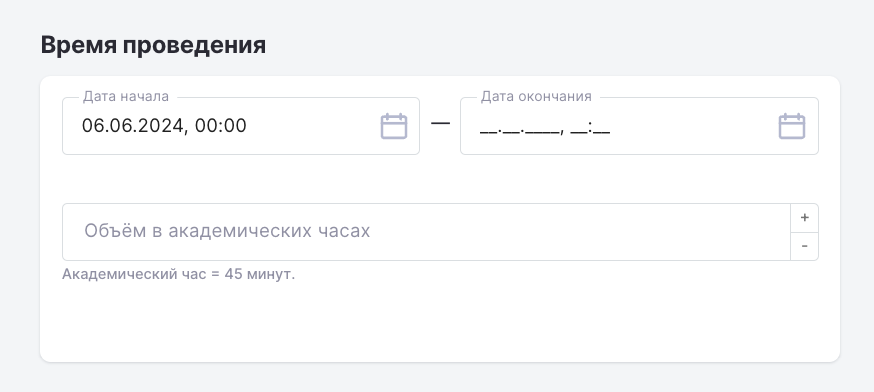
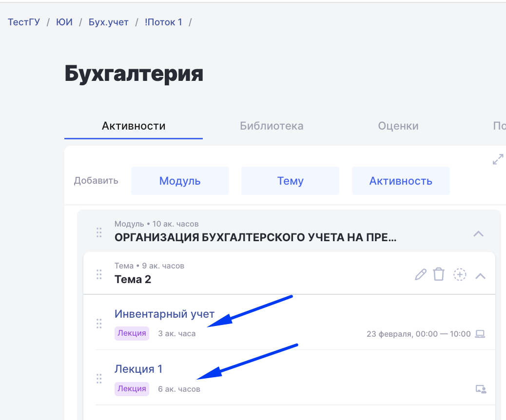
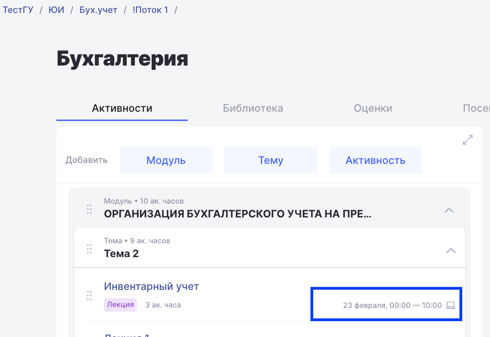
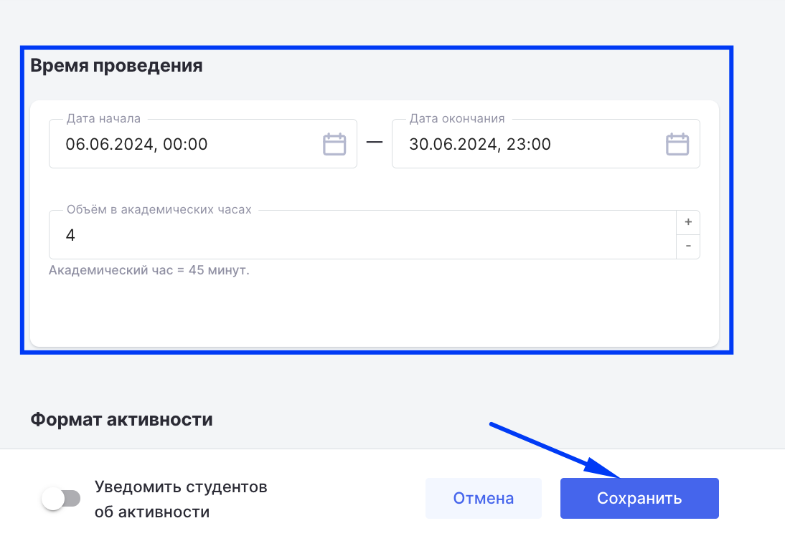
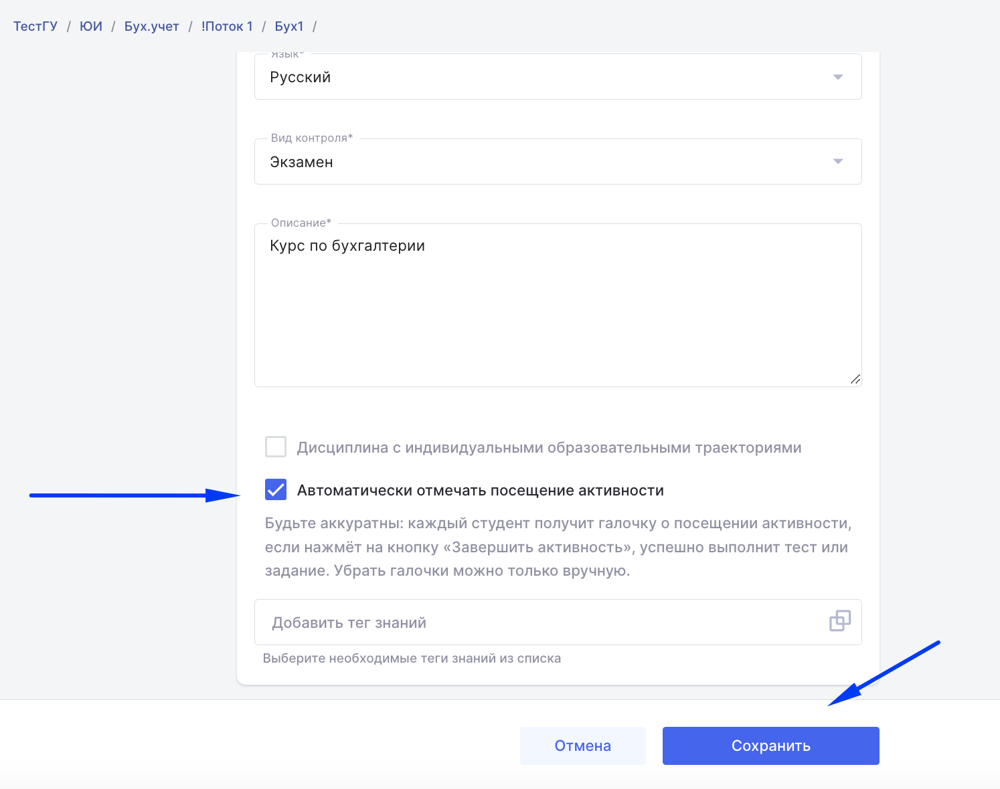
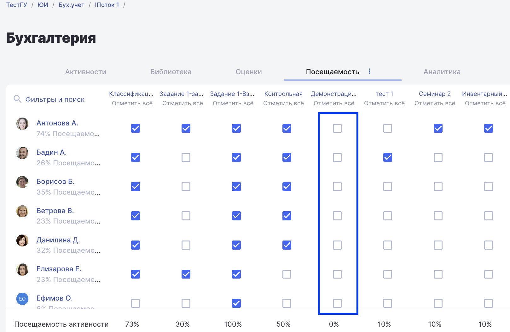

---
{}
---

В проекте 2024 года на портал Работа России необходимо вносить данные об успеваемости/посещаемости. Такие данные по каждому студенту собираются в Odin и в ежедневном режиме передаются во Flow, из Flow необходимо дублировать их на РР. [Подробнее](https://informa.gitbook.io/flow-partner/prikazy-spravki/uspevaemost-poseshaemost)

## **Какие данные необходимо будет переносить на РР?**

-  Количество посещенных занятий (ч)

-  Количество проведенных занятий (ч)

-  Успеваемость

## **Как формируются данные для переноса?**

-  Количество проведенных занятий (ч) - сумма ак. часов во всех активностях с датой окончания в отчетном месяце. **Как формируются данные для переноса?**

   -  Количество проведенных занятий (ч) - сумма ак. часов во всех активностях с датой окончания в отчетном месяце.

:::note 

Если в активности нет **даты окончани**я или не заполнено поле "**Объём в академических часах**", такая активность не будет учитываться при формировании данных для РР.

:::

{width=874px height=392px}

-  Количество посещенных занятий (ч) - галочки во вкладке "Посещаемость" на странице Дисциплины.

-  Успеваемость - подробнее о расчёте:

   1. Определяется общее количество активностей типа "Задание" и "Контрольная", которые завершаются в расчётном месяце (за исключением последних 6 дней месяца - если дата проведения активности попадает в этот период, то она не попадает в общее количество активностей). У активности обязательно должна быть указана дата окончания, чтобы она попала в выборку.

   2. Для студентов определяются активности из выборки в пункте 1, которые были успешно пройдены.

   3. Находится соотношение общего количества активностей из пункта 1 к пройденным студентом из пункта 2.

      1. Если в потоке совсем нет активностей из пункта 1 в расчётном месяце или студентом успешно пройдено >= 50%, то считается, что студент успевает в этом месяце

      2. Если \<50% - не успевает.

:::info 

Обратите внимание, если в активности с типом "Задание" для студента установлен индивидуальный срок сдачи решения, то данный срок учитывается в пункте 1, а не общая дата завершения активности.

:::

## **Что необходимо сделать для корректного формирования данных?**

1. Указать объем каждой активности в Odin: Лекции, Практики, Самостоятельной, Семинара, Задания и др.) в академических часах ( в соответствии с утвержденным учебно-тематическим планом) для формирования нормативного объема материалов (учитывается количество академических часов в календарный месяц, а не количество занятий с начала реализации потока).

2. {width=1038px height=862px}

3. Выставить даты проведения занятий (время не учитывается).

4. {width=1060px height=730px}

5. Обозначить период освоения материалов для самостоятельного изучения (например, в активности Самостоятельная допустимо выставить период, который должен укладываться в календарный месяц, в течение которого осваивается основной обучающий материал соответствующего раздела, то есть возможно указание периода с начала обучения до последнего дня месяца, затем с первого дня следующего месяца по последний день и т.д.)

6. Для промежуточного контроля необходимо зафиксировать сроки сдачи (для активностей Контрольная, Задание проставить дату окончания и максимально допустимое время, например, 23:00)

7. {width=1094px height=762px}

8. Выставить настройку в Дисциплине "Автоматически отмечать посещение активности".

9. {width=1494px height=1180px}

10. Напомнить Студентам о необходимости нажимать на кнопку "Завершить активность" - для активностей всех типов кроме Заданий и Контрольных (для этих активностей важно выполнить задание и получить оценку от преподавателя/успешно сдать тест)

## **Частые вопросы/проблемы**

### **Что проверить, если студент учится, но нулевая/низкая посещаемость?**

При создании/редактировании Дисциплины не отмечена галочка «Автоматически отмечать посещение активности». Отметьте её, если необходима автоматическая фиксация.

Преподаватели, кто вручную фиксирует посещаемость, необходимо системно отмечать посещаемость в активностях (если активности асинхронные, то выставить отметку о посещении необходимо на основании данных со страницы студента из блока "**Пройденные активности**").

И автоматическая, и ручная фиксация посещаемости передаются во Flow.

{width=1618px height=1056px}

### **Количество посещенных занятий (ч) равно нулю/очень маленькое**

Если выставлена галочка «Автоматически отмечать посещение активности», то причина только в том, что студент просматривает материалы, но не нажимает на кнопку "Завершить активность".

:::info 

Важно, чтобы Студент завершил активность (сдал тест/получил оценку за задание) в соответствующим активности календарном месяце.

:::

### **Количество проведенных занятий (ч) не соответствует равно нулю или не совпадает с запланированным в УТП объемом обучающих материалов.**

Не проставлены объемы академических часов на странице создания/редактирования Активности.

### **Не успевает, но активно учится**

-  Не сдал успешно более 50 процентов Контрольных/Заданий, запланированных в текущем месяце.

-  Не отправил решение в Задании в установленный срок.

-  Работа Студента не проверена преподавателем.