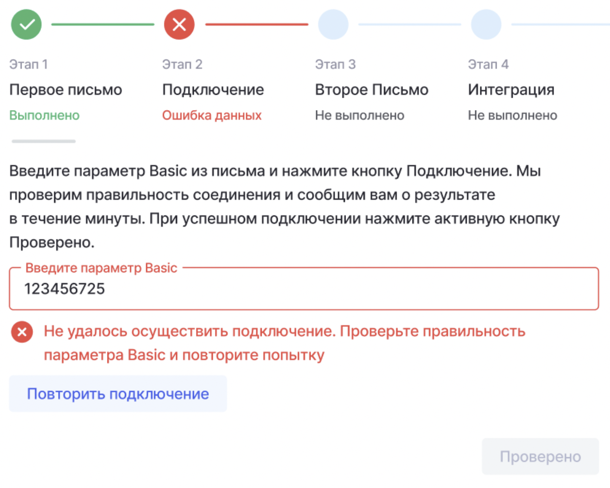

Для того, чтобы организации, работающие в Odin, могли участвовать в проекте У2035 - “Код Будущего”, реализована интеграция с у2035 для дальнейшей передачи организациями цифрового следа в формате xAPI.

В разделе “Интеграция с У2035” есть карточка интеграции.

{width=1098px height=698px}

По нажатию на карточку проекта пользователь перейдет к настройке интеграции. Настройка интеграции состоит из 4 этапов, на каждом из которых надо совершить какое-либо действие.

{width=1204px height=1022px}

**Этап 1**

Здесь показывается кнопка “Скопировать шаблон”, этот шаблон генерируется в системе и по нажатию на кнопку у пользователя копируется в буфер обмена.

Текст шаблона:

*Тема письма (вставьте в тему отправляемого сообщения):*

\*Доступ к тестовому External LRS, `название проекта` \*(вставляем константу "Код Будущего"), \*`название организации` \*(название необходимо подставить, основываясь на полном названии организации в Odin)

*Содержимое письма (оставьте в тексте письма):*

*Просим выдать логин, пароль и basic auth токен к External LRS.*

*Для какого контура: Тестовый.*

*Организация:* \*`название организации` \*(название необходимо подставить, основываясь на полном названии организации в Odin)

*Название проекта, в рамках которого проходит интеграция: Код Будущего*

`ID организации на Платформе: (вы можете найти ваш ID в адресной строке в` [`ЛК Каталога`](https://cat.2035.university/org-cabinet/) \*`-`[  https://cat.2035.university/org-cabinet/](https://cat.2035.university/org-cabinet/) `)` \*(просто вставляем данный текст).

А также отобразится кнопка “Данные у меня”, по нажатию на которую пользователь должен перейдет к этапу 2.

{width=1290px height=1204px}

При переходе на этот этап изменяется статус первого этапа на “выполнено”, а второго на “в процессе”. Здесь же отображается поле для ввода Basic и кнопка подключения.

После того как пользователь введет Basic и нажмет подключение, отправятся GET и POST запросы к тестовому хранилищу У2035 в соответствии с их [документацией](https://wiki.2035.university/pages/viewpage.action?pageId=198869541).

Пока ожидается ответ от У2035, показывается спиннер:

{width=1780px height=1232px}

Если все хорошо, то показывается успешный статус подключения на этом этапе и разблокируется кнопка “Проверено”.

{width=1810px height=1248px}

Если что-то пошло не так, то отражается ошибка:

{width=1636px height=1312px}

В случае успеха из ответа на POST-запрос автоматически забирается guid, он  потребуется на следующем этапе.

**Этап 3**

На этом шаге требуется получить доступ уже к промышленному контуру.

Пользователю показывается кнопка “Скопировать шаблон”, этот шаблон генерируется, а по нажатию на кнопку у пользователя он копируется в буфер обмена.

{width=1248px height=1130px}

Текст шаблона:

*Тема письма (вставьте в тему отправляемого сообщения):*

*Доступ к продуктовому External LRS*\*,\* `название проекта` (вставляем константу "БАС") \*, `название организации` \*(название необходимо подставить, основываясь на полном названии организации в Odin)

*Содержимое письма (оставьте в тексте письма):*

*Просим выдать логин, пароль и basic auth токен к External LRS.*

*Для какого контура:* *Промышленный*

*Организация:* `название организации` (название необходимо подставить, основываясь на полном названии организации в Odin)

*Название проекта, в рамках которого проходит интеграция: Код Будущего*

`ID организации на Платформе: (вы можете найти ваш ID в адресной строке в` [`ЛК Каталога`](https://cat.2035.university/org-cabinet/) \*`-` \* [  https://cat.2035.university/org-cabinet/](https://cat.2035.university/org-cabinet/) `)` (просто вставляем данный текст)

*ID стейтмента тестового результата загрузки:* (необходимо подставить guid, полученный от У2035 в рамках этапа 2)

По нажатию на кнопку “Данные у меня” пользователь попадает на этап 4.

**Этап 4**

{width=1058px height=1218px}

Если данный этап пользователь проходит успешно, то интеграция считается завершенной, и меняется статус на странице интеграций с У2035 на «Активен».