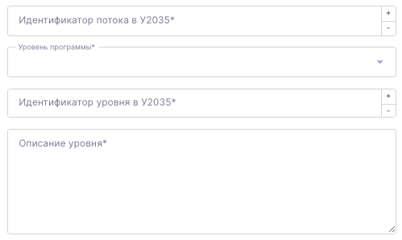

Информация актуальна для тех операторов, кто не пользуется системой Flow, а пользуется только Odin. Во Flow же сразу будут вноситься эти параметры и передаваться автоматически в Odin вместе с потоками.

Для корректной передачи цифрового следа по проекту «Код Будущего» доработаны страницы создания/редактирования программы и потока.

Если на странице редактирования программы в поле "Образовательный проект" выбирается "Код Будущего" и указывается год набора "2025", то на странице редактирования потока будут отображаться:

-  Поле «Идентификатор потока в У2035», обязательное для заполнения (если выбран любой уровень программы, кроме «Демо»)

-  Выпадающий список «Уровень программы» со значениями: Начальный, Базовый, Продвинутый, Профессиональный, Демо

-  Поле «Описание уровня» (если выбран любой уровень программы, кроме «Демо»)

   {width=499px height=298px}

А на странице программы надо будет указать Идентификатор курса в У2035 и добавить Методиста.