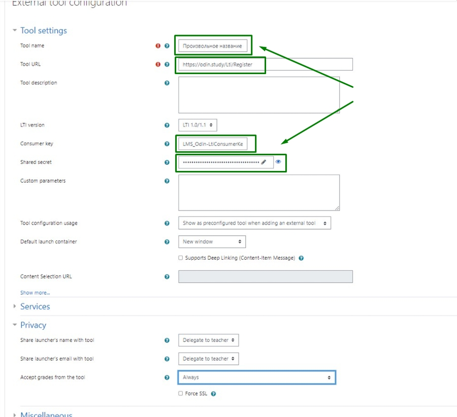
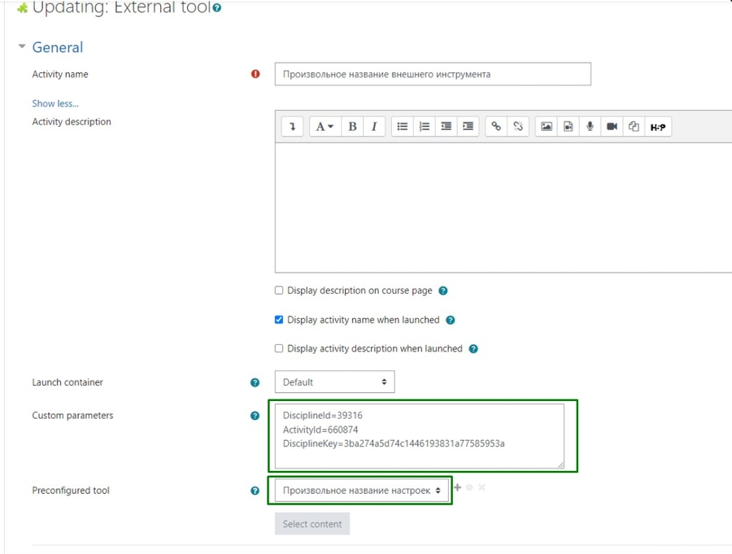

Ваши студенты обучались на платформе Moodle? Подготовьте ссылку, по которой они смогут перейти к дисциплине в Odin, для продолжения обучения.

### Настройка ссылки для перехода из Moodle в Odin

#### 1\. Перейдите в раздел "Администрирование" - >  "Обзор плагинов" и выберите "Внешний инструмент".

.png>)

#### 2\. Нажмите "Добавить предварительно настроенный инструмент".

#### 3\. Заполните информацию об инструменте

-  Поле "**Название**" может быть задано произвольным образом

-  Скопируйте и вставьте эту ссылку в поле "**базовый URL**" <https://odin.study/Lti/Register>\
   Базовый URL один для всех создаваемых переходов из Moodle в Odin.

-  Внесите данные в поле "**Ключ клиента**" - **LMS_Odin-LtiConsumerKey** (один для всех дисциплин).

Заполните поле "**Секретный ключ**". Секретный ключ предоставляется каждой образовательной организации в индивидуальном порядке.

{width=900px height=822px}

#### 4\. Перейдите **на страницу вашего курса** в системе Moodle и нажмите **"Режим редактирования блоков"** .

 (2) (1).png>)

#### 5\. Добавьте \*\*"\*\*Элемент или ресурс" и выберите "Внешний инструмент".

 (2) (1).png>)

#### 6\. Укажите название ссылки - это название будет видеть студент на странице курса в Moodle и выберите предварительно настроенный инструмент. В нашем примере  - Переезд.

**7\. Нажмите на кнопку "Показать больше", чтобы заполнить дополнительные параметры.**

{width=900px height=681px}

\
Скопируйте и вставьте пользовательские параметры:\
\
**DisciplineId=\*\*\*** (где \*\*\*  - id вашей дисциплины в Odin. Параметр **обязателен** для заполнения).\
**ActivityId=\*\*\*** (где \*\*\* - id активности в Odin. Параметр **не обязателен** для заполнения. Для перехода в дисциплину достаточно указать только DisciplineId).\
**DisciplineKey=\*\*\*** (где \*\*\* - секретный ключ для **этой** дисциплины. Параметр **обязателен** для заполнения).

Где взять секретный ключ для дисциплины?

На странице дисциплины по кнопке "Интеграция с Moodle".

 (1) (3).png>)

### Переход в Odin

Для перехода в  Odin студент в  Moodle должен будет  кликнуть по ссылке "Переезд в Odin". Ссылка будет доступна ему на странице курса. Далее студент сможет продолжить обучение по диcциплине, созданной в системе Odin.

:::info 

Обратите внимание, что студенты должны быть зарегистрированы в [Оdin](https://odin.study/ru) под тем же email, что и в Moodle.\
При первом переходе по ссылке на дисциплину в Odin потребуется авторизоваться.

:::

