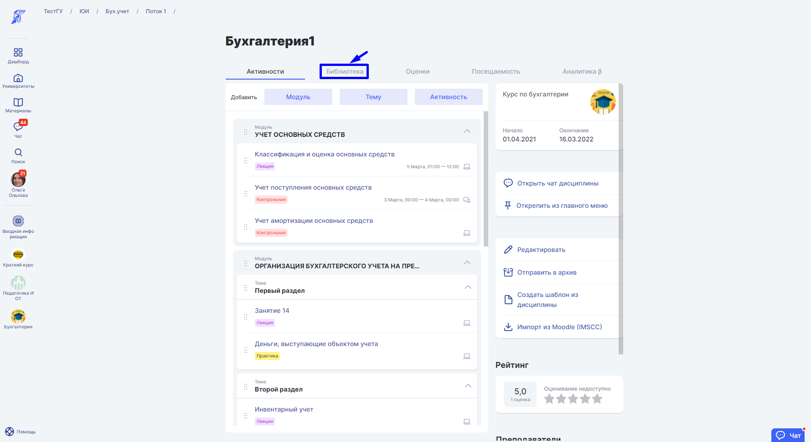
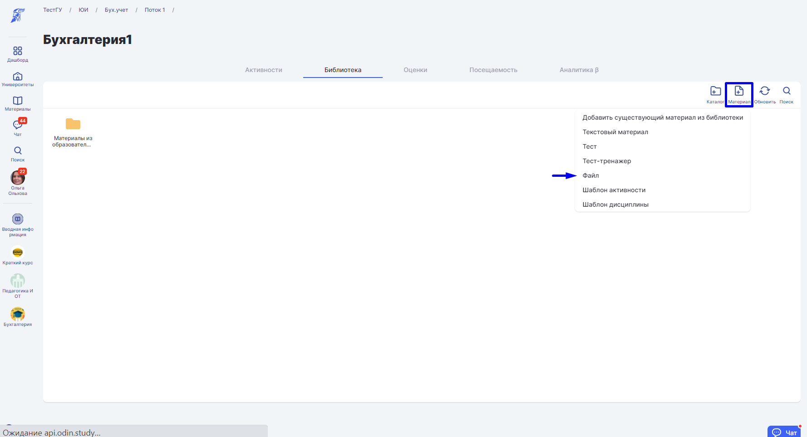
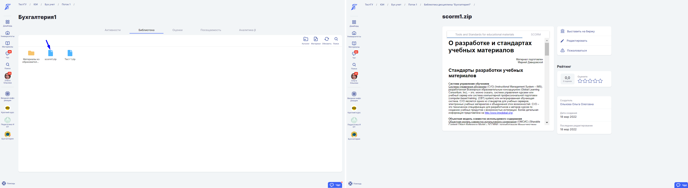

# Импорт SCORM - пакетов

В ODIN пакеты существуют в формате [материалов](../../servisy/biblioteka/materialy/). Добавление SCORM материала осуществляется так же, как и с другими материалами-файлами. [Подробнее](../../servisy/biblioteka/dobavlenie-materialov.md)

Чтобы загрузить scorm-пакет в архиве с расширением zip в библиотеку, зайдите на страницу [дисциплины](../../struktura/disciplina/) и выберете раздел "[Библиотека](../../servisy/biblioteka/)".

Чтобы добавить scorm-пакет, выберете "Файл" в разделе "[Материал](../../servisy/biblioteka/materialy/)".

Перенесите файлы в дропзону или нажмите на неё, чтобы загрузить scorm-пакет. Нажмите кнопку "Добавить".

.png>)

​ При необходимости отредактируйте или удалите материал. [Подробнее](../../servisy/biblioteka/udalenie-materialov.md)

