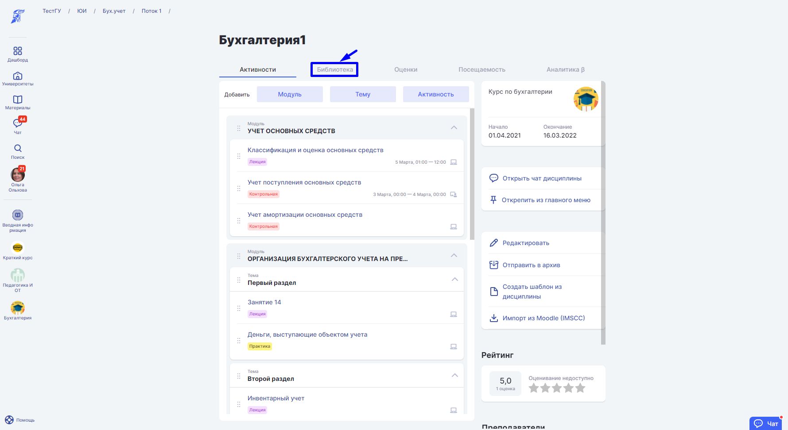
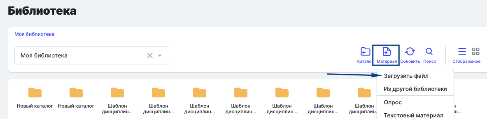

В ODIN пакеты существуют в формате [материалов](./../../servisy/biblioteka/materialy/_index). Добавление SCORM материала осуществляется так же, как и с другими материалами-файлами. [Подробнее](./../../servisy/biblioteka/dobavlenie-materialov)

Чтобы загрузить scorm-пакет в архиве с расширением zip в библиотеку, зайдите на страницу [дисциплины](./../../struktura/disciplina/_index) и выберете раздел "[Библиотека](./../../servisy/biblioteka/_index)".

Чтобы добавить scorm-пакет, выберете "Файл" в разделе "[Материал](./../../servisy/biblioteka/materialy/_index)".

{width=1183px height=292px}

Перенесите файлы в дропзону или нажмите на неё, чтобы загрузить scorm-пакет. Нажмите кнопку "Добавить".

{width=555px height=274px}

​ При необходимости отредактируйте или удалите материал. [Подробнее](./../../servisy/biblioteka/udalenie-materialov)

