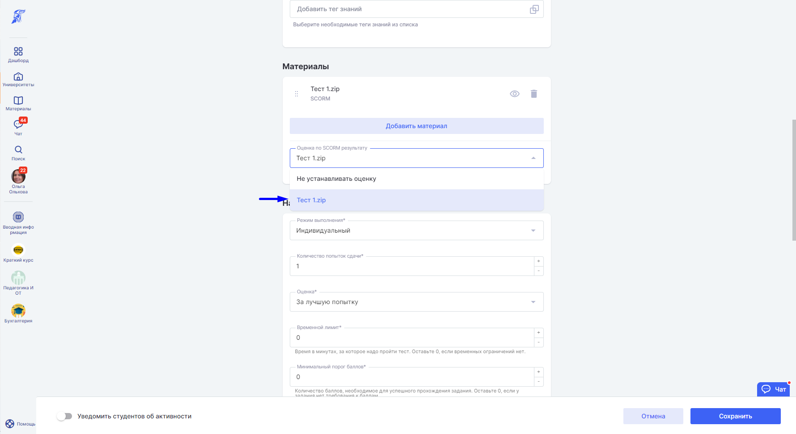
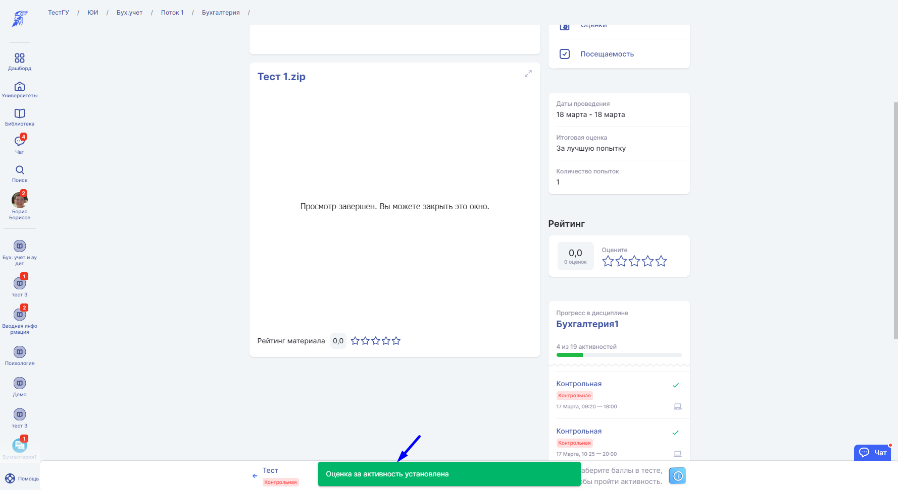
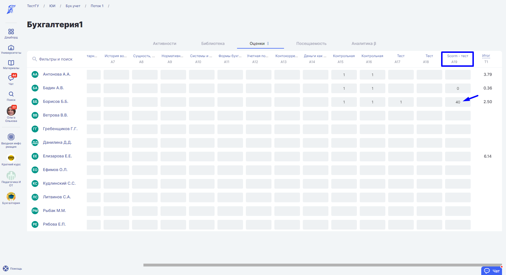

# Оценка за SCORM - тест

В таблице **Оценок** на странице [**Дисциплины**](../../struktura/disciplina/) **есть возможность** автоматического отображения **оценки за тест** в формате **Scorm.**\
Чтобы оценка попала в таблицу оценок после того, как студент прошел Scorm-тест на странице создания/редактирования [**Активности**](../../struktura/aktivnosti/)**,** в блоке [**Материалы**](../../servisy/biblioteka/materialy/) и [**тесты**](../../servisy/biblioteka/materialy/test/)**,** выберете тот scorm - пакет, по которому будет выставлена оценка.&#x20;

Чтобы установить оценку за образовательную активность на основе результатов выполнения теста, на странице создания активности, в графе "Оценка по SCROM результату", выберете нужный материал.\

После прохождения теста на странице активности нажмите на соответствующую кнопку завершения.

После завершения теста появится уведомление "Оценка за активность установлена".

В **таблицу оценок** попадёт **последняя** полученная за Scorm-тест **оценка**.

