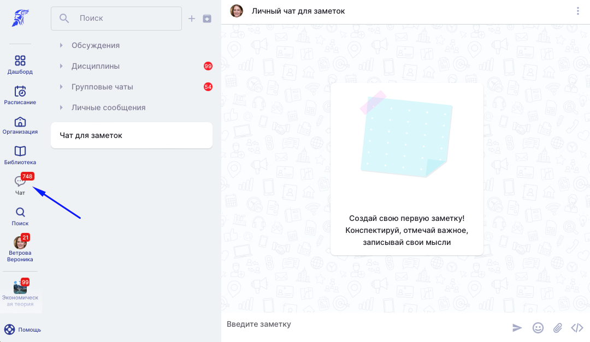
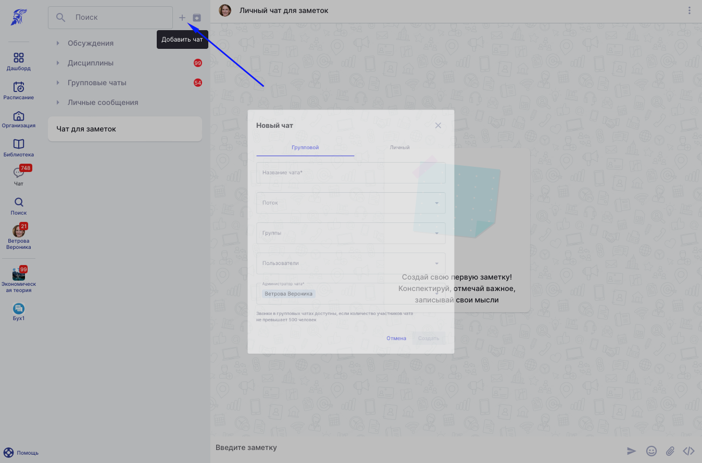
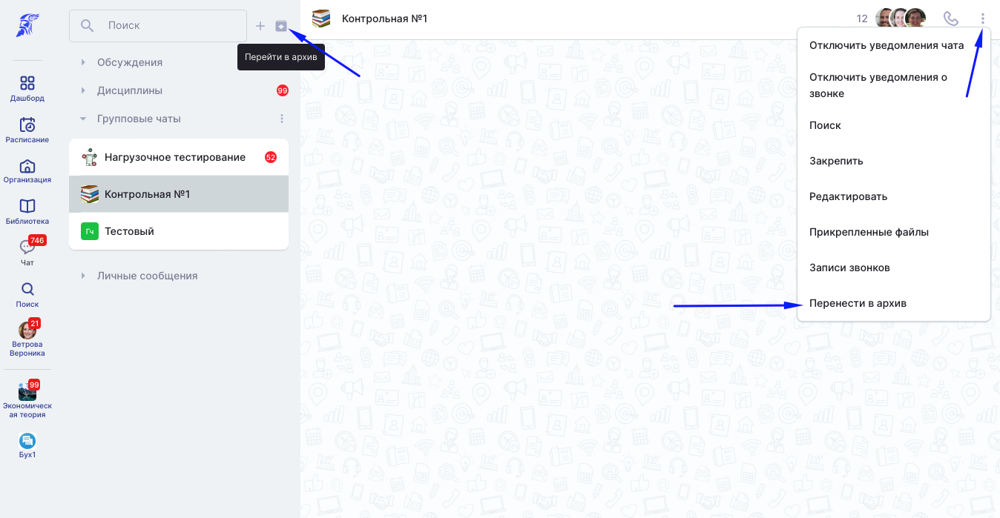

[view:hierarchy=none::::List]

**Чат** - сервис в Odin для мгновенного обмена сообщениями.

В системе доступны следующие типы чатов:

-  **Чаты Дисциплин**, где обсуждаются важные вопросы в рамках обучения. Если в дисциплине не планируется использовать чат, то его можно отключить на странице редактирования Дисциплины.

:::info 

В рамках 1 дисциплины могут быть созданы несколько чатов - [комнат](https://informa.gitbook.io/odin/kommunikaciya/chat/komnata-discipliny).

:::

-  **Чаты решений** в активностях с типом [Задание](https://informa.gitbook.io/odin/struktura/aktivnosti/zadanie). Преподаватель может обсудить решение со студентом. Если включен режим "Решения открыты всем" на странице редактирования задания, то в чате решений могут общаться все студенты с доступом к этому Заданию.

-  **Групповые чаты** - чаты, где вы являетесь участником. Например, чат потока.

-  **Личные чаты** - ваш чат для заметок и личные чаты с другими пользователями Odin.

:::info 

Все **Чаты**, в которых вы являетесь участником, доступны в меню для быстрого перехода. Счетчик уведомлений показывает количество новых уведомлений в каждом чате.

:::

{width=1080px height=627px}

### **Как добавить чат?**

:::note 

Не создавайте лишние чаты!

Чаты в Odin необходимо создавать только для быстрой коммуникации в образовательных целях.

:::

Каждый пользователь может создать личный или групповой Чат с другими пользователями системы в рамках своей организации. Для создания необходимо нажать на значок , выбрать тип чата и его участников. Личный чат также можно начать со страницы профиля пользователя, к которому есть доступ.

:::info 

Студенты не могут создавать групповые чаты.

:::

{width=1348px height=891px}

### **Как удалить чат?**

Удалить Чат нельзя, но если вы являетесь его создателем, то можете перенести групповой чат в архив. Личные чаты и чаты дисциплин заархивировать нельзя.

{width=1348px height=699px}