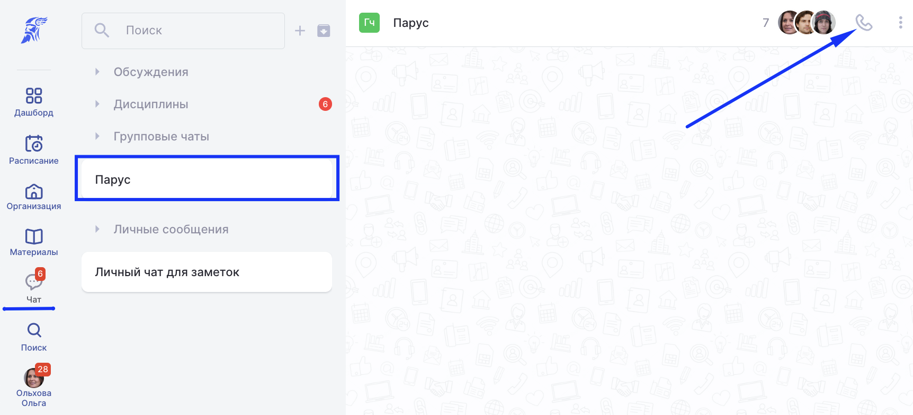
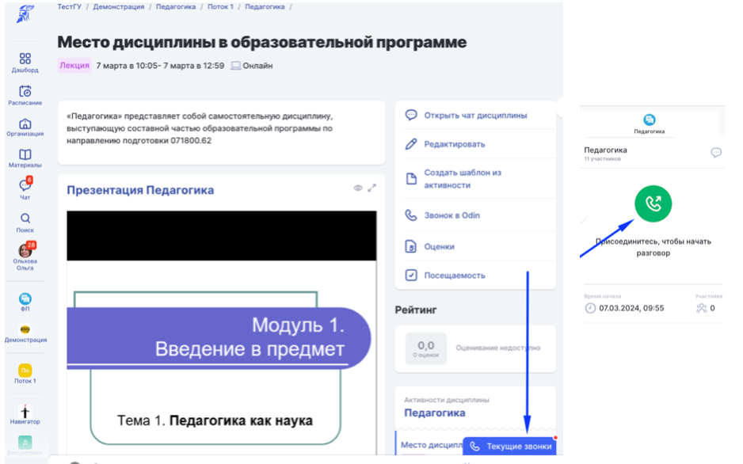
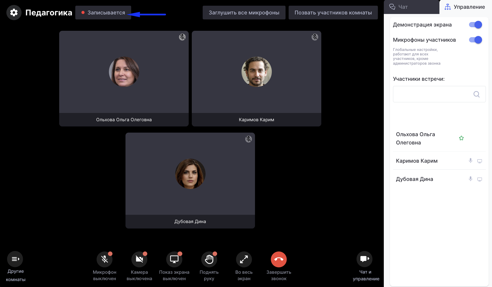
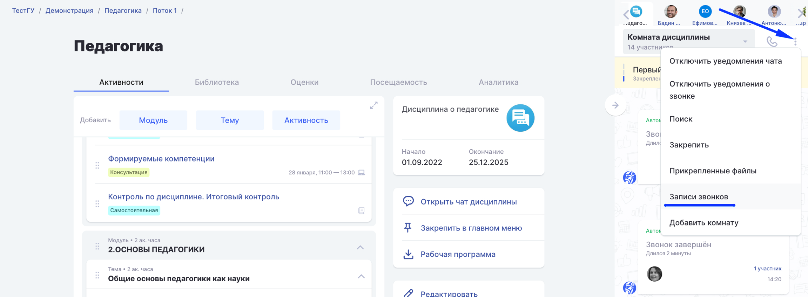

[view:hierarchy=none::::List]

Видеозвонки - сервис системы для проведения онлайн-занятий или видеоконференций.

:::info 

Рекомендуемое количество участников 100, но строгий запрет на количество присоединившихся не установлен.

:::

Позвонить можно в любом из [чатов](https://informa.gitbook.io/odin/kommunikaciya/chat) Odin или использовать видеозвонок как формат проведения [Активности](https://informa.gitbook.io/odin/struktura/aktivnosti).

Звонок в **Чате** начинает **пользователь**, [звонок в **Активности**](https://informa.gitbook.io/odin/kommunikaciya/videozvonki/dobavlenie-videozvonka-v-aktivnost) может начаться **автоматически** за 10 минут до времени её начала, если установлено время проведения и выбран формат "Звонок в Odin".

{width=1724px height=786px}

Звонок в чате. В примере групповой чат

{width=938px height=586px}

Звонок в активности дисциплины

Звонок доступен для всех пользователей с доступом к активности/чату. У каждого участника после начала звонка появится уведомление и возможность ответить на звонок.

Во время звонка администратор может включить запись, заглушить микрофоны, дополнительно позвать всех участников.

Если звонок проводится в чате Дисциплины или в Активности и предварительно созданы [комнаты](https://informa.gitbook.io/odin/kommunikaciya/chat/komnata-discipliny), то во время звонка возможно переходить между ними.

{width=2078px height=1212px}

## **Где будет запись звонка?**

Запись звонка, если она будет включена во время его проведения, будет доступна в чате, где он проводился: групповой, личный, чат дисциплины.

{width=2304px height=848px}

:::note 

Запись [звонка в Активности](https://informa.gitbook.io/odin/kommunikaciya/videozvonki/dobavlenie-videozvonka-v-aktivnost) также будет видна в чате дисциплины и автоматически станет материалом данной Активности.

:::