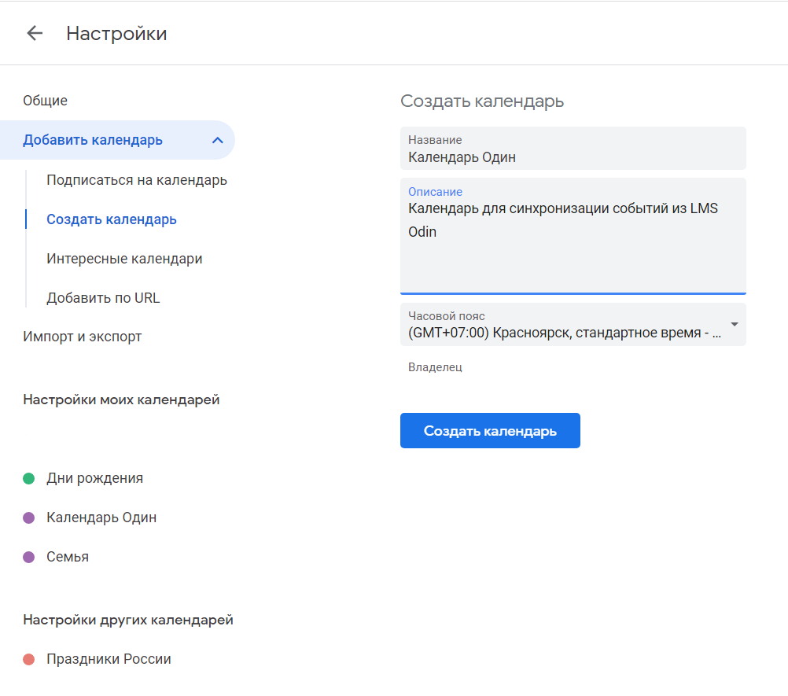
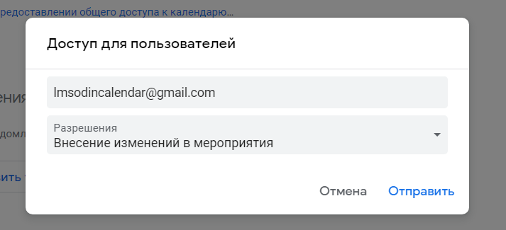

Процесс настройки синхронизации календаря Odin с Google Calendar включает 3 этапа:

1\.     Создание в Google Calendar отдельного календаря, в который будет производиться импорт событий.

2\.     Предоставление доступа к созданному Google календарю системному пользователю Odin.

3\.     Указание идентификатора созданного Google календаря в Odin и проверка подключения.

### Создание нового календаря в Google Календаре

Шаг 1. Перейдите на страницу сервиса <https://calendar.google.com/calendar/>.

Шаг 2. В интерфейсе управления календарями в разделе «Другие календари» нажмите на кнопку «+» и в выпадающем меню выберите пункт «Создать календарь».

.png>)

Шаг 3. В появившемся интерфейсе заполните Название, Описание календаря (название и описание могут быть любыми) и Часовой пояс, в котором будет отображено время событий. Для сохранения нажмите кнопку «Создать календарь».

Шаг 4. Для настройки доступа к календарю откройте выпадающее меню кнопкой «…», расположенной напротив названия календаря в списке, и выберите пункт «Настройки и общий доступ».

 (3) (1).png>)

Шаг 5. В появившемся интерфейсе найдите раздел «Доступ для отдельных пользователей» и нажмите на кнопку «Добавить пользователей».

.png>)

Шаг 6. В появившемся диалоговом окне введите имя системной учетной записи Odin – service@lmsodincalendar.iam.gserviceaccount.com, укажите разрешение – «Внесение изменений в мероприятия» и нажмите «Отправить».

На этой же странице в левом меню перейдите в раздел «Интеграция календаря». Скопируйте «Идентификатор календаря» и вставьте значение в соответствующее поле Odin.

.png>)

### Добавление Google Календаря в Odin

Для указания идентификатора календаря и включения синхронизации в Odin перейдите на страницу «Расписание», откройте меню настроек, нажав соответствующую кнопку, и выберите пункт «Включить синхронизацию с Google календарем».

.png>)

В появившемся диалоговом окне укажите идентификатор Google календаря, полученный ранее, и нажмите «Подключить». Если подключение прошло успешно, Вы увидите соответствующее информационное сообщение.

.png>)

### Удаление Google Календаря из Odin

Если необходимо отключить синхронизацию или изменить идентификатор календаря, воспользуйтесь пунктом меню «Отключить синхронизацию с Google календарем»  на странице Расписания, открыв настроки.

 (2).png>)

:::info 

Для изменения идентификатора сначала отключите синхронизацию,  затем снова включите, указав другой идентификатор.

:::