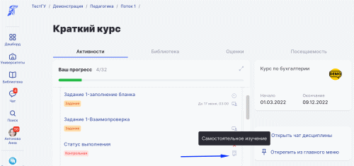

# Активности для самостоятельного изучения

Ранее используемый формат активности “Онлайн” - “Асинхронная”  был актуализирован в новый формат - “**Самостоятельное изучение**”. \
Для студентов не совсем было очевидно, что онлайн-активность в асинхронном формате требует самостоятельной работы. Новый формат проведения активности должен четко пояснить, что изучить активность необходимом самому.&#x20;

Для включения нового формата проведения занятий на странице редактирования активности в блоке "Формат активности" включите "Самостоятельное изучение".

<figure><figcaption></figcaption></figure>

Студенты на странице активности, дисциплины и в календаре увидят, что данная активность предназначена для самостоятельного изучения.

<figure><figcaption></figcaption></figure>


Все активности с форматом проведения “Онлайн” - “Асинхронная”  автоматически  будут изменены на “Самостоятельное изучение”.


14.09.2022
