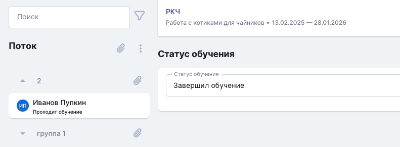

При загрузке страницы завершения обучения  автоматически буден выбран первый в списке студент, у которого статус «Проходит экзамен/Проходит обучение» и сразу отобразится его результат.

Если студентов с таким статусом нет, то автоматически выберется просто первый в списке студент и сразу покажется его результат.

{width=791px height=291px}

14\.04.2026