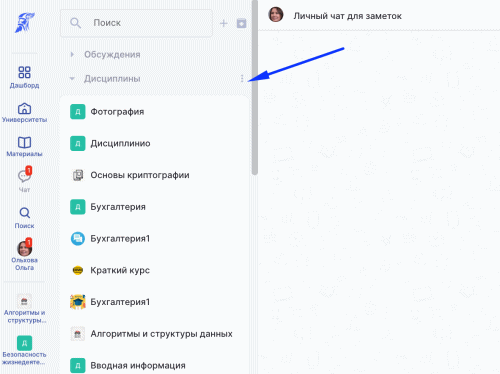

# Cортировка чатов в списке

Чтобы отсортировать Чаты, нажмите на три точки рядом с той группой чатов, которую хотите отсортировать и выберите признак для сортировки **по алфавиту** или **недавние**. &#x20;

<figure><figcaption></figcaption></figure>


Каждую группу чатов можно отсортировать отдельно. Например, личные чаты по алфавиту,  а чаты дисциплин по недавним сообщениям.&#x20;


14.09.2022
