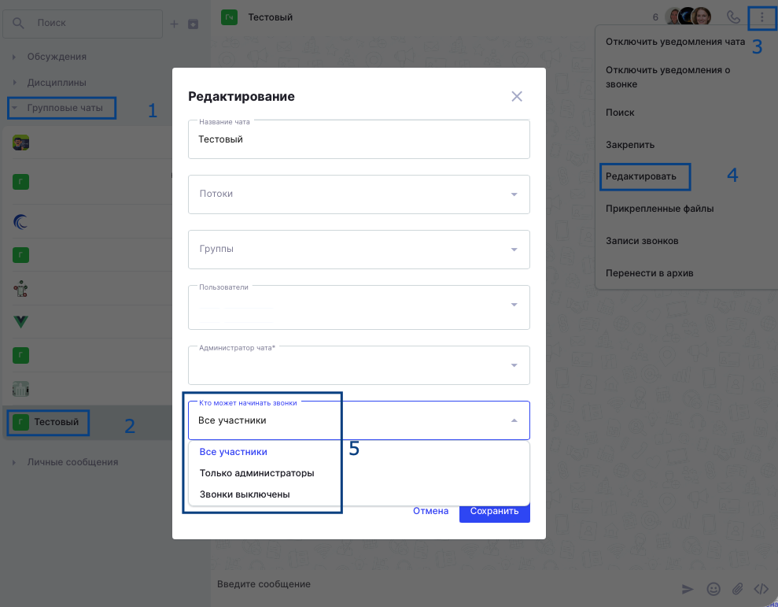

Ранее в групповых чатах звонки были доступны всегда. Однако, существуют такие групповые чаты в которых звонки не надо включать.

В связи с этим реализована возможность управления звонками в групповых чатах. Для этого при редактировании чатов можно выбрать "Кто может начинать звонки":

-  Все участники (дефолтное состояние)

-  Только администраторы

-  Звонки выключены

{width=989px height=771px}

Если установлена опция "Все участники", то все остается как было, то есть каждый может начать групповой звонок.

Если установлена опция "Только администраторы", то:

-  Для администраторов все остается как есть

-  Обычные участники чата увидят иконку запуска звонка, но она будет неактивна, по наведению появится тултип "Только администраторы могут начать звонок"

Если установлена опция "Звонки выключены", то кнопку начала звонков никто из участников не видит.

09\.09.2026