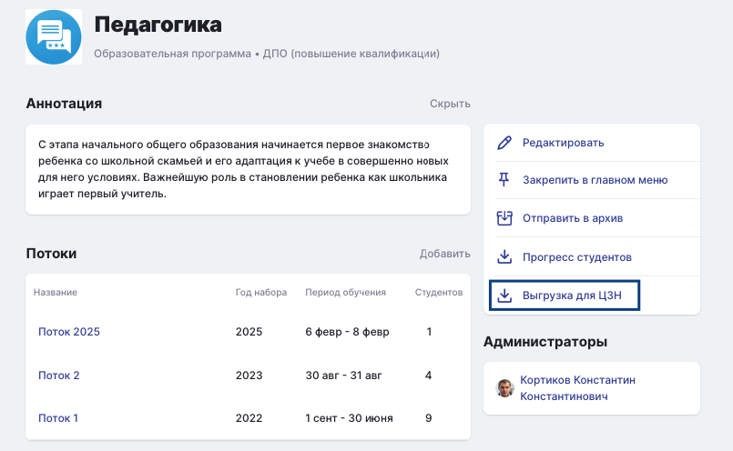

# Новый тип вопроса в тесте

Появился новый тип вопросов в тестах - заполнение пропусков.&#x20;

У данного типа есть дополнительные настройки:

* Регистрозависимые поля (Да, Нет) - в местах, где студенту надо будет ввести точный ответ, настройка влияет на автоматическую проверку, учитывая введено значение с заглавной буквы или нет (например, Москва или москва)
* Оценка вопроса (Все ответы верны, За каждый правильный ответ) - отвечает за то, как будет оцениваться вопрос: единый балл, если все ответы верны или будут суммироваться баллы за каждый правильный ответ.
* Общее количество баллов за вопрос - балл, который можно получить при корректном ответе на вопрос. Данная настройка зависима от значения в поле "Оценка вопроса" и показывается при установленном "Все ответы верны".

При создании вопроса есть две кнопки "Точный ответ" и "Свободный ответ":

* Точный ответ - это ответ студента, который должен точно совпадать с тем, что укажет создатель вопроса.
* Свободный ответ - это ответ студента в свободной форме, который заранее не определен. Такой ответ нельзя будет проверить автоматически.

Чтобы добавить место для ввода ответа студентом, создателю теста надо будет нажать на одну из кнопок (в зависимости от того, что студент должен будет вписать). После чего на месте, где был курсор, появится соответствующая кнопка:

<figure><figcaption></figcaption></figure>

Если пользователь добавил опцию для точного ответа, то ему необходимо будет вписать в этот элемент точный ответ, который он ожидает от студента. Если свободный ответ, то вписывать ничего не надо.

Если в настройке "Оценка вопроса" стоит значение "За каждый правильный ответ", то рядом с рамкой для ввода появляется еще одно окошко для ввода балла за конкретный ответ, а в правом верхнем углу показывается сумма баллов (общий балл).

<figure><figcaption></figcaption></figure>

Если в вопросе присутствуют только "точные ответы", то вопрос проверяется автоматически. Если в вопросе присутствуют и точные ответы, и свободные ответы, либо только свободные ответы, то автоматически проверяются точные ответы (при их наличии), свободные ответы будут ожидать ручной проверки. Если студент не дал ответа, сразу засчитывается как 0 баллов. После ввода баллов за каждый ответ необходимо пользователю нажимать кнопку "Оценить", чтобы оценка сохранилась.

29.05.2025
