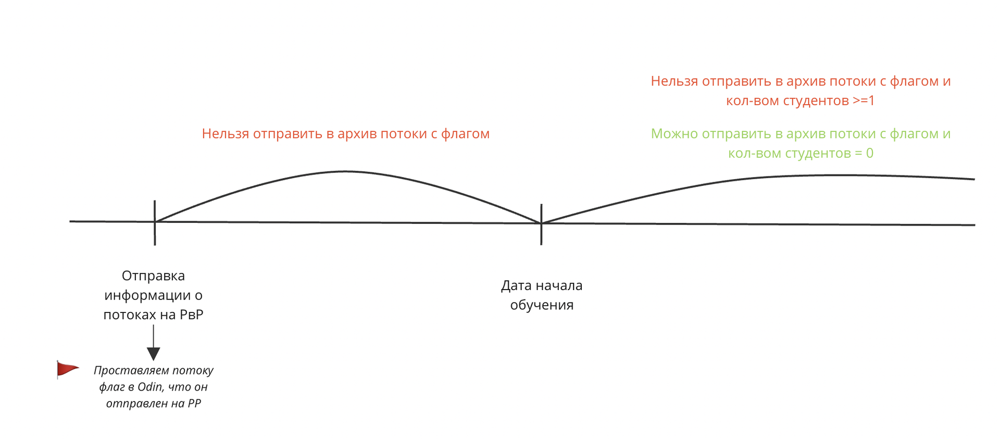

Для этого реализовано следующее:

При отправке программы и информации о потоках в рамках проекта на РР Flow в Odin для такого потока проставляется флаг, сигнализирующий о том, что данный поток опубликован на РР.

Если проставлен указанный флаг, то запрещена отправка данного потока в архив:

-  На странице потока кнопка “Отправить в архив” будет неактивна

-  По наведению на “Отправить в архив” показывается тултип “Отправка в архив невозможна, так как возможна запись на обучение в данный поток на портале Работа России”

 (1) (1) (1) (1) (1) (1) (1) (1) (1) (1) (1) (1) (1) (1) (1) (1) (1) (1) (1) (1) (1) (1) (1) (1) (1) (1) (1) (1) (1) (1) (1) (1) (1) (1) (1) (1) (1) (1) (1) (1).png>)

В случае, если одновременно соблюдаются следующие условия: для потока проставлен вышеуказанный флаг; дата начала обучения наступила, количество студентов в данном потоке = 0, то **разблокируется возможность отправить данный поток в архив**.

13\.03.2024