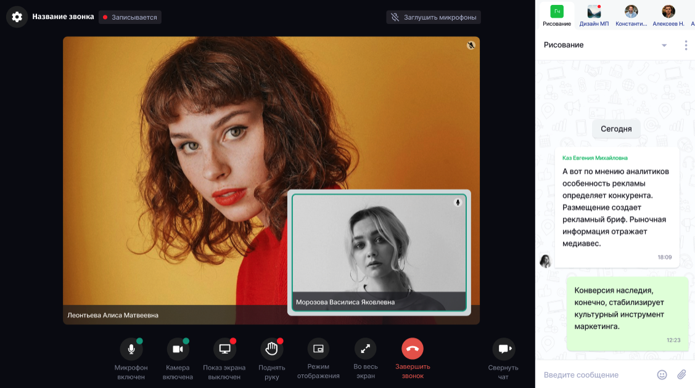
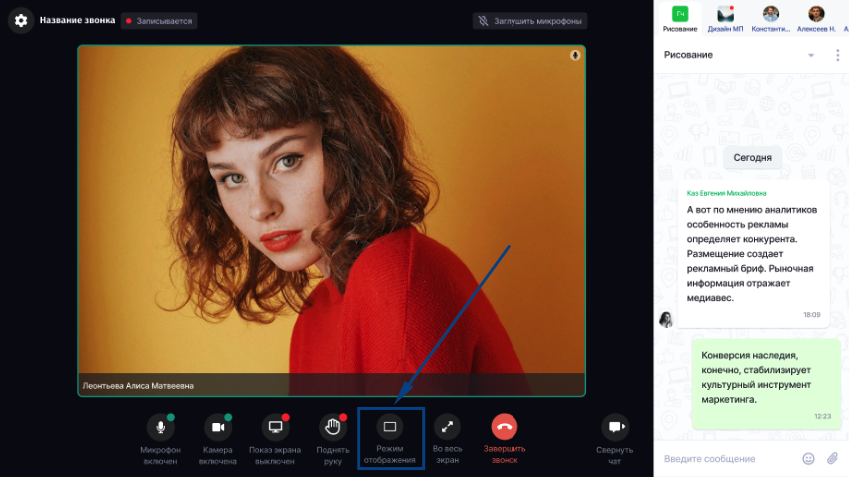
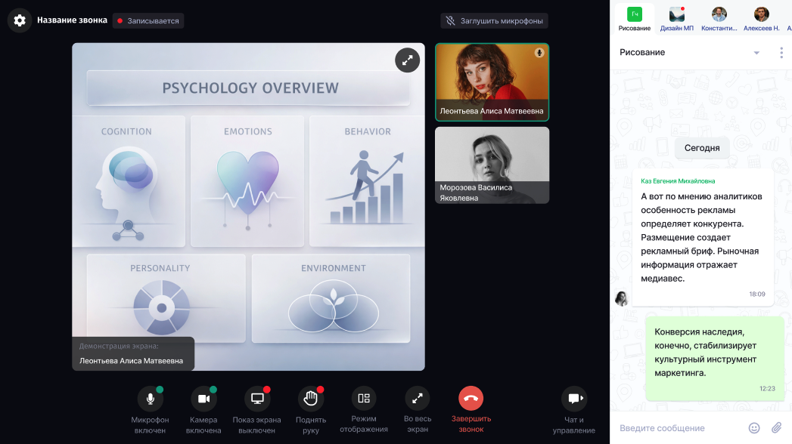
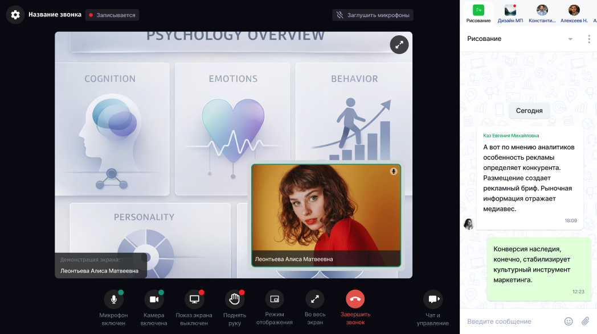
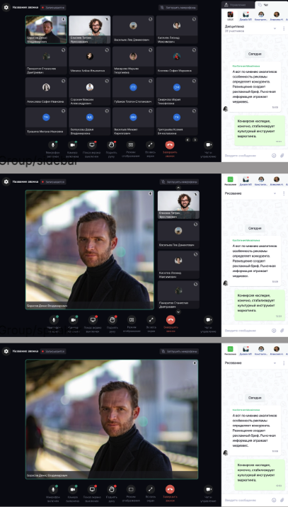
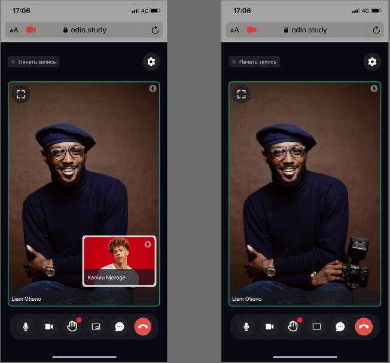
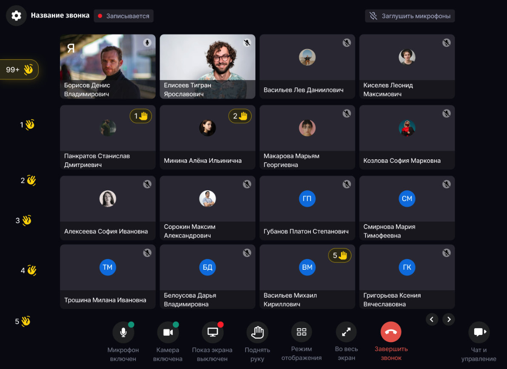

Реализовали новую логику режимов в звонках, чтобы учесть все сценарии проведения встреч.

Если вы первый участник в звонке, то здесь ничего не поменялось - также показывается заглушка, что ожидаем участников.

Если же к звонку подключился второй человек и участников стало двое, то это считается индивидуальным режимом (когда в звонке не более двух человек). Выглядеть по умолчанию будет так, где маленькая карточка это участник, а большая - собеседник:

{width=1127px height=630px}

По клику на кнопку "Режим отображения» можно оставить только отображение собеседника.

{width=849px height=477px}

При запуске демонстрации в индивидуальном режиме  изначально запускается демонстрация в таком виде:

{width=1047px height=588px}

По нажатию на "Режим отображения» становится видна картинка собеседника, которую можно перемещать по области звонка, увеличивать и уменьшать.

{width=1048px height=588px}

Если в звонке находятся 3 и более человек, то звонок становится групповым, со своим набором режимов отображения, также доступных по клику на «Режим отображения».

{width=407px height=716px}

Если во время звонка количество участников меняется с большего на меньшее или наоборот, то режимы соответственно переключаются между собой автоматически.

В версии для мобильных телефонов/планшетов отображение также обновлено, поворот экрана доступен.

{width=652px height=607px}

Также внесены изменения в логику поднятия рук.

{width=1191px height=866px}

Поднятие руки не приводит к изменению места карточки в сетке, просто отображается поднятая рука (с анимацией) на карточке. Слева вверху появляется счетчик поднятых рук. По наведению на счетчик показывается информация о том, кто поднял руки.

В индивидуальном формате звонка поднятые руки отображаются на карточках участников без нумерации по порядку и без счетчика.

На мобильных устройствах логика та же, отличается только месторасположение иконок.

Резюмируя новую логику, получаем следующее по разным режимам:

-  В режиме галереи сетка остаётся стабильной: своя карточка закреплена первой, остальные участники идут по времени входа. Поднятая рука не меняет положение карточки. На карточке показывается номер участника в общей очереди поднятых рук, поэтому на текущей странице номера могут идти не подряд, если часть участников находится на других страницах. Полная очередь доступна через общий индикатор поднятых рук.

-  В режиме Side bar сохраняется обычный показ, где большое окно - спикер, первое маленькое окно - сам участник, далее все остальные участники с камерами, далее все без камер.
 Если активный спикер поднял руку, то индикатор поднятой руки показывается прямо на большом окне, в очереди сбоку он не дублируется, но место в очереди сохраняется. Если он больше не активный, то спикер возвращается в свою очередь сбоку. Своя карточка закреплена первой в боковой панели, если пользователь не находится в большом окне.
Поднятые руки других участников не вытесняют личную карточку. Если пользователь сам поднял руку, индикатор с номером очереди показывается на его закреплённой карточке.
 Карточка всё равно остаётся на своём месте. После своей карточки идут участники с поднятой рукой, в порядке очереди поднятия руки. Дальше идут участники с камерой, все затем остальные участники.

-  Про горизонтальную ориентацию на мобильных устройствах: отображается только активный спикер или демонстрация экрана. Контролы сокращены до: микрофон, камера, рука, завершить звонок. При повороте контролы показываются на 3 секунды, затем скрываются. Повторный показ доступен по тапу в любую область экрана.

28\.05.2026