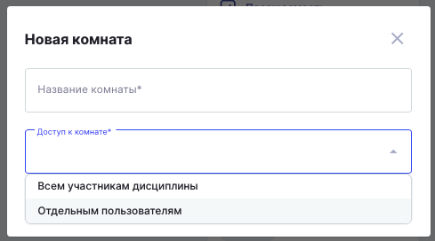
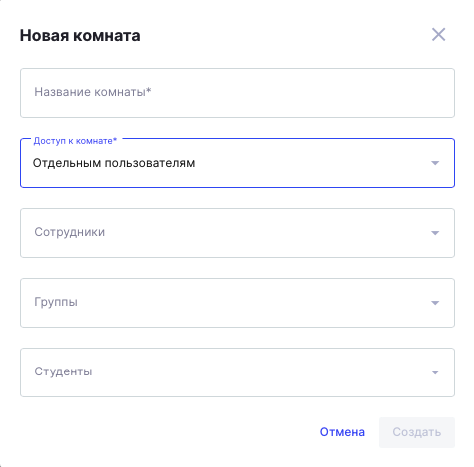

Внесены корректировки в процесс создания чат-комнаты.

В поле "Доступ к комнате» поменялось значение "Отдельным студентам" на "Отдельным пользователям».

{width=489px height=272px}

В случае выбора "Всем участникам дисциплины" ничего не меняется, добавляются абсолютно все пользователи.

В случае выбора "Отдельным пользователям" поле "Пользователи" переименовано на "Студенты".

{width=474px height=467px}

В случае выбора "Отдельным пользователям" добавлено поле "Сотрудники" (в списке отображаются только преподаватели и кураторы дисциплины), в этом случае система не совершит автоматическое добавление всех преподавателей и кураторов, а добавит только тех сотрудников, которые были выбраны.

В случае выбора "Отдельным пользователям" присутствует дополнительная логика:

1\. Если выбрана отдельная группа, несмотря на то кто выбран в поле "Сотрудники", автоматически добавятся кураторы этой/этих групп.

2\. Если текущий пользователь, который создает комнату является куратором или преподавателем данной дисциплины, то он автоматически добавляться в качестве участника комнаты.

01\.11.2025