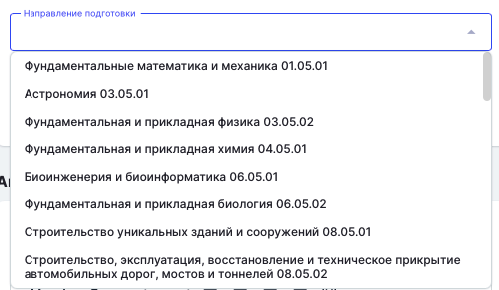

На страницу создания/редактирования основной образовательной программы в поле “Тип” добавлен “Специалитет”.

```
Если выбран тип “Специалитет”, то в поле “Форма обучения” отобразятся следующие значения:
```

-  Очная

-  Заочная

-  Очно-заочная

{width=551px height=196px}

Если на этой странице выбран тип “Специалитет”, то в поле “Направление подготовки” должны быть направления (специальности), соответствующие типу программы. В выпадающих значениях отображаются наименование направления (специальности) + код.

{width=499px height=290px}

При поиске  в данном поле значение находится как по названию, так и по коду направления (специальности).

10\.11.2025