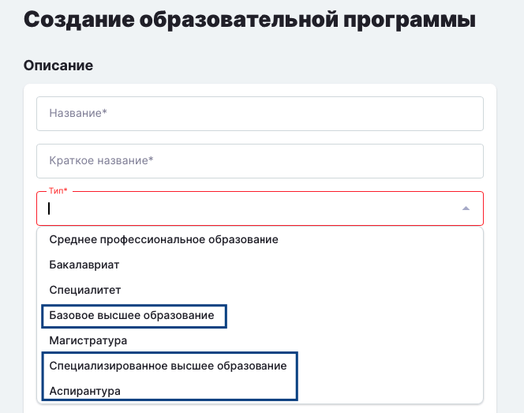

В поле "Тип" при создании программы основного образования добавлены следующие значения:

-  Аспирантура

-  Базовое высшее образование

-  Специализированное высшее образование

{width=664px height=523px}

03\.06.2026