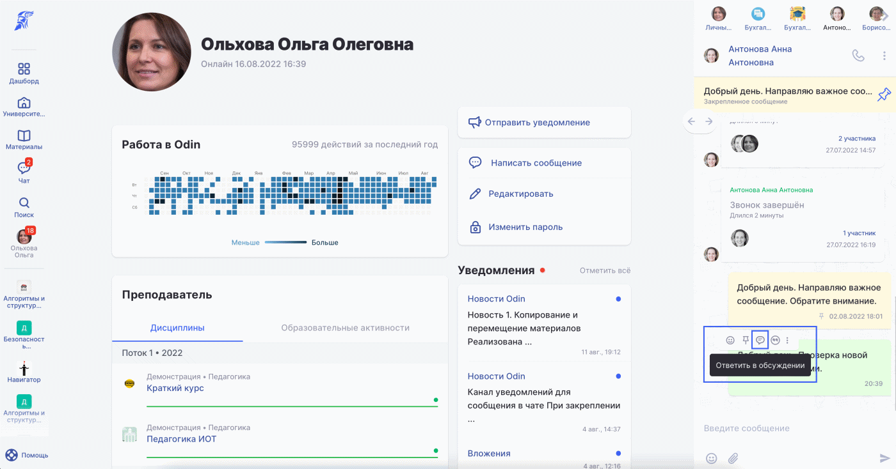

# Треды в чатах

Теперь к каждому сообщению в чате (кроме чата решений) можно открыть ветку обсуждения. Для этого необходимо навести курсор на сообщение, выбрать соответствующую иконку "Ответить в обсуждении". Далее обсуждение откроется в новой вкладке чата. Вернуться назад в основной чат можно, нажав на стрелочку "Назад".

<figure><figcaption></figcaption></figure>

Каждое сообщение в чате с тредом отображается с количеством ответов в нём.

<figure><figcaption></figcaption></figure>

15.08.2022
