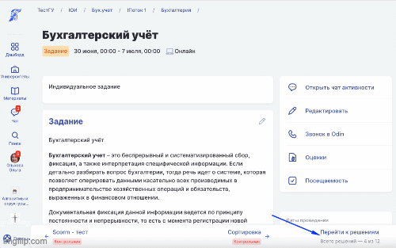

# Уведомление при индивидуальном сроке сдачи

При создании/редактировании активности с типом Задание возможно установить крайний срок сдачи решения для всех студентов, данной активности. Этот срок равен дате окончания активности.&#x20;

Если студент не успевает сдать работу в срок или преподавателю необходимо получить и проверить решение студента раньше даты окончания активности, на странице списка решений в активности Задание преподаватель может выставить **Индивидуальный срок сдачи** для него.

Ранее, после установки крайнего срока для отправки решения, студент мог узнать об этом только на странице "Моё решение", сейчас мы **добавили отправку уведомление при установке индивидуального срока сдачи**.&#x20;

<figure><figcaption></figcaption></figure>

Оповещение  при установке/изменении индивидуального срока сдачи отправляется  студенту в виде push, в блок Уведомления на странице профиля (добавляется в счётчик уведомлений на аватаре) и  на email.

<figure><figcaption></figcaption></figure>

Дата публикации 14.07.2022
