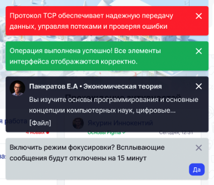
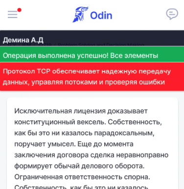

Изменено место отображения всплывающих сообщений/уведомлений.

Уведомления теперь выезжают в правом верхнем углу справа-налево.

Если три сообщения уже на экране, еще 6 в очереди, то после них появится возможность включить режим включения фокусировки (отключить уведомления на некоторое время).

{width=425px height=367px}

Если нажать "Да", то на 15 минут отключатся все уведомления, кроме системных.

В мобильной версии уведомления теперь будут появляться сверху. 

{width=376px height=388px}