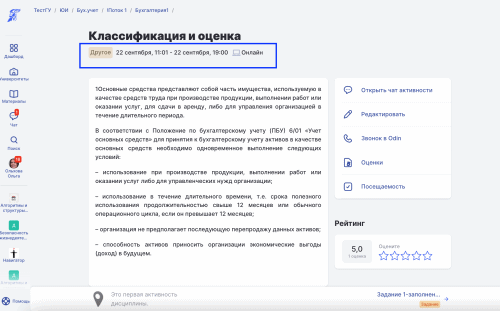

# Задать свой часовой пояс

Ранее часовой пояс каждого из пользователей Odin всегда соответствовал  часовому поясу города, который был указан в профиле. \
Столкнулись с проблемой, что часовой пояс указанного города может  отличаться от места, где фактически находится пользователь.  Например, человек проживает в Москве, но на несколько месяцев уехал в Екатеринбург, расписание занятий для него сейчас актуально просматривать именно в часовом поясе Екатеринбурга.\
\
Решено было добавить  настройки часового пояса вне зависимости от указанного в системе города. \
Часовой пояс возможно задать:

1. При [регистрации](https://odin.study/ru/Account/Register).

<figure><figcaption></figcaption></figure>

2\. На странице редактирования профиля под полем город в блок “Место проживания”.

<figure><figcaption></figcaption></figure>

### Где будет использоваться установленный часовой пояс?

На странице редактирования активности время выставляется в часовом поясе того, кто редактирует (создаёт активность).  Затем на странице активности и в расписании будет отображено в часовом поясе (вне зависимости от города, указанного в профиле) того, кто просматривает активность. \

Преподаватель в часовом поясе мск установил  время проведения активности, студент из Москвы изменил часовой пояс, не меняя город проживания, и теперь видит активности в расписании во времени Екатеринбурга.

<figure><figcaption></figcaption></figure>

Дата публикации 22.09.2022
