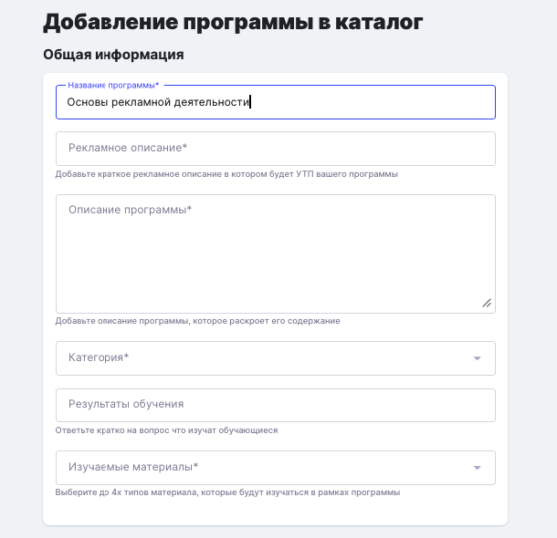
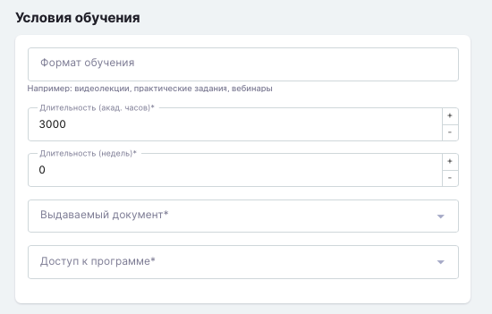
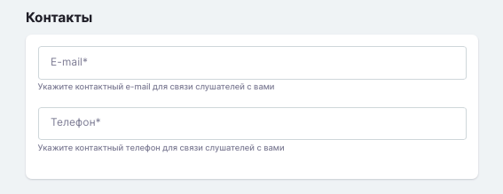
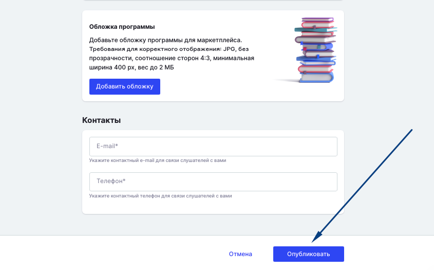

Раздел предназначен для публикации образовательной программы в общем каталоге <https://www.odin.study/marketplace/catalog>, где потенциальные слушатели могут ознакомиться с программой, изучить условия обучения и выбрать подходящую.

Публикация программы выполняется из личного кабинета администратора внутри конкретной программы. После заполнения обязательных полей и нажатия кнопки публикации программа автоматически появляется в каталоге образовательных программ. Дополнительная модерация не требуется.

Опубликованную программу можно редактировать и после размещения. При необходимости администратор может обновить описание, стоимость, изображение, условия обучения и контактные данные.

## **Основная информация о программе**

В первом блоке заполняются базовые сведения, которые формируют карточку программы в каталоге.

{width=610px height=590px}

### **Название программы**

Поле предназначено для указания названия образовательной программы. Название отображается в каталоге и помогает пользователю быстро понять тематику обучения. Рекомендуется использовать короткое, понятное и содержательное название без лишних уточнений.

Пример: «Основы рекламной деятельности».

### **Рекламное описание**

В этом поле указывается краткое рекламное описание программы. Описание должно быстро объяснять ценность обучения для потенциального слушателя: чему он научится, какую задачу сможет решить и почему программа может быть ему полезна. Рекомендуется писать кратко, конкретно и с акцентом на результат обучения.

Пример: «Программа поможет освоить базовые принципы рекламной деятельности, научиться анализировать аудиторию, выбирать каналы продвижения и оценивать эффективность рекламных кампаний».

### **Описание программы**

Поле предназначено для подробного описания содержания образовательной программы. Здесь можно раскрыть структуру программы, основные темы, практические задания, приобретаемые навыки и профессиональные компетенции. В это поле можно вставить заранее подготовленный текст или заполнить описание вручную.

Рекомендуется указать:

-  что изучается в рамках обучения;

-  для кого предназначена программа;

-  какие темы входят в обучение;

-  какие практические навыки получит слушатель;

-  какой результат ожидается после прохождения обучения.

### **Категория**

В этом поле выбирается категория, к которой относится образовательная программа. Категория используется для навигации, поиска и фильтрации программ в каталоге. Корректный выбор категории помогает пользователям быстрее находить подходящие варианты.

Например, для программы «Основы рекламной деятельности» может использоваться категория «Креативные индустрии и медиа».

## **Результаты обучения**

Блок «Результаты обучения» помогает пользователю понять, какие знания и навыки он получит после завершения программы.

### **Результаты обучения**

В этом поле необходимо кратко описать итог прохождения образовательной программы. Рекомендуется отвечать на вопрос: что сможет делать слушатель после завершения обучения?

Пример: «После завершения обучения слушатель сможет понимать основные принципы рекламной деятельности, разрабатывать рекламные сообщения, выбирать каналы продвижения и анализировать эффективность рекламных кампаний».

### **Изучаемые материалы**

В этом поле выбираются типы учебных материалов, которые используются в программе. Доступен выбор до четырёх типов материалов:

-  текстовые материалы;

-  видео, включая записи лекций и вебинары;

-  практические задания;

-  презентации.

Этот блок помогает слушателю заранее понять, в каком формате будет проходить обучение и какие материалы будут доступны.

## **Условия обучения**

В блоке «Условия обучения» указываются параметры прохождения программы: формат, длительность, выдаваемый документ, доступ и стоимость.

{width=550px height=351px}

### **Формат обучения**

Поле предназначено для описания организации учебного процесса. Здесь можно указать, как именно проходит обучение: через видеолекции, вебинары, самостоятельное изучение материалов, практические задания, тесты или смешанный формат.

Пример: «Обучение проходит в дистанционном формате и включает видеолекции, текстовые материалы, презентации и практические задания».

### **Длительность в академических часах**

В этом поле указывается общий объём программы в академических часах. Этот параметр помогает пользователю оценить трудоёмкость обучения и сопоставить программу с собственным графиком.

### **Длительность в неделях**

В этом поле указывается рекомендуемый срок прохождения программы в неделях. Если обучение можно проходить в индивидуальном темпе, рекомендуется указать ориентировочную продолжительность.

### **Выдаваемый документ**

В этом поле выбирается документ, который получает слушатель после успешного завершения обучения.

Например: «Сертификат организации».

### **Доступ к программе**

Поле определяет условия доступа к программе. Возможные варианты могут включать платный или бесплатный доступ. Если выбран платный доступ, необходимо указать стоимость обучения.

### **Цена**

В этом поле указывается стоимость программы. Цена отображается в карточке программы в каталоге и помогает пользователю принять решение о записи на обучение.

## **Обложка программы**

В этом блоке загружается изображение, которое будет использоваться как обложка программы в каталоге.

{width=539px height=200px}

Изображение должно соответствовать тематике образовательной программы и визуально выделять ее среди других предложений. Поддерживается загрузка изображения в формате JPEG. Рекомендуется использовать качественную обложку без мелкого текста и перегруженных визуальных элементов, так как изображение может отображаться в каталоге в уменьшенном размере.

## **Контакты**

В блоке контактов указываются данные для связи потенциальных слушателей с организацией.

{width=567px height=219px}

### **E-mail**

В этом поле указывается контактный адрес электронной почты. На этот адрес пользователи смогут направлять вопросы по программе, условиям обучения и записи.

### **Телефон**

В этом поле указывается контактный телефон для связи со слушателями. Рекомендуется указывать актуальный номер, по которому организация действительно готова принимать обращения по опубликованной программе.

## **Публикация программы**

После заполнения всех обязательных полей необходимо нажать кнопку публикации.

{width=845px height=525px}

После публикации программа автоматически размещается в каталоге образовательных программ и становится доступна пользователям для просмотра и выбора. Если после публикации нужно изменить информацию, администратор может вернуться в раздел размещения программы, внести корректировки и сохранить обновлённые данные.

## Видеоинструкция по добавлению образовательной программы в каталог

[video:https://rutube.ru/video/private/373b41d88e1d4ca88c6bdb590aa19927/?p=rNG4-vJ69f-omWNSJsxyjg]