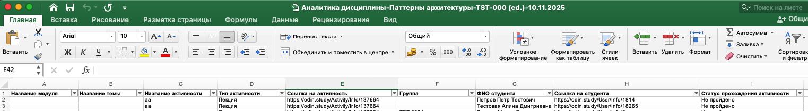

Открыть вкладку Аналитика можно со страницы дисциплины, выбрав необходимую вкладку. По нажатию на тридот появляется возможность скачать эту выгрузку с прогрессом студентов.

 (1) (1) (1) (1) (1) (1) (1) (1) (1) (1) (1) (1) (1) (1) (1) (1) (1) (1) (1) (1) (1) (1) (1) (1) (1) (1) (1) (1) (1) (1) (1) (1) (1) (1) (1) (1) (1) (1) (1) (1) (1) (1) (1) (1) (1) (1) (1) (1) (1) (1) (1) (1).png>)

В загруженном файле можно открыть одну из двух вкладок:

{width=425px height=60px}

Вкладка «Вовлеченность студентов» со следующими данными:

{width=1523px height=211px}

А вкладка «Аналитика дисциплины» с такими данными:

{width=1105px height=188px}

