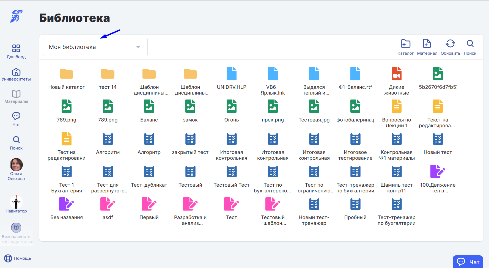
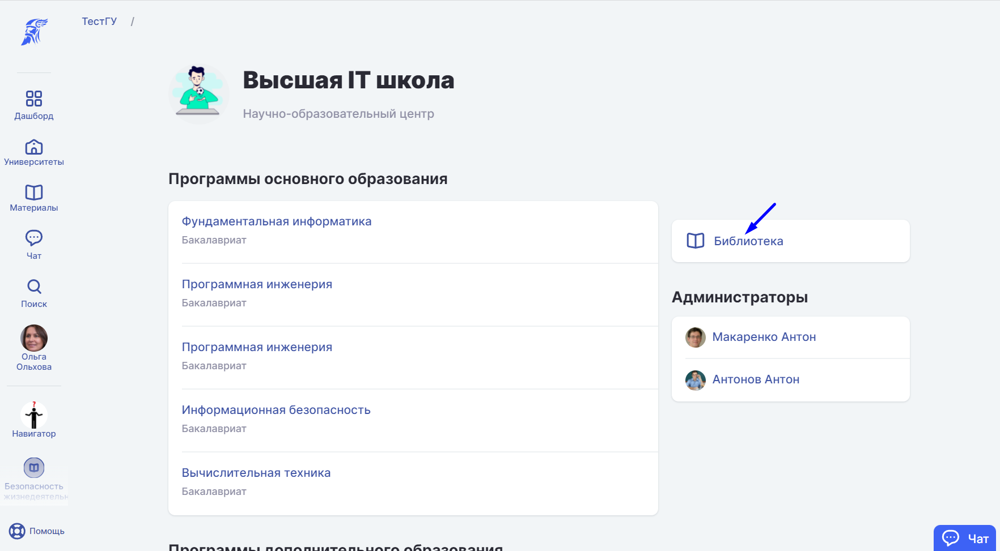
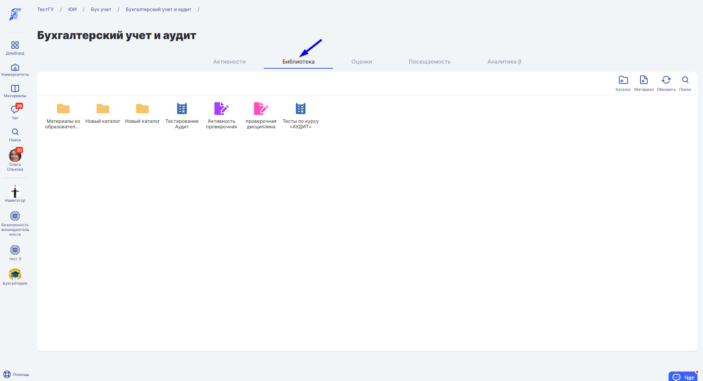
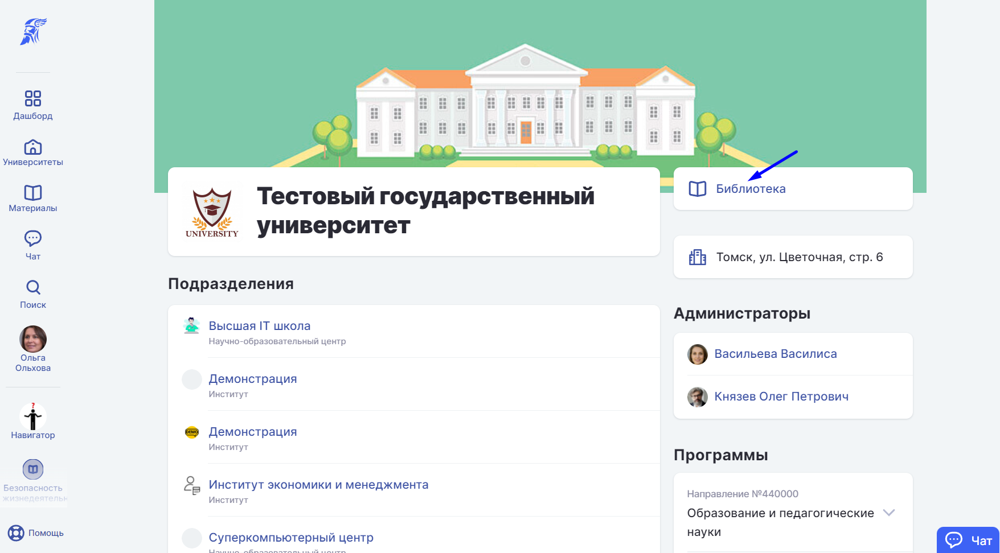

**Библиотека - сервис системы Odin**, предоставляющий пользователю место хранения его материалов и круглосуточный доступ к ним. [Материалы](./materialy/_index) - файлы, видео, текстовые документы и т.д.

Такой сервис позволяет удобно хранить, находить и  использовать материалы в образовательном процессе.

:::info 

Правообладатель (система Odin) не получает каких-либо прав на использование, распространение, модификацию, передачу третьим лицам контента, размещаемого в системе Odin.

:::

:::info 

Студенты имеют доступ к материалам программы на срок, установленный в оганизации.

:::

:::info 

Доступ к своим материалам можно ограничить, разместив их в личную библиотеку.

:::

В системе представлено 4 типа Библиотек:

[tabs]

[tab:Личная]

Личная Библиотека доступна только самому пользователю. В ней можно выбрать любую доступную пользователю библиотеку из списка.

{width=1778px height=975px}

Материалы из личной библиотеки доступны только вам, их не видят другие пользователи системы.

Материалы из личной библиотеки можно использовать при создании [активности](./../../struktura/disciplina/aktivnosti/kontrolnaya/README-2). Тогда они попадут в библиотеку дисциплины и станут доступны всем, у кого есть доступ к дисциплине.

[/tab]

[tab:Подразделения]

Для каждом [подразделения](./../../struktura/podrazdelenie) в Odin предусмотрена своя библиотека. [Материалы](./materialy/_index) видят все, кто входит в это подразделение.

{width=1764px height=973px}

[/tab]

[tab:Дисциплины]

Библиотека доступна только участникам конкретной Дисциплины. Вы можете заранее добавить в библиотеку дисциплины [материалы](./materialy/_index) и затем использовать их при создании Активностей.

Дополнительно в библиотеку дисциплины могут быть добавлены любые полезные для студентов материалы, которые не изучаются в рамках [Активностей](./../../struktura/disciplina/aktivnosti/kontrolnaya/README-2). Например, электронные книги по программе.

Все материалы используемые при создании [Активности](./../../struktura/disciplina/aktivnosti/kontrolnaya/README-2), в библиотеке дисциплины автоматически попадают в каталог "Материалы из образовательных активностей". Для группировки других материалов можно создать новые папки.

{width=1777px height=965px}

[/tab]

[tab:Организации]

Библиотека организации одна. Доступна каждому, но только в рамках своей организации.

В эту библиотеку можно добавить общедоступные материалы.

{width=1756px height=972px}

[/tab]

[/tabs]

--

Материал в систему следует загружать один раз, затем использовать его, добавляя в нужную сущность.

При копировании материала в  доступные библиотеки, он будет занимать объём в хранилище равный размеру файла.

:::info 

**Объём занимаемого места  в хранилище не увеличивается при копировании одного и того же материала внутри системы, то есть один и тот же материал занимает место единожды.**

:::
