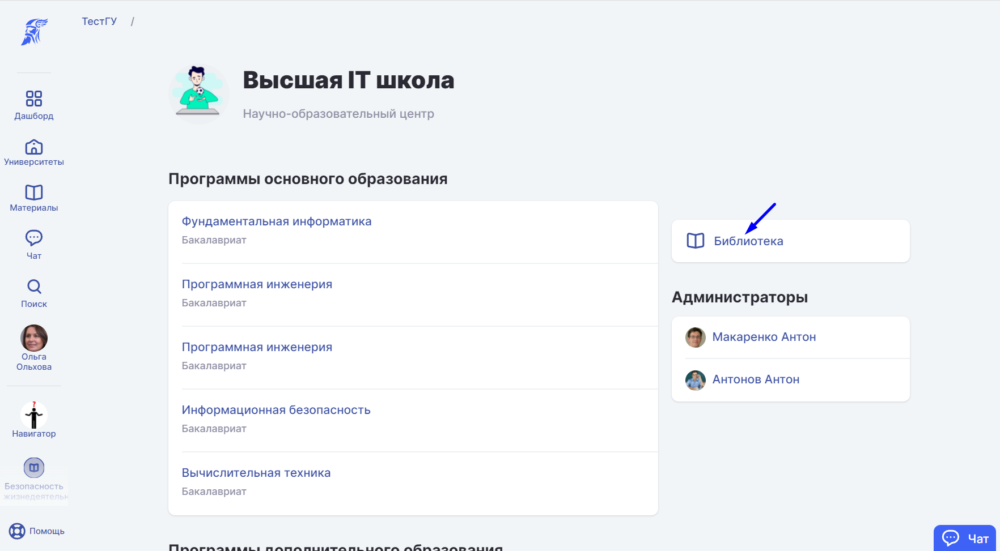

# Библиотека

**Библиотека - сервис системы Odin**, предоставляющий пользователю место хранения его материалов и круглосуточный доступ к ним. [Материалы](materialy/) - файлы, видео, текстовые документы и т.д.

Такой сервис позволяет удобно хранить, находить и  использовать материалы в образовательном процессе.

:::info

Правообладатель (система Odin) не получает каких-либо прав на использование, распространение, модификацию, передачу третьим лицам контента, размещаемого в системе Odin.

:::

:::info

Студенты имеют доступ к материалам программы на срок, установленный в оганизации.

:::

:::info

Доступ к своим материалам можно ограничить, разместив их в личную библиотеку.

:::

В системе представлено 4 типа Библиотек:

<strong>1. Библиотека университета</strong>

Библиотека вуза одна. Доступна каждому, но только в рамках своего университета.

В эту библиотеку можно добавить общедоступные материалы.

<strong>2. Библиотека подразделения</strong>

Для каждом [подразделения](../../struktura/podrazdelenie.md) в Odin предусмотрена своя библиотека. [Материалы](materialy/) видят все, кто входит в это подразделение.

3. Библиотека дисциплины

Библиотека  доступна только участникам  конкретной Дисциплины. Вы можете заранее добавить в библиотеку дисциплины [материалы](materialy/) и затем использовать их при создании Активностей.

Дополнительно в библиотеку дисциплины могут быть добавлены любые полезные   для студентов материалы, которые не  изучаются в рамках [Активностей](../../struktura/aktivnosti/). Например, электронные книги по программе.

Все материалы  используемые  при создании [Активности](../../struktura/aktivnosti/), в библиотеке дисциплины автоматически  попадают в  каталог "Материалы из образовательных активностей". Для группировки других материалов можно создать новые папки.

<strong>4. Личная библиотека пользователя</strong>

Личная Библиотека доступна только самому пользователю. В ней можно выбрать любую доступную пользователю библиотеку из списка.

Материалы из личной библиотеки доступны только вам, их не видят другие пользователи системы.

Материалы из личной библиотеки можно использовать при создании [активности](../../struktura/aktivnosti/). Тогда они попадут в библиотеку дисциплины и станут доступны всем, у кого есть доступ к дисциплине.

Материал в систему следует загружать один раз, затем использовать его.

При копировании материала в  доступные библиотеки, он будет занимать объём в хранилище равный размеру файла.

Объём занимаего места  в хранилище не увеличивается при копировании одного и того же материала внутри системы.
