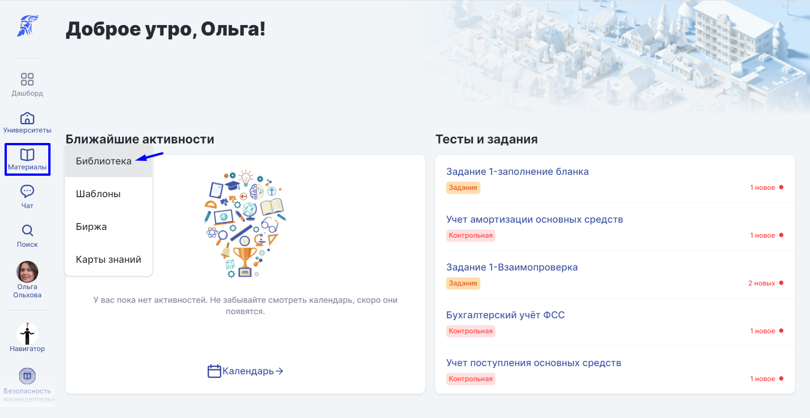
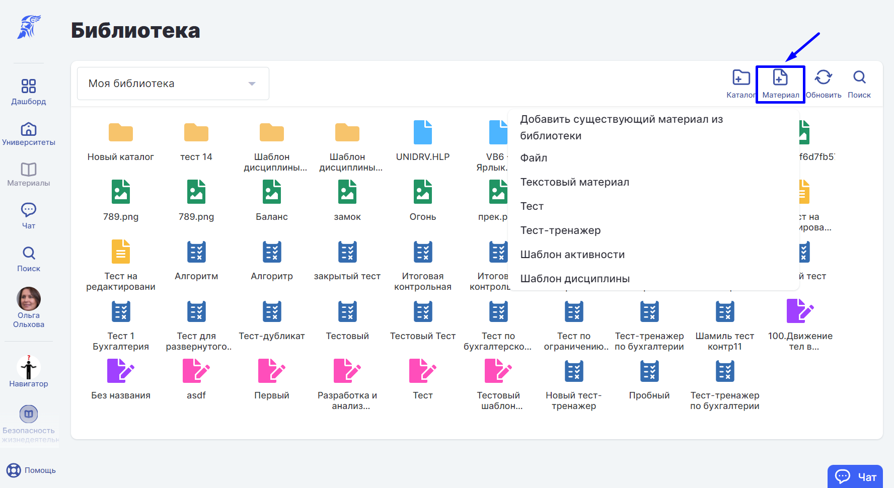
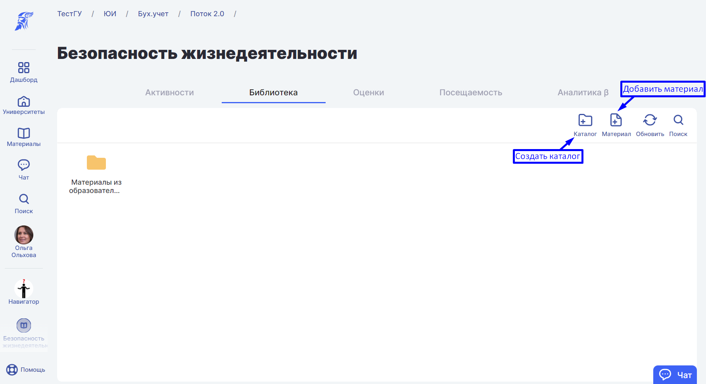
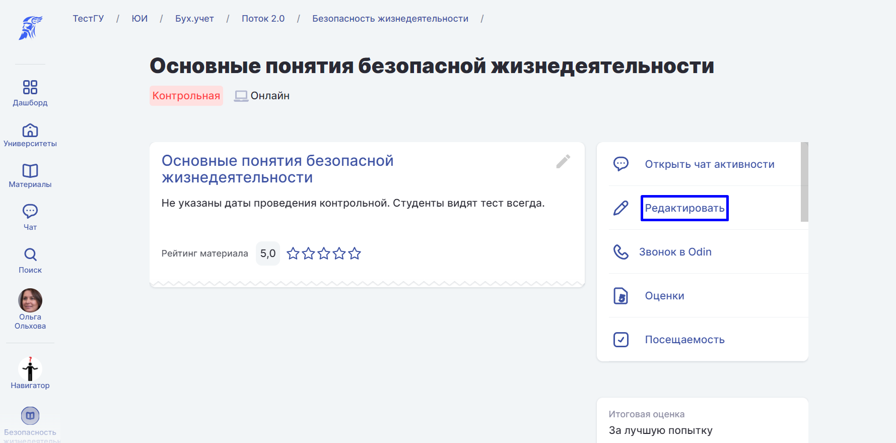
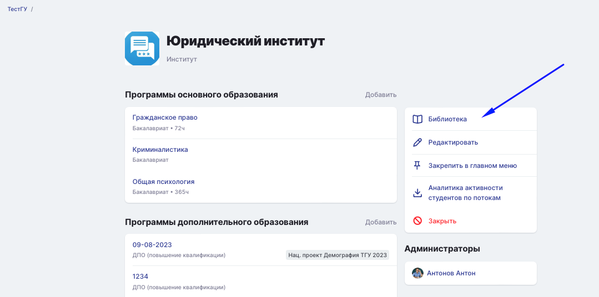
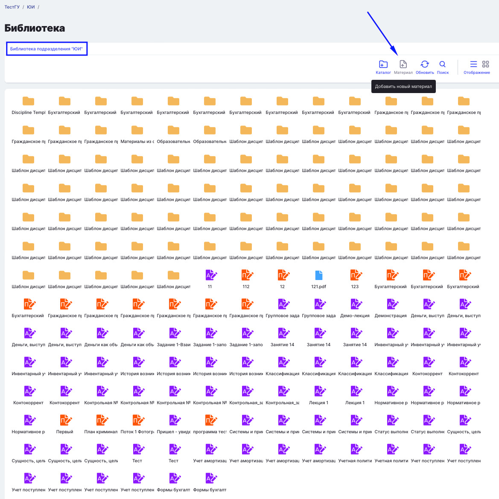

## **1\. В** личную библиотеку.

1) Выберете в разделе "Материалы" пункт "Библиотека".

{width=1779px height=918px}

2) Со страницы Библиотеки добавьте [материал](https://www.odin.study/help/servisy/biblioteka/materialy). В этом случае материал сразу добавится в личную библиотеку.

{width=1776px height=970px}

## **2\.** В образовательную активность.

1) Зайдите на страницу вуза.

2) Выберите раздел "Библиотека" на странице дисциплины и добавьте материал в нужный каталог.

{width=1780px height=971px}

В этом случае материал добавится конкретно в этот каталог библиотеки**.**

При добавлении материала к Образовательной Активности необходимо указать доступность:

-  Виден всегда

-  Виден только во время Образовательной активности

-  Не виден никогда

{width=1779px height=879px}

В этом случае материал будет добавлен в личную библиотеку пользователя, библиотеку дисциплины и образовательную активность.

## 3\.В библиотеку подразделения

1) Зайдите на страницу подразделения, далее выберите "Библиотека".

{width=1079px height=536px}

2) Добавьте материал в библиотеку.

{width=1169px height=1169px}