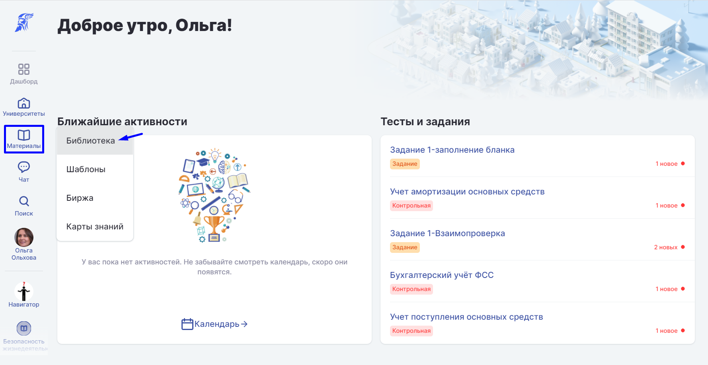
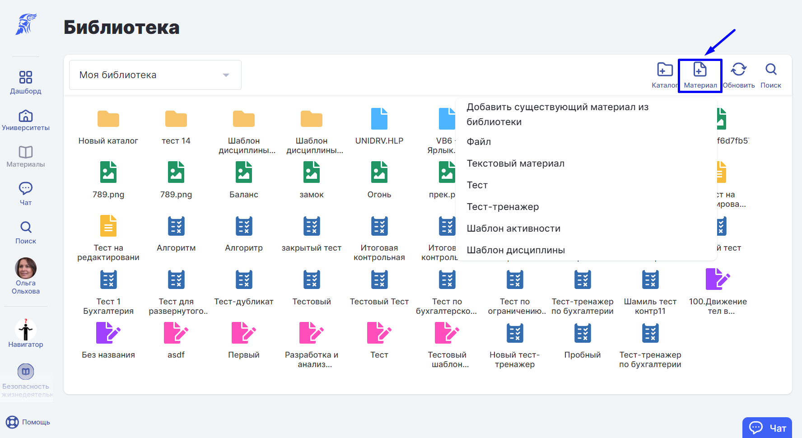
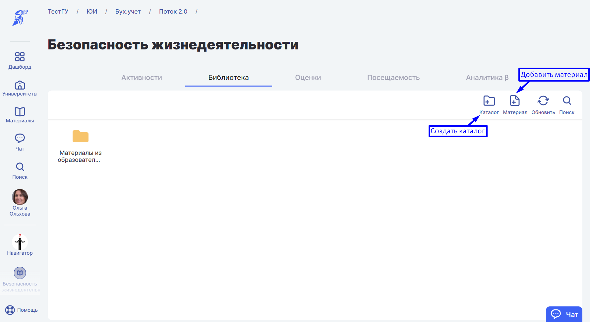
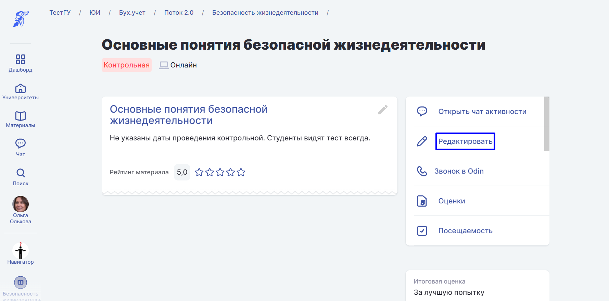
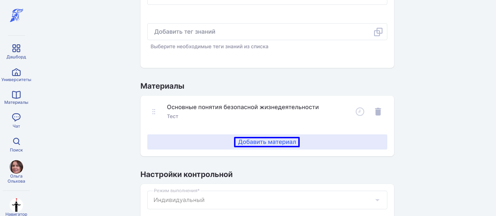

# Добавление материалов

<strong>1. В</strong> личную библиотеку.

1\) Выберете в разделе "Материалы" пункт "Библиотека".

2\) Со страницы Библиотеки добавьте [материал](materialy/). В этом случае материал сразу добавится в личную библиотеку.

<strong>2.</strong> В образовательную активность.

1\) Зайдите на страницу вуза.

2\) Выберите раздел "Библиотека" на странице дисциплины и добавьте материал в нужный каталог.

В этом случае материал добавится конкретно в этот каталог библиотек&#x438;**.**

При добавлении материала к Образовательной Активности необходимо указать доступность:

* Виден всегда
* Виден только во время Образовательной активности
* Не виден никогда

В этом случае материал будет добавлен в личную библиотеку пользователя, библиотеку дисциплины и образовательную активность.

3.В библиотеку подразделения

1\) Зайдите на страницу подразделения, далее выберите "Библиотека".

.png>)

2\) Добавьте материал в библиотеку.

.png>)

