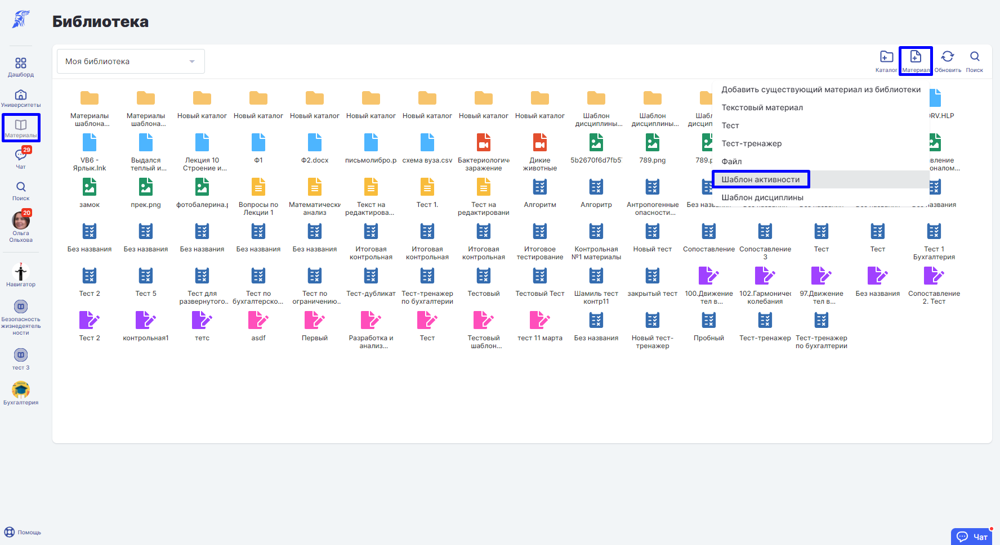
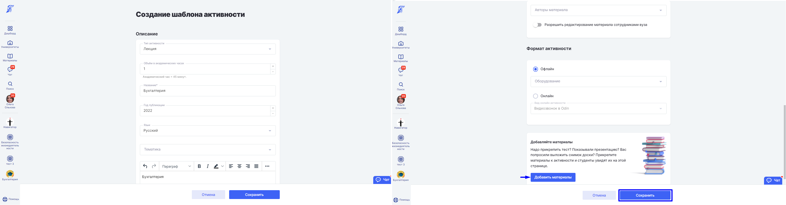
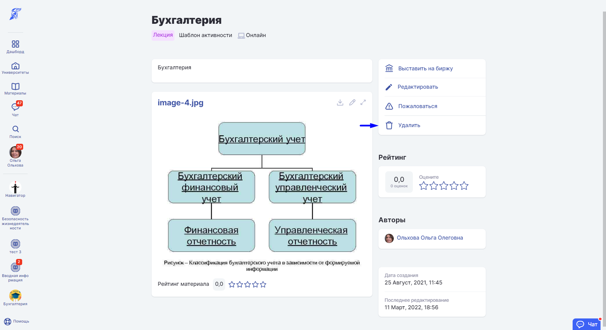

# Шаблон активности

При добавлении образовательной активности в [дисциплину](../../../struktura/disciplina/) возможно добавить как новую [активность](../../../struktura/aktivnosti/), так и шаблон образовательной активности из [материалов](./).&#x20;

Шаблон активности позволяет многократно использовать полностью подготовленный материал или его определенную часть.&#x20;


Шаблоны образовательных активностей создаются при добавлении активности.


Чтобы создать шаблон активности, в разделе "Материалы" выберете пункт "Библиотека", а затем [добавьте материал](../dobavlenie-materialov.md) "Шаблон активности"

Отредактировать шаблон активности можно на странице шаблона. Чтобы сохранить изменения, нажмите кнопку "Сохранить".

Зайдите на страницу создания образовательной [активности](../../../struktura/aktivnosti/) и нажмите "Выбрать шаблон".

.png>)

Сменить или удалить шаблон из активности можно на странице редактирования активности.


В шаблон активности дублируются и сохраняются заполненные поля.


Также создать шаблон активности можно из основного меню. В разделе "Материалы" выберете пункт "Шаблоны". Чтобы создать шаблон образовательной активности, нажмите "+". Воспользуйтесь фильтром для поиска шаблона активности по библиотекам.

.png>)

Удалить шаблон активности можно на странице шаблона. Нажмите кнопку "Удалить".

