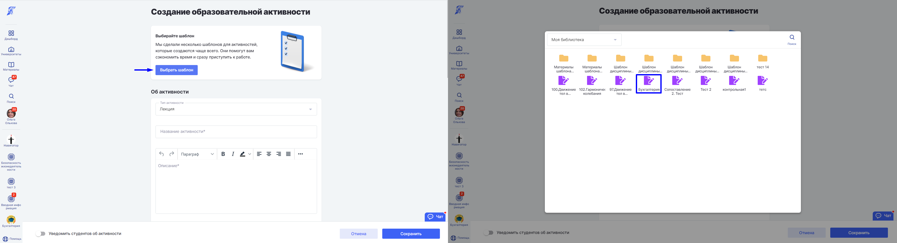
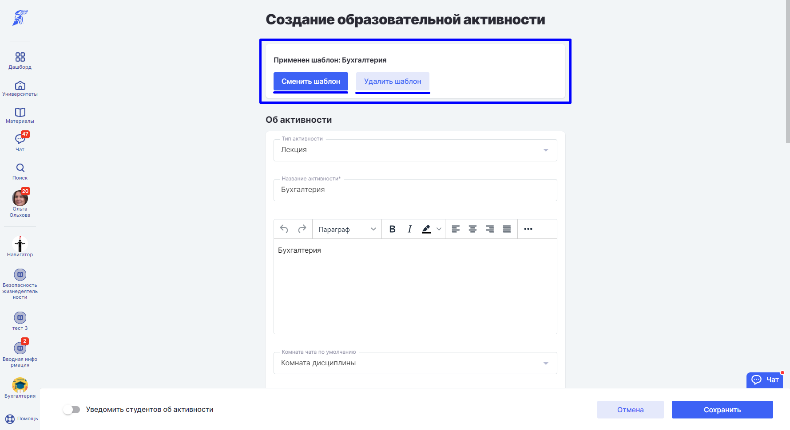
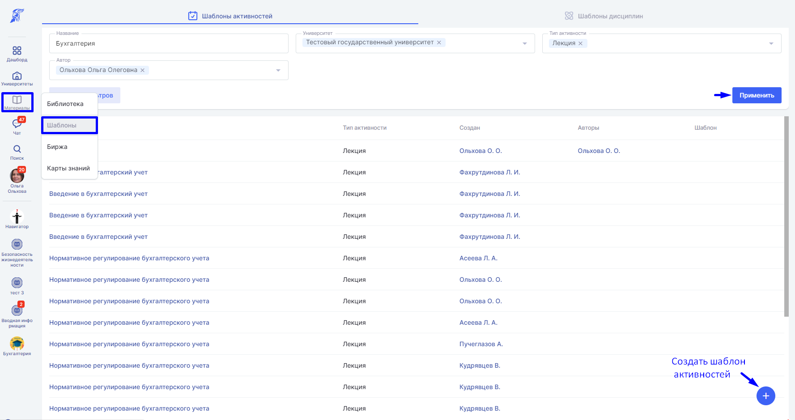

При добавлении образовательной активности в [дисциплину](./../../../struktura/disciplina/_index) возможно добавить как новую активность, так и шаблон образовательной активности из [материалов](./_index).

Шаблон активности позволяет многократно использовать полностью подготовленный материал или его определенную часть.

:::info 

Шаблоны образовательных активностей создаются при добавлении активности.

:::

Чтобы создать шаблон активности, в разделе "Материалы" выберете пункт "Библиотека", а затем [добавьте материал](./../dobavlenie-materialov) "Шаблон активности"

Отредактировать шаблон активности можно на странице шаблона. Чтобы сохранить изменения, нажмите кнопку "Сохранить".

Зайдите на страницу создания образовательной [активности](./../../../struktura/disciplina/aktivnosti/_index) и нажмите "Выбрать шаблон".

Сменить или удалить шаблон из активности можно на странице редактирования активности.

:::info 

В шаблон активности дублируются и сохраняются заполненные поля.

:::

Также создать шаблон активности можно из основного меню. В разделе "Материалы" выберете пункт "Шаблоны". Чтобы создать шаблон образовательной активности, нажмите "+". Воспользуйтесь фильтром для поиска шаблона активности по библиотекам.

Удалить шаблон активности можно на странице шаблона. Нажмите кнопку "Удалить".

