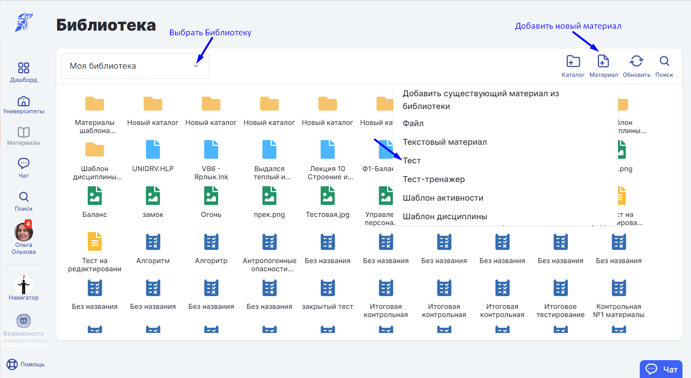
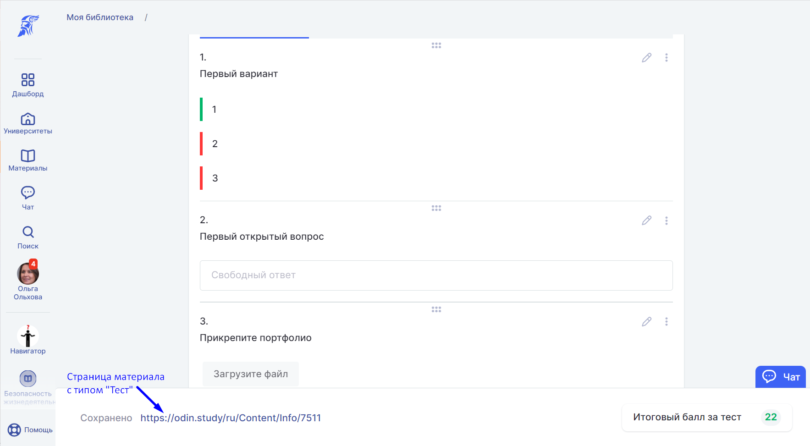
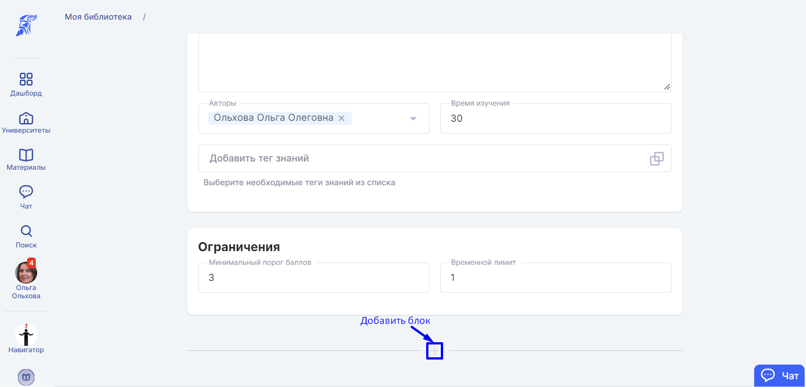
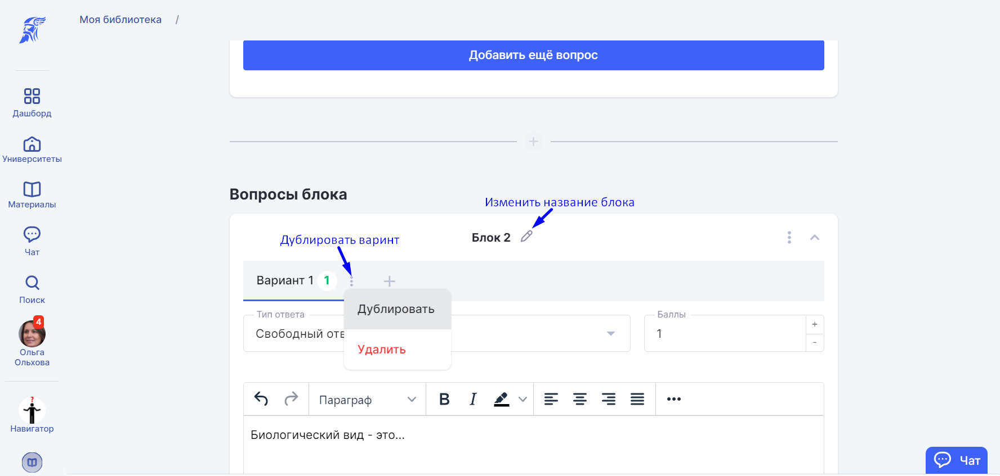
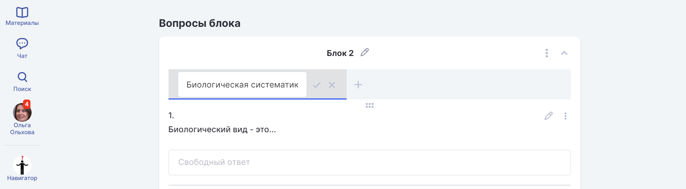
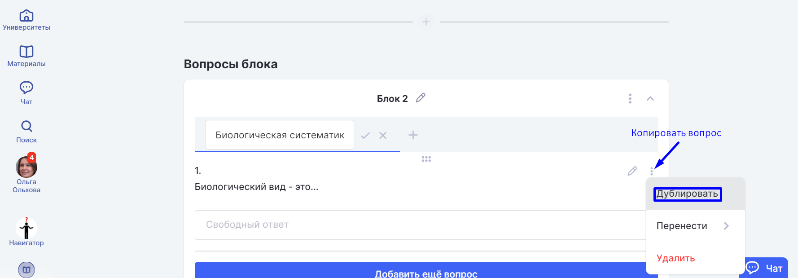
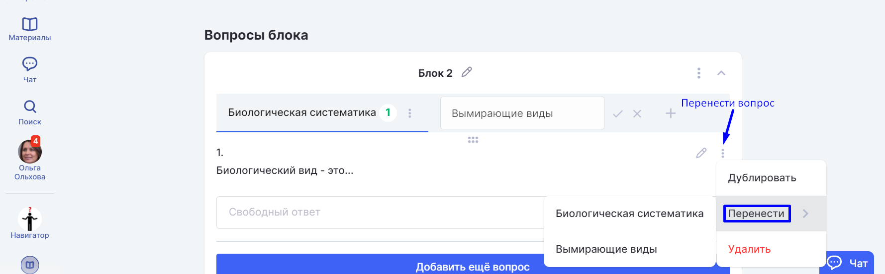
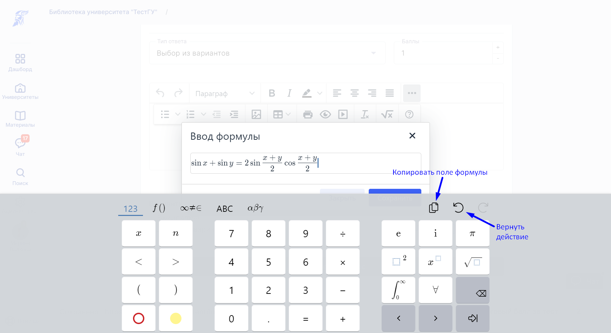

# Тест

Для закрепления информации по теме активности и самоконтроля студента используйте материал с типом "Тест". Тест создаётся в конструкторе тестов.&#x20;

Чтобы попасть в конструктор тестов, добавьте [материал](../../dobavlenie-materialov.md) с типом "Тест" в доступной библиотеке.&#x20;

Тест автоматически сохраняется под ссылкой редактирования теста в конструкторе. При выходе со страницы редактирования теста заново найти его можно в выбранной для доступа теста [Библиотеке](../../).&#x20;


Материал с типом "Тест" можно добавить только в [активность](../../../../struktura/aktivnosti/) с типом "[Контрольная](../../../../struktura/aktivnosti/kontrolnaya/)".


Блоки группируют вопросы, например, по сложности или темам.&#x20;

Чтобы добавить Блок, нажмите "+".

Вопросы объединяются в варианты. У вариантов должно быть равное количество баллов. При выполнении теста [студенты](../../../../roli-v-sisteme/studenty.md) получат случайный вариант.

Чтобы добавить Вариант, нажмите "+".

Заполните вопросы теста и варианты ответов, если это характерно для выбранного типа вопроса, и нажмите на три точки рядом с Вариантом: в выпадающем списке выберите "Дублировать".&#x20;

Кликните 2 раза по заголовку варианта, чтобы переименовать его.

Если нужно копировать вопрос в текущий вариант, то после создания вопроса нажмите на три точки рядом с кнопкой Редактировать и продублируйте вопрос. Затем в него можно внести изменения (например, числовые).

Также вопрос после создания или редактирования можно перенести в выбранный вариант. Для этого, нажмите на три точки рядом с карандашом и выберите пункт "Перенести", а затем нужный вариант.


Редактировать и дополнять варианты теста после создания можно независимо друг от друга.



Студент получит наиболее уникальный вариант теста, если в нем будет несколько блоков и вариантов.


Чтобы вывести формулу, нажмите три точки в меню редактирования вопроса.

